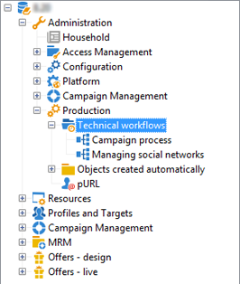
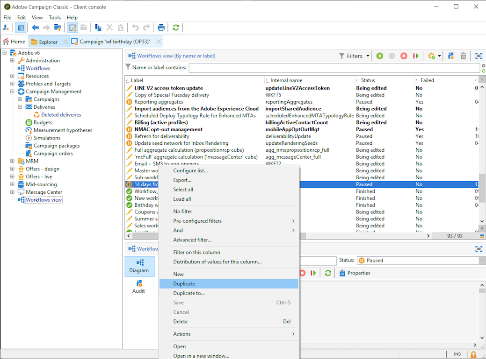

# Creación de un flujo de trabajo {#building-a-workflow}

Esta sección detalla los principios fundamentales y las prácticas recomendadas para crear un flujo de trabajo en Campaign.

* Creación de un flujo de trabajo, consulte [Creación de un nuevo flujo de trabajo](#creating-a-new-workflow)
* Diseño del diagrama de flujo de trabajo, consulte [Adición y vinculación de actividades](#adding-and-linking-activities)
* Acceso a parámetros y propiedades de actividades, consulte [Configuración de actividades](#configuring-activities)
* Diseño de flujos de trabajo de objetivos, consulte [Flujos de trabajo de objetivo](#targeting-workflows)
* Uso de flujos de trabajo para ejecutar una campaña, consulte [Flujos de trabajo de campaña](#campaign-workflows)
* Acceso y creación de flujos de trabajo técnicos, consulte [Flujos de trabajo técnicos](#technical-workflows)
* Uso de plantillas para crear flujos de trabajo, consulte [Plantillas de flujo de trabajo](#workflow-templates)

## Creación de un flujo de trabajo nuevo {#creating-a-new-workflow}

Desde **[!UICONTROL Explorer]** acceda a una carpeta de flujo de trabajo. De forma predeterminada, puede utilizar **[!UICONTROL Profiles and Targets]** > **[!UICONTROL Jobs]** > **[!UICONTROL Targeting workflows]**.

Haga clic en el botón **[!UICONTROL New]** situado sobre la lista de flujos de trabajo.

También puede utilizar el botón **[!UICONTROL Create]** de la descripción general del flujo de trabajo (enlace **[!UICONTROL Monitoring]** > **[!UICONTROL Workflow]**).

Introduzca una etiqueta y haga clic en **[!UICONTROL Save]**.

>[!NOTE]
>
>Cuando modifique el nombre interno de una actividad de flujo de trabajo o el propio flujo de trabajo, asegúrese de guardar el flujo de trabajo antes de cerrarlo para que el nuevo nombre interno se aplique correctamente.

## Adición y vinculación de actividades {#adding-and-linking-activities}

A continuación debe definir las distintas actividades y vincularlas todas en el diagrama. En esta fase de la configuración, podemos ver la etiqueta del diagrama y el estado del flujo de trabajo (edición en curso). La sección inferior de la ventana se utiliza para editar solo el diagrama. Contiene una barra de herramientas, una paleta de actividades (a la izquierda) y el diagrama (a la derecha).

>[!NOTE]
>
>Si no se muestra la paleta, haga clic en el primer botón de la barra de herramientas para mostrarla.

Las actividades se agrupan por categorías dentro de las diferentes pestañas de la paleta. Las pestañas y actividades disponibles pueden variar según el tipo de flujo de trabajo (técnico, de objetivos o flujo de trabajo de la campaña).

* La primera pestaña contiene actividades de establecimiento de objetivos y de manipulación de datos. Estas actividades se detallan en [Actividades de establecimiento de objetivos](../../workflow/using/about-targeting-activities.md).
* La segunda pestaña contiene las actividades de planificación, que se utilizan principalmente para coordinar otras actividades. Estas actividades se detallan en [Actividades de control de flujos](../../workflow/using/about-flow-control-activities.md).
* La tercera pestaña contiene herramientas y acciones que se pueden utilizar en el flujo de trabajo. Estas actividades se detallan en [Actividades de acción](../../workflow/using/about-action-activities.md).
* La cuarta pestaña contiene actividades que dependen de un evento determinado, como la recepción de un correo electrónico o la llegada de un archivo en un servidor. Estas actividades se detallan en [Actividades de eventos](../../workflow/using/about-event-activities.md).

Creación del diagrama

1. Añada una actividad seleccionándola en la paleta y moviéndola al diagrama mediante una operación de arrastrar y soltar.

   En el diagrama, añada una actividad **Start** y luego una actividad **Delivery**.

   

1. Para vincular las actividades, arrastre la transición de la actividad **Start** y suéltela sobre la actividad **Delivery**.

   

   Puede enlazar automáticamente una actividad a la anterior colocando la nueva actividad al final de la transición.

1. Añada las actividades que necesita y vincúlelas como se muestra en el diagrama siguiente.

   

>[!CAUTION]
>
>Puede copiar y pegar actividades en un mismo flujo de trabajo. Sin embargo, no se recomienda copiar y pegar actividades en diferentes flujos de trabajo. Algunas configuraciones asociadas a actividades como Deliveries y Scheduler podrían provocar conflictos y errores al ejecutar el flujo de trabajo de destino. En su lugar, le recomendamos que **duplique** los flujos de trabajo. Para obtener más información, consulte [Duplicación de flujos de trabajo](#duplicating-workflows).

Puede cambiar la visualización y el diseño del gráfico mediante los siguientes elementos:

* **Uso de la barra de herramientas**

   La barra de herramientas de edición del diagrama le permite acceder a las funciones de diseño y ejecución del flujo de trabajo.

   

   Esto le permite adaptar el diseño de la herramienta de edición: visualización de la paleta y descripción general, tamaño y alineación de los objetos gráficos.

   

   En esta [sección](../../campaign/using/marketing-campaign-deliveries.md#creating-a-targeting-workflow) se describen los iconos relacionados con el seguimiento y el inicio de un flujo de trabajo de objetivos avanzado.

* **Alineación de objetos**

   Para alinear los iconos, selecciónelos y haga clic en el icono **[!UICONTROL Align vertically]** o **[!UICONTROL Align horizontally]**.

   Utilice la tecla **Ctrl** para seleccionar varias actividades separadas o para anular la selección de una o varias actividades. Haga clic en el fondo del diagrama para anular la selección de todo.

* **Gestión de imágenes**

   Puede personalizar la imagen de fondo del diagrama, así como las relacionadas con las distintas actividades. Consulte [Administración de imágenes de actividad](../../workflow/using/managing-activity-images.md).

## Configuración de actividades {#configuring-activities}

Haga doble clic en una actividad para configurarla o haga clic con el botón derecho y seleccione **[!UICONTROL Open...]**

>[!NOTE]
>
>Las actividades de flujo de trabajo de Campaign se detallan en [esta sección](../../workflow/using/about-activities.md).

La primera pestaña contiene la configuración básica. La pestaña **[!UICONTROL Advanced]** contiene los parámetros adicionales, que se utilizan principalmente para definir el comportamiento cuando se encuentra un error para especificar la duración de la ejecución de una actividad y para introducir una secuencia de comandos de inicialización.

Para comprender mejor las actividades y mejorar la legibilidad del flujo de trabajo, se pueden introducir comentarios en las actividades, que se muestran automáticamente cuando los operadores se desplazan por la actividad.

## Flujos de trabajo de objetivos {#targeting-workflows}

Los flujos de trabajo de objetivos permiten crear varios objetivos de entrega. Gracias a las actividades de flujo de trabajo, se pueden crear consultas, definir uniones o exclusiones basadas en criterios específicos y añadir planificaciones. El resultado de esta dirección se puede transferir automáticamente a una lista que pueda servir como objetivo de las acciones de entrega.

Además de estas actividades, la gestión de datos permite manipular dichos datos y acceder a funciones avanzadas para satisfacer problemas complejos relacionados con los objetivos. Para obtener más información, consulte [Administración de datos](../../workflow/using/targeting-data.md#data-management).

Todas estas actividades se encuentran en la primera pestaña del flujo de trabajo.

>[!NOTE]
>
>Las actividades de segmentación se describen en esta [página](../../workflow/using/about-activities.md).

Los flujos de trabajo de objetivos se pueden crear y editar mediante el nodo **[!UICONTROL Profiles and Targets > Jobs > Targeting workflows]** del árbol de Adobe Campaign o a través del menú **[!UICONTROL Profiles and Targets > Targeting workflows]** de la página principal.

Dentro del marco de una campaña, los flujos de trabajo de objetivos se almacenan con todos los flujos de trabajo de la campaña.

### Pasos clave para crear un flujo de trabajo de segmentación {#implementation-steps-}

Los pasos para crear un flujo de trabajo de segmentación se describen en las siguientes secciones:

1. **Identificar** datos en la base de datos. Consulte [Creación de consultas](../../workflow/using/targeting-data.md#creating-queries)
1. **Preparar** datos para satisfacer las necesidades de envío. Consulte [Enriquecimiento y modificación de datos](../../workflow/using/targeting-data.md#enriching-and-modifying-data)
1. **Usar** datos para realizar actualizaciones o dentro de un envío. Consulte [Actualización de la base de datos](../../workflow/using/how-to-use-workflow-data.md#updating-the-database)

Los resultados de todos los enriquecimientos y todas las gestiones realizadas durante el establecimiento de objetivos se almacenan y están accesibles en los campos personalizados, en particular para utilizarlos al crear mensajes personalizados. Para obtener más información, consulte [Datos de destinatarios](../../workflow/using/data-life-cycle.md#target-data).

### Establecimiento de objetivos y filtrado de dimensiones {#targeting-and-filtering-dimensions}

Durante las operaciones de segmentación de datos, la clave de establecimiento de objetivos se asigna a una dimensión de filtrado. La dimensión objetivo permite definir la población objetivo de la operación: destinatarios, beneficiarios de contratos, operadores, suscriptores, etc. La dimensión de filtrado permite seleccionar la población en función de determinados criterios: titulares de contrato, suscriptores a boletines, etc.

Por ejemplo, para seleccionar clientes que han tenido una póliza de seguro de vida durante más de 5 años, seleccione la siguiente dimensión de segmentación: **Clients** y la siguiente dimensión de filtrado: **Contract holder**. Después, puede definir las condiciones de filtrado dentro de la actividad de consulta.

Durante la fase de selección de la dimensión objetivo, solo se ofrecen en la interfaz las dimensiones de filtrado compatibles.

Estas dos dimensiones deben estar vinculadas. Por lo tanto, el contenido de la lista **[!UICONTROL Filtering dimension]** depende de la dimensión de segmentación especificada en el primer campo.

Por ejemplo, para los destinatarios (**recipient**), están disponibles las siguientes dimensiones de filtrado:

No obstante, para las **aplicaciones web**, la lista contiene las siguientes dimensiones de filtrado:

## Flujos de trabajo de la campaña {#campaign-workflows}

Para cada campaña se pueden crear flujos de trabajo que se ejecutan desde la pestaña **[!UICONTROL Targeting and workflows]**. Estos flujos de trabajo son específicos de la campaña.

Esta pestaña contiene las mismas actividades para todos los flujos de trabajo. [Más información](#implementation-steps-)

Además de las campañas de destino, los flujos de trabajo de la campaña permiten crear y configurar envíos de principio a fin para todos los canales disponibles. Una vez creados en el flujo de trabajo, estos envíos están disponibles en el panel de la campaña. [Más información](../../campaign/using/marketing-campaign-deliveries.md)

Todos los flujos de trabajo de campaña están centralizados en el nodo **[!UICONTROL Administration > Production > Objects created automatically > Campaign workflows]**.

En [esta página](../../campaign/using/marketing-campaign-deliveries.md#building-the-main-target-in-a-workflow) se describen los flujos de trabajo de campañas y ejemplos de implementación.

## Flujos de trabajo técnicos {#technical-workflows}

Los flujos de trabajo técnicos se incluyen ya preparados con Adobe Campaign. Son operaciones o trabajos planificados para su ejecución periódica en el servidor. Permiten realizar el mantenimiento de la base de datos, enviar información de seguimiento sobre los envíos y configurar procesos provisionales relacionados con los envíos. Los flujos de trabajo técnicos se configuran mediante el nodo **[!UICONTROL Administration > Production > Technical workflows]**.

Hay plantillas nativas disponibles para crear flujos de trabajo técnicos. Se pueden configurar para adaptarlas a sus necesidades.

La subcarpeta **[!UICONTROL Campaign process]** centraliza los flujos de trabajo necesarios para ejecutar procesos en las campañas: notificación de tareas, administración de existencias, cálculo de costes, etc.

>[!NOTE]
>
>La lista de flujos de trabajo técnicos instalados con cada módulo está disponible en una [sección específica](../../workflow/using/about-technical-workflows.md).

Puede crear otros flujos de trabajo técnicos en el nodo **[!UICONTROL Administration > Production > Technical workflows]** de la estructura del árbol. Sin embargo, este proceso está reservado para usuarios expertos.

Las actividades ofrecidas son las mismas que para los flujos de trabajo de objetivos. [Más información](#implementation-steps-)

## Plantillas de flujo de trabajo {#workflow-templates}

Las plantillas de flujo de trabajo contienen la configuración general de las propiedades y posiblemente diversas actividades concatenadas dentro de un diagrama. Esta configuración se puede reutilizar para crear nuevos flujos de trabajo que contengan un determinado número de elementos preconfigurados

Puede crear nuevas plantillas de flujo de trabajo basadas en plantillas existentes o cambiar un flujo de trabajo en una plantilla directamente.

Las plantillas de flujo de trabajo se almacenan en el nodo **[!UICONTROL Resources > Templates > Workflow templates]** del árbol de Adobe Campaign.

Además de las propiedades habituales del flujo de trabajo, las propiedades de la plantilla permiten especificar el archivo de ejecución para los flujos de trabajo creados en función de esta plantilla.

## Duplicación de flujos de trabajo {#duplicating-workflows}

Se pueden duplicar diferentes tipos de flujos de trabajo. Una vez duplicados, las modificaciones del flujo de trabajo no se transfieren a la copia del flujo de trabajo.

>[!CAUTION]
>
>La función de copiar y pegar está disponible en los flujos de trabajo, pero le recomendamos que utilice **Duplicate**. Una vez copiada una actividad, se conserva toda su configuración. Para las actividades de entrega (correo electrónico, SMS, notificaciones push...), el objeto de entrega adjunto a la actividad también se copia, lo que puede provocar un colapso.

1. Haga clic con el botón derecho en un flujo de trabajo.
1. Haga clic en **Duplicate**.

   

1. En la ventana de flujo de trabajo, cambie la etiqueta de flujo de trabajo.
1. Haga clic en **Save**.

La función duplicar no está directamente disponible en la vista de una campaña.

Sin embargo, puede crear una vista para mostrar todos los flujos de trabajo de la instancia. En esta vista, puede duplicar flujos de trabajo mediante **Duplicate to**.

**Primero, creemos una vista:**

1. En **Explorer**, vaya a la carpeta en la que debe crear la vista.
1. Haga clic con el botón derecho y vaya a **Add a new folder** > **Process** y seleccione **Workflows**.

   

Se crea la nueva carpeta **Workflows**.

1. Haga clic con el botón derecho y seleccione **Properties**.
1. En **Restriction**, marque **Folder is a view** y haga clic en **Save**.

   

La carpeta ahora se rellena con todos los flujos de trabajo de la instancia.

**Duplicación de un flujo de trabajo de campaña**

1. Seleccione un flujo de trabajo de campaña en la vista de flujo de trabajo.
1. Haga clic con el botón derecho en **Duplicate to**.
   
1. Cambie su etiqueta.
1. Haga clic en **Save**.

Puede ver el flujo de trabajo duplicado en la vista de flujo de trabajo.
