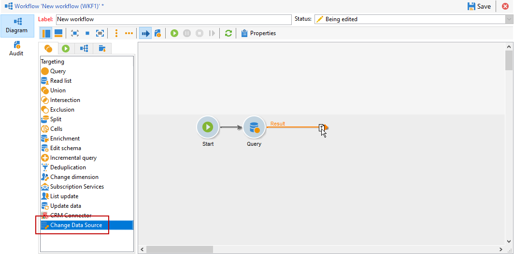

# Cambio de la fuente de datos {#change-data-source}

>[!NOTE]
>
> La actividad **[!UICONTROL Change data source]** solo está disponible con el paquete **[!UICONTROL Access to external data (Federated Data Access)]**. Para obtener más información sobre los paquetes integrados de Adobe Campaign Classic, consulte esta [página](../../installation/using/installing-campaign-standard-packages.md).

La actividad **[!UICONTROL Change data source]** permite cambiar la fuente de datos de un flujo de trabajo **[!UICONTROL Working table]**. Esto proporciona más flexibilidad para administrar los datos en diferentes fuentes de datos, como FDA, FFDA y bases de datos locales.

La **[!UICONTROL Working table]** permite que el flujo de trabajo de Adobe Campaign Classic gestione y comparta datos con las actividades de flujo de trabajo.
De forma predeterminada, la **[!UICONTROL Working table]** se crea en la misma base de datos que la fuente de los datos que consultamos.

Por ejemplo, al consultar la tabla **[!UICONTROL Profiles]**, almacenada en la base de datos en la nube, creará una **[!UICONTROL Working table]** en la misma base de datos en la nube.
Para cambiar esto, puede añadir la actividad **[!UICONTROL Change Data Source]** para elegir una fuente de datos diferente para su **[!UICONTROL Working table]**.

Tenga en cuenta que al utilizar la actividad **[!UICONTROL Change Data Source]**, deberá volver a la base de datos en la nube para continuar con la ejecución del flujo de trabajo.

Para utilizar la actividad **[!UICONTROL Change Data Source]**:

1. Cree un flujo de trabajo.

1. Consulte los destinatarios objetivo con una actividad **[!UICONTROL Query]**.

   Para obtener más información sobre la actividad **[!UICONTROL Query]**, consulte esta [página](../../workflow/using/query.md#creating-a-query)

1. En la pestaña **[!UICONTROL Targeting]**, añada una actividad **[!UICONTROL Change data source]**.

   

1. Haga doble clic en la actividad **[!UICONTROL Change data source]** para seleccionar **[!UICONTROL Default data source]**.

   La tabla de trabajo, que contiene el resultado de la consulta, se mueve a la base de datos predeterminada PostgreSQL.

   

1. En la pestaña **[!UICONTROL Actions]**, arrastre y suelte una actividad **[!UICONTROL JavaScript code]** para realizar operaciones unitarias en la tabla de trabajo.

   Para obtener más información sobre la actividad **[!UICONTROL JavaScript code]**, consulte la página [Código JavaScript y código JavaScript avanzado](../../workflow/using/sql-code-and-javascript-code.md#javascript-code).

1. Añada otra actividad **[!UICONTROL Change data source]** para volver a la base de datos en la nube.

1. Haga doble clic en la actividad y seleccione **[!UICONTROL Active FDA external account]**, y luego escoja la cuenta externa **[!UICONTROL External database]** correspondiente.

   

1. Ahora puede iniciar el flujo de trabajo.
