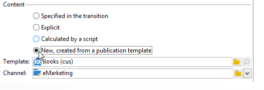

# Gestión de contenido{#content-management}

Una actividad de **Content management** (gestión de contenido) permite crear y manipular contenidos y generar archivos basados en este contenido. Este contenido se puede entregar a través de la actividad “Envío”.

>[!CAUTION]
>
>El Gestor de contenido es un módulo opcional de Adobe Campaign. Compruebe el acuerdo de licencia.

Las propiedades de la actividad se dividen en tres pasos:

* **Content selection**: el contenido se puede crear previamente o a través de la actividad.
* **Content update**: la tarea puede modificar el asunto del contenido o importar todo el contenido XML.
* **Action**: el contenido resultante se puede guardar o generar.

   

   Para obtener más información sobre la configuración y el uso del Gestor de contenidos en Adobe Campaign, consulte esta [sección](../../delivery/using/about-content-management.md).

1. **Content**

   * **[!UICONTROL Specified in the transition]**

      This option lets you use the content specified in the transition, i.e. the event that activates content management must contain a **[!UICONTROL contentId]** variable. Esta variable puede haber sido configurada por un gestor de contenido anterior o por cualquier script.

   * **[!UICONTROL Explicit]**

      This option lets you select a content already created, via the **[!UICONTROL Content]** field. This field is visible only when the **[!UICONTROL Explicit]** option is selected.

      

   * **[!UICONTROL Calculated by a script]**

      El identificador de contenido se calcula mediante una secuencia de comandos. The **[!UICONTROL Script]** field lets you define a JavaScript template evaluating the identifier (primary key) of the content. This field is visible only when the **[!UICONTROL Calculated by a script]** option is selected.

      

   * **[!UICONTROL New, created from a publication template]**

      Crea un nuevo contenido a partir de una plantilla de publicación. This new content will be saved in the file specified in the **[!UICONTROL String]** field. The **[!UICONTROL Template]** field specifies the publication template to be used to create the content.

      

1. **Update content**

   * **[!UICONTROL Subject]**

      Este campo permite modificar el asunto del contenido.

   * **[!UICONTROL Access to data from an XML feed]**

      Esta opción permite construir el contenido de un documento XML descargado mediante una hoja de estilos XSL. When this option is selected, the **[!UICONTROL URL]** field specifies the XML content downloading URL. The **[!UICONTROL XSL stylesheet]** lets you specify the stylesheet to be used to transform the downloaded XML document. Esta propiedad es opcional.

      

1. **Acción que quiere ejecutar**

   * **[!UICONTROL Save]**

      Esta opción guarda el contenido creado o modificado.

      The outbound transition is activated only once, with the content saved in the **[!UICONTROL contentId]** variable as a parameter.

   * **[!UICONTROL Generate]**

      Esta opción guarda el contenido y genera los archivos de salida para cada plantilla de transformación con una publicación de tipo “Archivo”.

      

      The outbound transition is activated for each file generated with the identifier of the content saved in the **[!UICONTROL contentId]** variable as its parameter and the filename in the **[!UICONTROL filename]** variable.

## Parámetros de entrada {#input-parameters}

* contentId

Identifier of the content to be used if the **[!UICONTROL Specified in the transition]** option is enabled.

## Parámetros de salida {#output-parameters}

* contentId

   Identificador de contenido.

* filename

   Full name of the generated file if the selected action is **[!UICONTROL Generate]**.

## Ejemplos {#examples}

Se ofrecen ejemplos en esta [sección](../../delivery/using/automating-via-workflows.md#examples).
