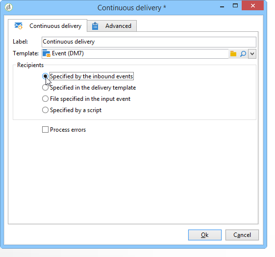

# Envío continuo{#continuous-delivery}

Una acción del tipo **Continuous delivery** permite agregar nuevos destinatarios a un envío existente. Este tipo de envío evita tener que crear una nueva entrega cada vez que: Este modo suele ser más eficaz, en particular para las alertas de bajo volumen o las notificaciones enviadas cuando es necesario. A nivel de la plantilla de envío, puede especificar un script para calcular la etiqueta (y la carpeta de la campaña) del envío asociado. Si la secuencia de comandos calcula un envío que aún no existe, se crea sobre la marcha.

The **[!UICONTROL Process errors]** option displays a particular transition which will be activated if an error is generated. En este caso, el flujo de trabajo no pasa al modo de error y se activa con la ejecución.

Los errores que se tienen en cuenta son los errores del sistema de archivos (el archivo no se puede mover, no se puede acceder a un directorio, etc.).

Esta opción no procesa los errores relacionados con la configuración de la actividad, es decir, valores no válidos.

## Parámetros de entrada {#input-parameters}

* tableName
* esquema

Cada evento entrante debe especificar un objetivo definido por estos parámetros.

Solo cuando la **[!UICONTROL Specified by the inbound event]** opción está seleccionada.

## Parámetros de salida {#output-parameters}

* tableName
* esquema
* recCount

Este conjunto de tres valores identifica el objetivo resultante del envío sobre la marcha. **[!UICONTROL tableName]** es el nombre de la tabla que memoriza los identificadores del objetivo, **[!UICONTROL schema]** es el esquema de la población (normalmente nms:Recipiente) y **[!UICONTROL recCount]** es el número de elementos de la tabla.

La transición asociada al complemento tiene los mismos parámetros.
