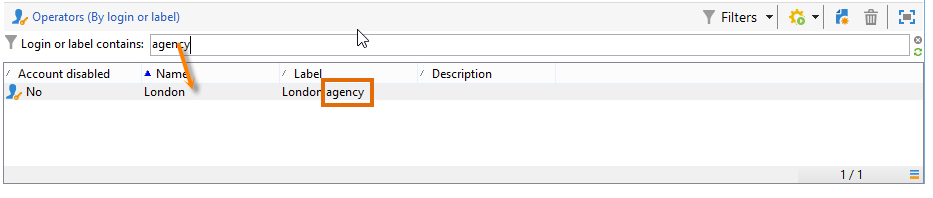
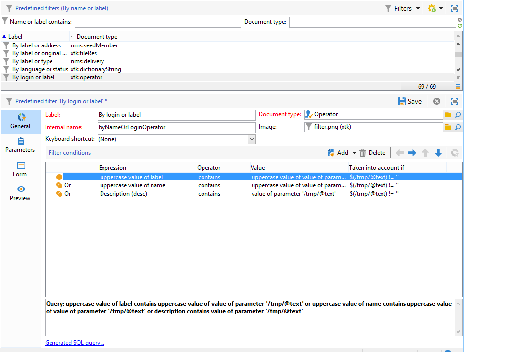

# Creación de filtros {#creating-a-filter}

Los filtros disponibles en Adobe Campaign se definen mediante condiciones de filtrado que se crean con el mismo modo de funcionamiento que las consultas.

>[!NOTE]
>
>Para obtener más información sobre creación de filtros, consulte [esta sección](../../platform/using/filtering-options.md).

El nodo **[!UICONTROL Administration > Configuration > Predefined filters]** contiene todos los filtros utilizados en las listas y vistas generales.

Por ejemplo, la lista de operadores puede filtrarse con **[!UICONTROL Active accounts]**:

El filtro coincidente contiene la consulta en el valor **[!UICONTROL Account disabled]** del esquema **[!UICONTROL Operators]**:

En la misma lista, el filtro **[!UICONTROL By login or label]** permite filtrar los datos de la lista en función del valor introducido en el campo de filtro:

Se crea de la siguiente manera:

Para hacer coincidir las condiciones de filtrado, la cuenta de operador debe comprobar una de las siguientes condiciones:

* Su etiqueta contiene los caracteres introducidos en el campo de entrada,
* El nombre del operador contiene los caracteres introducidos en el campo de entrada,
* El contenido del área de descripción contiene los caracteres introducidos en el campo de entrada.

>[!NOTE]
>
>La función **[!UICONTROL Upper]** permite desactivar la función que distingue entre mayúsculas y minúsculas.

La columna **[!UICONTROL Taken into account if]** permite definir los criterios de aplicación para estas condiciones de filtrado. En este caso, los caracteres **$(/tmp/@text)** representan el contenido del campo de entrada vinculado al filtro:

Aquí, **$(/tmp/@text)=&#39;agency&#39;**

La expresión **$(/tmp/@text)!=&#39;&#39;** aplica cada condición cuando el campo de entrada no está vacío.
