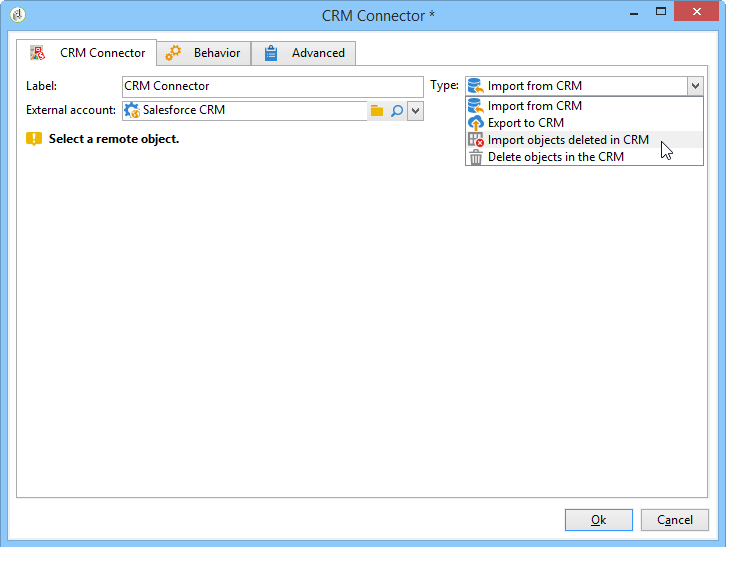

# Conector CRM{#crm-connector}

La actividad del **conector CRM** permite configurar la sincronización de datos entre Adobe Campaign y un sistema CRM.

Para obtener más información sobre conectores CRM en Adobe Campaign, consulte [esta sección](../../platform/using/crm-connectors.md).

Con esta actividad, puede:

* Importación desde CRM
* Exportación a CRM
* Importación de objetos eliminados en CRM
* Eliminación de objetos en CRM

Seleccionar la cuenta externa que coincide con el CRM con el que desea configurar la sincronización y, a continuación, seleccione el objeto que se va a sincronizar (cuentas, oportunidades, contactos, etc.).

La configuración de esta actividad depende del proceso que se realice. Varias configuraciones se detallan [en esta página](../../platform/using/crm-data-sync.md).
