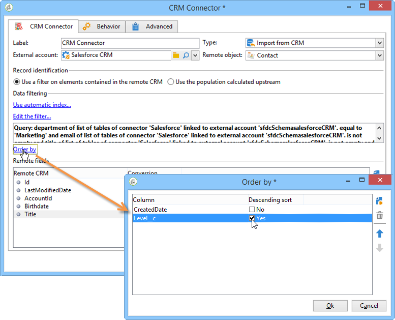
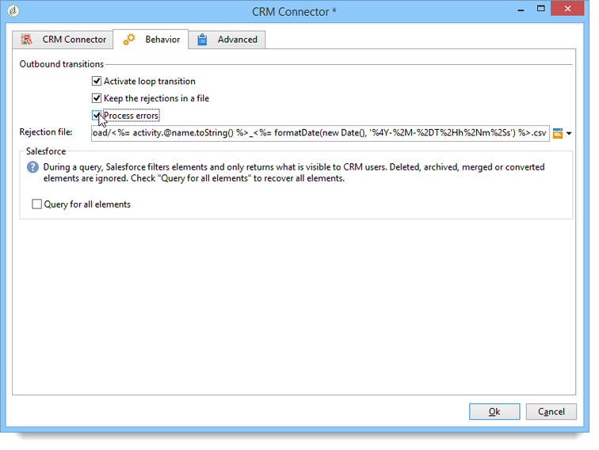

# Conectores CRM{#crm-connector}

**CRM connector** permite configurar la sincronización de datos entre Adobe Campaign y un CRM.

Para obtener más información sobre conectores CRM en Adobe Campaign, consulte [esta sección](../../platform/using/crm-connectors.md).

Esto significa que se puede:

* Importar desde CRM (consulte [Importación desde CRM](#importing-from-the-crm)),
* Exportar a CRM (consulte [Exportación a CRM](#exporting-to-the-crm)),
* Importar objetos eliminados en la CRM (consulte [Importación de objetos eliminados en la CRM](#importing-objects-deleted-in-the-crm)),
* Eliminar objetos en CRM (consulte [Eliminación de objetos en CRM](#deleting-objects-in-the-crm)).


Seleccionar la cuenta externa que coincide con el CRM con el que desea configurar la sincronización y, a continuación, seleccione el objeto que se va a sincronizar (cuentas, oportunidades, contactos, etc.).


La configuración de esta actividad depende del proceso que se realice. A continuación se describen varias configuraciones.

## Importación desde CRM {#importing-from-the-crm}

Para importar datos a través de CRM en Adobe Campaign, debe crear el siguiente tipo de flujo de trabajo:


Para una actividad de importación, los pasos de configuración de actividad del **conector CRM** son:

1. Seleccione una **[!UICONTROL Import from the CRM]** operación.
1. Go to the **[!UICONTROL Remote object]** drop-down list and select the object concerned by the process. Este objeto coincide con una de las tablas creadas en Adobe Campaign durante la configuración del conector.
1. Go to the **[!UICONTROL Remote fields]** section and enter the fields to be imported.

   To add a field, click the **[!UICONTROL Add]** button in the toolbar, then click the **[!UICONTROL Edit expression]** icon.

   

   If necessary, alter the data format via the drop-down list of the **[!UICONTROL Conversion]** columns. Los tipos de conversión posibles se encuentran detallados en esta [página](../../platform/using/crm-connectors.md#data-format).

   >[!CAUTION]
   >
   >El identificador del registro en CRM es obligatorio para enlazar objetos en CRM y en Adobe Campaign. Se añade automáticamente cuando se aprueba la actividad.
   > 
   >La fecha de modificación del servidor CRM también es obligatoria para las importaciones de datos incrementales.

1. También puede filtrar los datos para importarlos según sus necesidades. Para ello, haga clic en el **[!UICONTROL Edit the filter...]** vínculo.

   En el siguiente ejemplo, Adobe Campaign solo importa contactos para los que se haya registrado alguna actividad desde el 31 de julio de 2012.

   

   The limitations linked to data filtering modes are detailed in [Filter on data](#filter-on-data) section.

1. The **[!UICONTROL Use automatic index]** option enables you to automatically manage incremental object synchronization between the CRM and Adobe Campaign, depending on the date and their last modification.

   For more on this, refer to [Variable management](#variable-management).

## Administración de variables {#variable-management}

Enabling the **[!UICONTROL Automatic index]** option lets you collect only objects modified since the last import.


La fecha de la última sincronización se almacena de forma predeterminada en la opción especificada en la ventana de configuración:

```
LASTIMPORT_<%=instance.internalName%>_<%=activityName%>
```

Puede especificar el campo remoto CRM que desea tener en cuenta para identificar los cambios más recientes.

De forma predeterminada, se utilizan los campos siguientes (en el orden especificado):

* Para Microsoft Dynamics: **modificado**,
* Para Oracle On Demand: **ÚltimaActualización**, **FechaDeModificación**, **ÚltimoInicioDeSesión**,
* Para Salesforce.com: **LastModifiedDate**, **SystemModstamp**.

Activating the **[!UICONTROL Automatic index]** option generates three variables that can be used in the synchronization workflow via a **[!UICONTROL JavaScript code]** type activity. Estas actividades son:

* **varscrmOptionName**: representa el nombre de la opción que contiene la última fecha de importación.
* **vars.crmStartImport**: representa la fecha de inicio (incluida) de la última recuperación de datos.
* **vars.crmEndDate**: representa la fecha de finalización (excluida) de la última recuperación de datos.

   Estas fechas se muestran en el siguiente formato: **aaaa/MM/dd hh:mm:ss**.

## Filtros en datos {#filter-on-data}

Para garantizar una operación eficaz con los distintos CRM, es necesario crear filtros con las siguientes reglas:

* Cada nivel de filtrado solo puede utilizar un tipo de operador lógico.
* No se admite el operador EXCEPT (AND NOT).
* Las comparaciones solo pueden tener como resultado valores nulos (“está vacío”/“no está vacío”) o números. This means that once the **[!UICONTROL Value]** column (right-hand column) is assessed, the result of this assessment must be a number.
* The data in the **[!UICONTROL Value]** column is assessed in JavaScript.
* No se admiten comparaciones JOIN.
* La expresión de la columna de la izquierda debe ser un campo. No puede ser una combinación de varias expresiones, un número, etc.

Por ejemplo, la condición de filtrado que se muestra a continuación NO será válida para una importación de CRM, ya que:

* El operador OR se coloca en el mismo nivel que los operadores AND.
* Las comparaciones se llevan a cabo en cadenas de texto.


## Ordenar por {#order-by}

En Microsoft Dynamics y Salesforce.com, puede ordenar los campos remotos para que se importen en orden ascendente o descendente.

To do this, click the **[!UICONTROL Order by]** link and add the columns to the list.

El orden de las columnas de la lista es el orden de clasificación:



## Identificación de registro {#record-identification}

En lugar de importar elementos incluidos (y posiblemente filtrados) en CRM, puede utilizar una población calculada con anterioridad en el flujo de trabajo.

To do this, select the **[!UICONTROL Use the population calculated upstream]** option and specify the field that contains the remote identifier.

A continuación, seleccione los campos de la población entrante que desea importar, como se muestra a continuación:


## Exportación a CRM {#exporting-to-the-crm}

Exportar los datos de Adobe Campaign en CRM permite copiar todo el contenido en una base de datos de CRM.

Para exportar datos a CRM, debe crear el siguiente tipo de flujo de trabajo:


Para una exportación, aplique la configuración siguiente en la actividad del **conector de CRM** :

1. Seleccione una **[!UICONTROL Export to CRM]** operación.
1. Go to the **[!UICONTROL Remote object]** drop-down list and select the object concerned by the process. Este objeto coincide con una de las tablas creadas en Adobe Campaign durante la configuración del conector.

   >[!CAUTION]
   >
   >La función de exportación de la actividad de **conectores de CRM** puede insertar o actualizar campos en el lado del CRM. Para activar las actualizaciones de campo en el CRM, debe especificar la clave principal de la tabla remota. Si falta la clave, se insertan los datos (en lugar de actualizarse).

1. In the **[!UICONTROL Mapping]** section, specify the fields to be exported and their mapping in the CRM.

   

   To add a field, click the **[!UICONTROL Add]** button in the toolbar, then click the **[!UICONTROL Edit expression]** icon.

   En un campo determinado, si no hay ninguna coincidencia definida en el lado del CRM, los valores no se pueden actualizar: se insertan directamente en el CRM.

   If necessary, alter the data format via the drop-down list of the **[!UICONTROL Conversion]** columns. Los tipos de conversión posibles se encuentran detallados en esta [sección](../../platform/using/crm-connectors.md#data-format).

   La lista de registros que se van a exportar y el resultado de la exportación se guardan en un archivo temporal que permanece accesible hasta que el flujo de trabajo termina o se reinicia. Esto le permite volver a iniciar el proceso en caso de errores sin correr el riesgo de exportar el mismo registro varias veces o perder datos.

## Formato de datos y procesamiento de errores {#data-format-and-error-processing}

Puede convertir el formato de los datos sobre la marcha al importarlos desde o hacia CRM.

Para ello, seleccione la conversión que se aplica en la columna correspondiente.


The **[!UICONTROL Default]** mode applies automatic data conversion, which in most cases equals a copy/paste of the data. Sin embargo, se aplica la administración de zona horaria.

Otras conversiones posibles son:

* **[!UICONTROL Date only]**:: este modo elimina los campos de tipo Fecha + Hora.
* **[!UICONTROL Without time offset]**:: este modo cancela la administración de huso horario aplicada en el modo predeterminado.
* **[!UICONTROL Copy/Paste]**:: este modo utiliza datos sin procesar como cadenas (sin conversión).



Dentro del marco de las importaciones o exportaciones de datos, puede aplicar un proceso específico a errores y rechazos. Para ello, seleccione las opciones **[!UICONTROL Process rejects]** y **[!UICONTROL Process errors]** en la **[!UICONTROL Behavior]** ficha.

Estas opciones colocan las transiciones de salida coincidentes.


A continuación, coloque las actividades relevantes para los procesos que desee aplicar.

Por ejemplo, para procesar errores puede añadir una actividad de espera y planificar los reintentos de los flujos de trabajo.

Los rechazos se recopilan junto con el código de error y el mensaje relacionado, lo que significa que puede configurar el seguimiento de rechazos para optimizar el proceso de sincronización.

Even when the **[!UICONTROL Process rejects]** option isn&#39;t enabled, a warning is generated for each rejected column with an error code and message.

The **[!UICONTROL Reject]** outbound transition lets you access the output schema that contains the specific columns relevant to error messages and codes. Estas columnas son:

* For Oracle On Demand: **errorLogFilename** (name of the log file on the Oracle side), **errorCode** (error code), **errorSymbol** (error symbol, different from the error code), **errorMessage** (description of the error context).
* For Salesforce.com: **errorSymbol** (error symbol, different from the error code), **errorMessage** (description of the error context).

## Importación de objetos eliminados en CRM {#importing-objects-deleted-in-the-crm}

Para habilitar la configuración de un proceso de sincronización de datos extenso, puede importar los objetos eliminados en el CRM a Adobe Campaign.

Para ello, siga los siguientes pasos:

1. Seleccione una **[!UICONTROL Import objects deleted in the CRM]** operación.
1. Go to the **[!UICONTROL Remote object]** drop-down list and select the object concerned by the process. Este objeto coincide con una de las tablas creadas en Adobe Campaign durante la configuración del conector.
1. Specify the deletion period to be taken into account in the **[!UICONTROL Start date]** and the **[!UICONTROL End date]** fields. Estas fechas se incluyen en el período.

   

   >[!CAUTION]
   >
   >El período de eliminación de elementos debe coincidir con las limitaciones específicas del CRM. Esto significa que para Salesforce.com, por ejemplo, los elementos eliminados hace más de 30 días no se pueden recuperar.

## Eliminación de objetos en CRM {#deleting-objects-in-the-crm}

Para eliminar objetos en CRM, debe especificar la clave principal de los elementos remotos que desea eliminar.


The **[!UICONTROL Behavior]** tab lets you enable the processing of rejects. This option generates a second output transition for the **[!UICONTROL CRM connector]** activity. Para obtener más información, consulte [esta sección](../../platform/using/crm-connectors.md#error-processing).

Even when the **[!UICONTROL Process rejects]** option is disabled, a warning is generated for each rejected column.

## Ejemplo de configuración de una importación de contactos {#example-of-how-to-configure-a-contact-import}

En el ejemplo siguiente, la actividad se configura para importar contactos de un Oracle On Demand CRM. Antes de importarse, los campos CRM se seleccionan de manera que coincidan con los que ya existen en la base de datos de Adobe Campaign.


