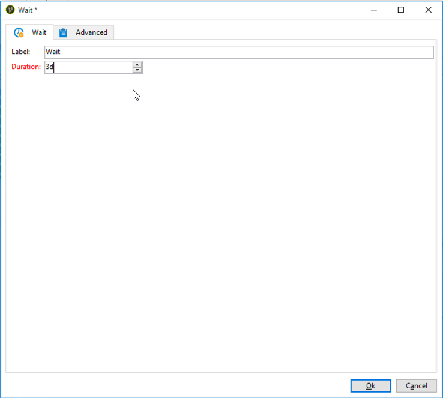

# Flujo de trabajo de entrega por canales cruzados{#cross-channel-delivery-workflow}

Este caso de uso presenta un ejemplo que implica un flujo de trabajo de envío por canales cruzados. En [esta sección](../../workflow/using/cross-channel-deliveries.md) se presenta el concepto general de envíos por canales cruzados.

El objetivo es segmentar a un público de los destinatarios de la base de datos en grupos diferentes con el fin de enviar un correo electrónico a un grupo y un mensaje SMS a otro grupo.

Los pasos de implementación principales para este caso de uso son los siguientes:

1. Creating a **[!UICONTROL Query]** activity to target your audience.
1. Creating an **[!UICONTROL Email delivery]** activity containing a link to an offer.
1. Using a **[!UICONTROL Split]** activity to:

   * Enviar otro correo electrónico a los destinatarios que no hayan abierto el primer correo electrónico.
   * Enviar un SMS a los destinatarios que abrieron el correo electrónico pero que no hicieron clic en el vínculo de la oferta.
   * Agregar a la base de datos los destinatarios que abrieron el correo electrónico e hicieron clic en el vínculo.

## Paso 1: Segmentación de la audiencia {#step-1--targeting-the-audience}

Para definir el objetivo, cree una consulta para identificar los destinatarios.

1. Cree una campaña. Para obtener más información, consulte [esta sección](../../campaign/using/setting-up-marketing-campaigns.md#creating-a-campaign).
1. En la pestaña **[!UICONTROL Targeting and workflows]** de la campaña, añada una actividad **Query** al flujo de trabajo. Para obtener más información sobre esta actividad, consulte [esta sección](../../workflow/using/query.md).
1. Defina los destinatarios que recibirán las entregas. Por ejemplo, seleccione miembros “Gold” como el entorno objetivo.
1. Agregue condiciones de filtro a la consulta. En este ejemplo, seleccione destinatarios que tengan una dirección de correo electrónico y un número de móvil.

   

1. Guarde los cambios.

## Paso 2: Crear un correo electrónico que incluya una oferta {#step-2--creating-an-email-including-an-offer}

1. Create an **[!UICONTROL Email delivery]** activity and double-click it in your workflow to edit it. Para obtener más información sobre la creación de correos electrónicos, consulte [esta sección](../../delivery/using/about-email-channel.md).
1. Diseñe el mensaje e inserte un vínculo que incluya una oferta en el contenido.

   

   Para obtener más información sobre la integración de una oferta en el cuerpo de un mensaje, consulte [esta sección](../../interaction/using/integrating-an-offer-via-the-wizard.md#delivering-with-a-call-to-the-offer-engine).

1. Guarde los cambios.
1. Right-click the **[!UICONTROL Email delivery]** activity to open it.
1. Select the **[!UICONTROL Generate an outbound transition]** option to recover the population and the tracking logs.

   

   Esto permite utilizar dicha información para efectuar otro envío según los comportamientos de los destinatarios al recibir el primer correo electrónico.

1. Add a **[!UICONTROL Wait]** activity to let a few days for the recipients to open the email.

   

## Paso 3: Segmentación del público resultante {#step-3--segmenting-the-resulting-audience}

Una vez identificado el objetivo y que se haya creado el primer envío, se debe segmentar el objetivo en diferentes poblaciones utilizando condiciones de filtrado.

1. Agregue una actividad **Split** al flujo de trabajo y ábrala. Para obtener más información sobre esta actividad, consulte [esta sección](../../workflow/using/split.md).
1. Cree tres segmentos a partir de la población calculada de forma ascendente en la consulta.

   

1. Para el primer subconjunto, seleccione la **[!UICONTROL Add a filtering condition on the inbound population]** opción y haga clic en **[!UICONTROL Edit]**.

   

1. Seleccione **[!UICONTROL Recipients of a delivery]** como filtro de restricción y haga clic en **[!UICONTROL Next]**.

   

1. In the filter settings, select **[!UICONTROL Recipients who have not opened or clicked (email)]** from the **[!UICONTROL Behavior]** drop-down list and select the email including the offer you want to send from the delivery list. Haga clic en **[!UICONTROL Finish]**.

   

1. Proceda de forma similar para el segundo subconjunto y seleccione **[!UICONTROL Recipients who have not clicked (email)]** en la **[!UICONTROL Behavior]** lista desplegable.

   

1. Para el tercer subconjunto, después de seleccionar el **[!UICONTROL Add a filtering condition on the inbound population]** y hacer clic en **[!UICONTROL Edit]**, seleccione la **[!UICONTROL Use a specific filtering dimension]** opción.
1. Seleccione **[!UICONTROL Recipient tracking log]** en la lista **[!UICONTROL Filtering dimension]** desplegable, resalte **[!UICONTROL Filtering conditions]** en el **[!UICONTROL List of restriction filters]** y haga clic en **[!UICONTROL Next]**.

   

1. Seleccione las condiciones de filtrado como se indica a continuación:

   

1. Click **[!UICONTROL Finish]** to save your changes.

## Paso 4: Finalizar del flujo de trabajo {#step-4--finalizing-the-workflow}

1. Add the relevant activities to your workflow after the three subsets resulting from the **[!UICONTROL Split]** activity:

   * Add an **[!UICONTROL Email delivery]** activity to send a reminder email to the first subset.
   * Add a **[!UICONTROL Mobile delivery]** activity to send an SMS message to the second subset.
   * Add a **[!UICONTROL List update]** activity to add the corresponding recipients to the database.

1. Haga doble clic en las actividades de envío del flujo de trabajo para editarlas. Para obtener más información sobre la creación de un correo electrónico y de un mensaje SMS, consulte [Canal de correo electrónico](../../delivery/using/about-email-channel.md) y [Canal SMS](../../delivery/using/sms-channel.md).
1. Haga clic con el doble en la **[!UICONTROL List update]** actividad y seleccione la **[!UICONTROL Generate an outbound transition]** opción.

   A continuación, se puede exportar los destinatarios resultantes de Adobe Campaign a Adobe Experience Cloud. For example, you can use the audience in Adobe Target by adding an **[!UICONTROL Update shared audience]** activity to the workflow. Para obtener más información, consulte [Exportación de público](../../integrations/using/importing-and-exporting-audiences.md#exporting-an-audience).

1. Haga clic en el botón **Inicio** de la barra de acciones para ejecutar el flujo de trabajo.

La población a la que se dirige la actividad **Consulta** se segmenta para recibir un correo electrónico o un SMS según los comportamientos de los destinatarios. The remaining population will be added to the database using the **[!UICONTROL List update]** activity.
