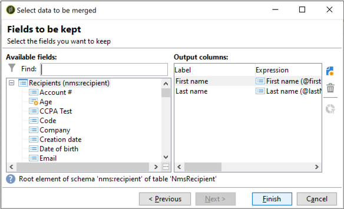

# Uso de la funcionalidad Combinar de la actividad de Deduplicaciones {#deduplication-merge}

## Acerca de este caso de uso {#about-this-use-case}

Este caso de uso describe cómo utilizar la funcionalidad **[!UICONTROL Merge]** en la actividad **[!UICONTROL Deduplication]**.

Para obtener más información sobre esta funcionalidad, consulte [esta sección](../../workflow/using/deduplication.md#merging-fields-into-single-record).

La actividad **[!UICONTROL Deduplication]** se utiliza para eliminar filas de duplicado de un conjunto de datos. En este caso de uso, los datos que se muestran a continuación se duplican en función del campo Correo electrónico.

| Fecha de la última modificación | Nombre | Apellido | Correo electrónico | Teléfono móvil | Teléfono |
|-----|------------|-----------|-------|--------------|------|
| 19/5/2020 | Robert | Tisner | bob@mycompany.com | 444-444-444 | 777-777-7777 |
| 22/7/2020 | Bobby | Tisner | bob@mycompany.com |  | 777-777-7777 |
| 03/10/2020 | Bob |  | bob@mycompany.com |  | 888-888-8888 |

Con la funcionalidad **[!UICONTROL Merge]** de la actividad de Deduplicación, puede configurar un conjunto de reglas para la deduplicación a fin de definir un grupo de campos para combinar en un único registro de datos resultante. Por ejemplo, con un conjunto de registros de duplicado, puede elegir mantener el número de teléfono más antiguo o el nombre más reciente.

## Activación de la funcionalidad Combinar {#activating-merge}

Para habilitar la funcionalidad de combinación, primero debe configurar la actividad **[!UICONTROL Deduplication]**. Para ello, siga estos pasos:

1. Abra la actividad y haga clic en el vínculo **[Editar configuración]**.

1. Select the reconciliation field to use for the deduplication, then click **[!UICONTROL Next]**. En este ejemplo, queremos anular la duplicación en función del campo de correo electrónico.

   

1. Haga clic en el vínculo **[!UICONTROL Advanced parameters]** y active las opciones **[!UICONTROL Merge records]** y **[!UICONTROL Use several record merging criteria]**.

   

1. La ficha **[!UICONTROL Merge]** se agrega a la pantalla de configuración **[!UICONTROL Deduplication]**. Utilizaremos esta ficha para especificar los datos que se combinarán al realizar la deduplicación.

## Configuración de los campos para combinar {#configuring-rules}

Estas son las reglas que queremos utilizar para combinar los datos en un único registro:

* Mantener el nombre más reciente (campos de nombre y apellidos),
* Mantener el teléfono móvil más reciente,
* Mantenga el número de teléfono más antiguo,
* Todos los campos de un grupo no deben ser nulos para poder acceder al registro final.

Para configurar estas reglas, siga estos pasos:

1. Abra la ficha **[!UICONTROL Merge]** y haga clic en el botón **[!UICONTROL Add]**.

   

1. Especifique el identificador y la etiqueta del grupo de campos que se van a combinar.

   

1. Indíquense las condiciones para seleccionar los registros que deben tenerse en cuenta.

   

1. Se ordenan en la fecha de la última modificación para seleccionar el nombre más reciente.

   

1. Seleccione los campos que desea combinar. En este ejemplo, queremos mantener los campos de nombre y apellido.

   

1. Los campos se agregan al conjunto de datos para combinar y se agrega un nuevo elemento al esquema de flujo de trabajo.

   Repita estos pasos para configurar los campos de teléfono y teléfono móvil.

   

   

## Resultados {#results}

Después de configurar estas reglas, se reciben los siguientes datos al final de la actividad **[!UICONTROL Deduplication]**.

| Fecha de modificación | Nombre | Apellido | Correo electrónico | Teléfono móvil | Teléfono |
-----|------------|-----------|-------|--------------|------|
| 19/5/2020 | Robert | Tisner | bob@mycompany.com | 444-444-444 | 777-777-7777 |
| 22/7/2020 | Bobby | Tisner | bob@mycompany.com |  | 777-777-7777 |
| 03/10/2020 | Bob |  | bob@mycompany.com |  | 888-888-8888 |

El resultado se combina de los tres registros según las reglas configuradas anteriormente. Tras la comparación, se concluye que se utilizan el nombre y el teléfono móvil más recientes, junto con el número de teléfono original.

| Nombre | Apellido | Correo electrónico | Teléfono móvil | Teléfono |
|------------|-----------|-------|--------------|------|
| Bobby | Tisner | bob@mycompany.com | 444-444-4444 | 888-888-8888 |

>[!NOTE]
>
> Tenga en cuenta que el nombre que se ha combinado es &quot;Bobby&quot;, ya que configuramos una regla de &quot;Nombre&quot; hecha tanto del nombre como de los últimos campos.
>
>Como resultado, &quot;Bob&quot; (el nombre más reciente) no se pudo tener en cuenta porque el campo de apellido asociado estaba vacío. La combinación más reciente de nombres y apellidos se combinó en el registro final.
