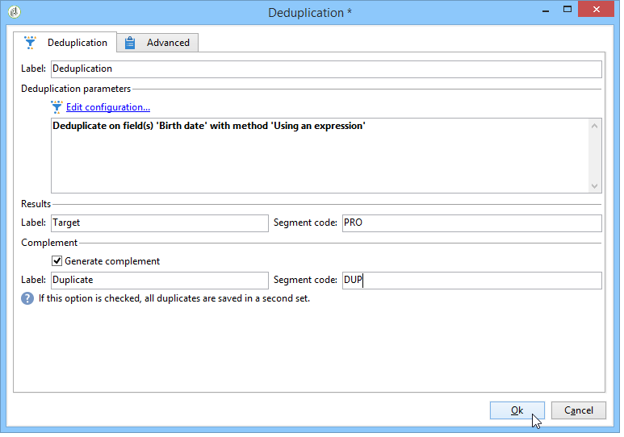

# Deduplicación{#deduplication}

La deduplicación elimina los duplicados de los resultados de las actividades entrantes. La deduplicación se puede realizar en la dirección de correo electrónico, el número de teléfono u otro campo.

## Prácticas recomendadas {#best-practices}

Durante la deduplicación, los flujos entrantes se procesan por separado. Si por ejemplo el destinatario A se encuentra en el resultado de la consulta 1 y en el resultado de la consulta 2, no se deduplican.

Esta cuestión debe solucionarse de la siguiente manera:

* Cree una actividad **Union** para unificar cada flujo entrante.
* Cree una actividad **Deduplication** después de la actividad **Union**.

## Configuración {#configuration}

Para configurar una deduplicación, introduzca su etiqueta, el método, los criterios de deduplicación y las opciones relativas al resultado.

Haga clic en el enlace **[!UICONTROL Edit configuration...]** para definir el modo de anulación de duplicación.

1. Selección de objetivo

   Seleccione el tipo de objetivo para esta actividad (de forma predeterminada, la deduplicación hace referencia a los destinatarios) y el criterio que se utilizará, es decir, el campo para el que los valores idénticos permiten identificar duplicados: direcciones de correo electrónico, número de teléfono o móvil, número de fax o dirección de correo directo.

   

   >[!NOTE]
   >
   >Si utiliza datos externos como entrada, por ejemplo, de un archivo externo, asegúrese de seleccionar la opción **[!UICONTROL Temporary schema]**.

   >
   >En el siguiente paso, la opción **[!UICONTROL Other]** permite seleccionar los criterios que se van a utilizar:

   

1. Métodos de deduplicación

   En la lista desplegable, seleccione el método de deduplicación que desea utilizar e introduzca el número de duplicados que desea conservar.

   

   Los métodos disponibles son:

   * **[!UICONTROL Choose for me]**: selecciona de forma aleatoria el registro que se va a excluir de los duplicados.
   * **[!UICONTROL Following a list of values]**: permite definir una prioridad de valor para uno o varios campos. Para definir los valores, seleccione un campo o cree una expresión y, a continuación, añada los valores a la tabla adecuada. Para definir un nuevo campo, haga clic en el botón **[!UICONTROL Add]** situado sobre la lista de valores.

      

   * **[!UICONTROL Non-empty value]**: esto permite mantener registros para los que el valor de la expresión seleccionada no está vacío como prioridad.

      

   * **[!UICONTROL Using an expression]**: permite mantener los registros con el valor más bajo (o el más alto) de la expresión dada.

      
   Haga clic en **[!UICONTROL Finish]** para aprobar el método de deduplicación seleccionado.

   La sección de en medio de la ventana resume la configuración definida.

   En la sección inferior de la ventana del editor de actividad, puede modificar la etiqueta para la transición de salida del objeto gráfico e introducir un código de segmento que se asociará al resultado de la actividad. Este código se puede utilizar posteriormente como criterio de establecimiento de objetivos.

   

   Seleccione la opción **[!UICONTROL Generate complement]** si desea utilizar la población restante. El complemento está formado por todos los duplicados. A continuación, se agregará una transición adicional a la actividad de la siguiente manera:

   

## Ejemplo: identificar los duplicados antes de una entrega {#example--identify-the-duplicates-before-a-delivery}

En el ejemplo siguiente, la deduplicación se refiere a la unión de tres consultas.

El objetivo del flujo de trabajo es definir el objetivo de una entrega mediante la exclusión de los duplicados para evitar enviarlo al mismo destinatario varias veces.

Los duplicados identificados también se incorporarán a una lista de duplicados que puede reutilizarse en caso necesario.

1. Agregue y vínculo las distintas actividades necesarias para que el flujo de trabajo funcione como se muestra arriba.

   La actividad de unión se utiliza aquí para “unificar” las tres consultas en una sola transición. Por lo tanto, la deduplicación no funcionará para cada consulta por separado pero para toda la consulta. Para obtener más información, consulte [Prácticas recomendadas](#best-practices).

1. Abra la actividad de anulación de duplicación y haga clic en el enlace **[!UICONTROL Edit configuration...]** para definir el modo de anulación de la duplicación.
1. En la nueva ventana, seleccione **[!UICONTROL Database schema]**.
1. Seleccione **Recipients** como dimensiones de destino y filtrado.
1. Seleccione el campo ID de los duplicados **[!UICONTROL Email]** para enviar la entrega solo una vez a cada dirección de correo electrónico y haga clic en **[!UICONTROL Next]**.

   Si desea establecer las ID duplicadas en un campo específico, seleccione **[!UICONTROL Other]** para acceder a la lista de campos disponibles.

1. Elija si desea conservar solo una entrada cuando se identifique la misma dirección de correo electrónico para varios destinatarios.
1. Seleccione el modo de deduplicación **[!UICONTROL Choose for me]** para que los registros guardados en caso de duplicados identificados se elijan aleatoriamente y, a continuación, haga clic en **[!UICONTROL Finish]**.

Al ejecutar el flujo de trabajo, todos los destinatarios identificados como duplicados se excluyen del resultado (y, por lo tanto, de la entrega) y se añaden a la lista de duplicados. Esta lista puede utilizarse de nuevo en lugar de tener que volver a identificar los duplicados.

## Parámetros de entrada {#input-parameters}

* tableName
* esquema

Cada evento entrante debe especificar un objetivo definido por estos parámetros.

## Parámetros de salida {#output-parameters}

* tableName
* esquema
* recCount

Este conjunto de tres valores identifica el objetivo resultante de la deduplicación. **[!UICONTROL tableName]** es el nombre de la tabla que guarda los identificadores objetivo, **[!UICONTROL schema]** es el esquema de la población (normalmente nms:recipient) y **[!UICONTROL recCount]** es el número de elementos en la tabla.

La transición asociada al complemento tiene los mismos parámetros.
