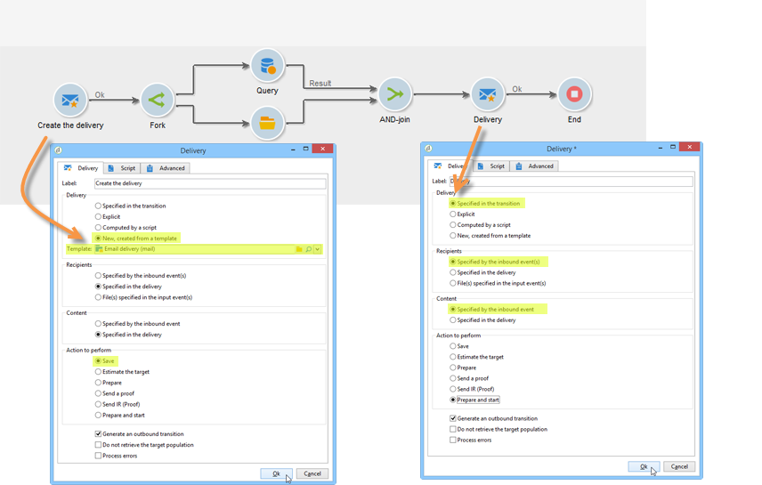
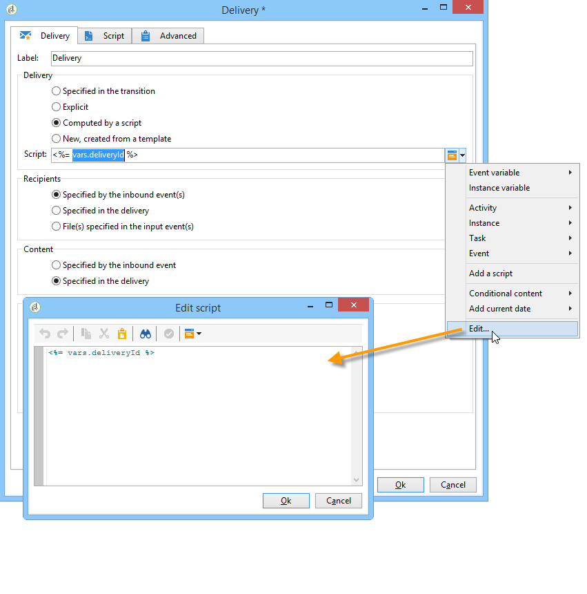
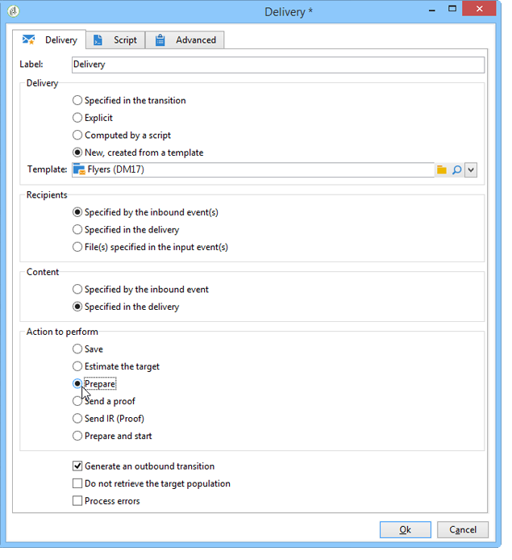

# Envío{#delivery}

Una actividad de tipo **Delivery** permite crear una acción de envío. Se puede construir utilizando elementos de entrada.

Para configurarlo, edite la actividad e introduzca las opciones de envío.


1. **Envío**

   Se puede:

   * Actuar sobre el envío especificado en la transición entrante. To do this, select the first option of the **[!UICONTROL Delivery]** section of the window.

      Esta opción se puede utilizar si ya se ha creado o especificado una actividad de flujo de trabajo anterior. Esto se puede hacer, como en el ejemplo a continuación, con una actividad del mismo tipo que generó una transición saliente.

      En el ejemplo siguiente, se crea el envío por primera vez. La población y el contenido se definen más adelante. A continuación, la información de estos tres elementos se reingresa en una nueva actividad de envío utilizando la transición entrante para que se pueda enviar.

      

   * Seleccione directamente el envío correspondiente. To do this, select the **[!UICONTROL Explicit]** option and select the delivery from the drop-down list of the **[!UICONTROL Delivery]** field.

      La lista muestra los envíos no finalizados contenidos en la carpeta **Envíos** de forma predeterminada. To access other campaigns, click the **[!UICONTROL Select link]** icon.

      

      Select the campaign from the drop-down list of the **[!UICONTROL Folder]** field, or click **[!UICONTROL Display sub-levels]** to display all of the deliveries contained in sub-folders:

      

      After selecting the delivery action, you can display the content by clicking the **[!UICONTROL Edit link]** icon.

   * Cree una secuencia de comandos para calcular el envío. To do this, select the **[!UICONTROL Calculated by a script]** option and enter the script. You can open an input window by clicking the **[!UICONTROL Edit...]** option. El ejemplo siguiente recupera el identificador del envío:

      

   * Crear un envío nuevo. To do this, select the **[!UICONTROL New, created from a template]** option and select the delivery template which the delivery will be based on.

      

      Click the **[!UICONTROL Select link]** icon to browse the folders, and click the **[!UICONTROL Edit link]** icon if you wish to view the content of the selected template.

1. **Recipients**

   Los eventos de entrada pueden especificar los destinatarios, por ejemplo, con una importación de archivos o especificados en la acción de envío. También pueden almacenarse en uno o más archivos.

   

1. **Content**

   El contenido del mensaje se puede definir en el envío o en el evento de entrada.

   

1. **Acción que quiere ejecutar**

   Puede crear el envío, prepararlo, iniciarlo, estimar el objetivo o enviar una prueba.

   

   Seleccione el tipo de acción que se va a realizar:

   * **[!UICONTROL Save]**:: esta opción le permite crear la entrega y guardarla. No lo analiza ni lo envía.
   * **[!UICONTROL Estimate the target]**:: esta opción le permite calcular el objetivo de entrega para evaluar su potencial (primera fase de análisis). This action is the equivalent of selecting the **[!UICONTROL Estimate the population to be targeted]** option and clicking **[!UICONTROL Analyze]** when sending a delivery to the main target via **Delivery**.
   * **[!UICONTROL Prepare]**:: esta opción le permite ejecutar el proceso de análisis completo (cálculo de objetivos y preparación de contenido). No se manda el envío. This action is the equivalent of selecting the **[!UICONTROL Deliver as soon as possible]** option and clicking **[!UICONTROL Analyze]** when sending a delivery to the main target with **Delivery**.
   * **[!UICONTROL Send a proof]**:: esta opción le permite enviar una prueba del envío. This action is the equivalent of clicking the **[!UICONTROL Send a proof]** button in the toolbar of a delivery with **Delivery**
   * **[!UICONTROL Prepare and start]**:: esta opción inicia el proceso de análisis completo (cálculo de objetivos y preparación de contenido) y envía la entrega. Esta acción equivale a hacer clic en **[!UICONTROL Deliver as soon as possible]**, **[!UICONTROL Analyze]** y **[!UICONTROL Confirm delivery]** cuando se envía un envío al destino principal con **Entrega**.
   The **[!UICONTROL Act on a delivery]** activity used further on in the workflow lets you launch all remaining steps required for starting the delivery (target calculation, content preparation, delivery). For more on this, refer to [Delivery control](../../workflow/using/delivery-control.md).

   Las siguientes opciones también están disponibles:

   * **[!UICONTROL Generate an outbound transition]**

      Crea una transición saliente que se activará al final de la ejecución. Puede elegir si desea o no recuperar el objetivo del envío saliente.

   * **[!UICONTROL Do not recover target]**

      No recupera el objetivo de la acción de envío saliente.

   * **[!UICONTROL Processing errors]**

      Refer to [Delivery control](../../workflow/using/delivery-control.md).
   La pestaña **Script** permite modificar los parámetros de envío.

   

## Ejemplo: flujo de trabajo del envío {#example--delivery-workflow}

Cree un nuevo flujo de trabajo y añada actividades como se muestra en el gráfico siguiente:


Abra la actividad **Delivery** y defina las propiedades como se indica a continuación:

* En la **[!UICONTROL Delivery]** sección, seleccione **[!UICONTROL New, created from a template]** y seleccione una plantilla de envío.
* En la **[!UICONTROL Recipients]** sección, seleccione **[!UICONTROL Specified in the delivery]**.
* En la **[!UICONTROL Action to execute]** sección, mantenga la **[!UICONTROL Prepare]** opción.



Click **[!UICONTROL OK]** to close the properties window. Acaba de configurar una actividad que consista en crear y preparar un nuevo envío basado en una plantilla de envío cuyo objetivo se especificará ahí dentro.

Abra la actividad **Approval** y defina las propiedades como se indica a continuación:

1. In the **[!UICONTROL Assignment type]** field, select a group in which you are registered. Si está conectado con la cuenta “admin”, seleccione el grupo Administración.
1. A continuación, introduzca un título e inserte el texto siguiente en el cuerpo del mensaje:

   ```
   Do you wish to approve delivery (<%= vars.recCount %> recipient(s))?
   ```

   Este es un mensaje que incluye una expresión escrita en JavaScript: **[!UICONTROL vars.recCount]** representa el número de destinatarios objetivo por el envío de la tarea anterior. Para obtener más información sobre las expresiones JavaScript, consulte las plantillas [y secuencias de comandos](../../workflow/using/javascript-scripts-and-templates.md)JavaScript.

   

   The Approval task is detailed in [Approval](../../workflow/using/approval.md).

## Parámetros de entrada {#input-parameters}

Identificador de entrega, si la **[!UICONTROL Specified in the transition]** opción está seleccionada en la **[!UICONTROL Delivery]** sección.

* deliveryId
* tableName
* esquema

Cada evento entrante debe especificar un objetivo definido por estos parámetros.

>[!NOTE]
>
>Este parámetro solo aparece si la **[!UICONTROL Specified by inbound event(s)]** opción está seleccionada en la **[!UICONTROL Recipients]** sección.

* filename

   Nombre completo del archivo generado si la **[!UICONTROL File(s) specified by inbound event(s)]** opción está seleccionada en la **[!UICONTROL Recipients]** sección.

* contentId

   Identificador de contenido si la **[!UICONTROL Specified by inbound events]** opción está seleccionada en la **[!UICONTROL Content]** sección.

## Parámetros de salida {#output-parameters}

* tableName
* esquema
* recCount

Este conjunto de tres valores identifica el objetivo resultante del envío. **[!UICONTROL tableName]** es el nombre de la tabla que memoriza los identificadores del destino, **[!UICONTROL schema]** es el esquema de la población (normalmente nms:Recipiente) y **[!UICONTROL recCount]** es el número de elementos de la tabla.

La transición asociada al complemento tiene los mismos parámetros.

>[!NOTE]
>
>There are no output parameters when the **[!UICONTROL Do not recover target]** option is selected.

