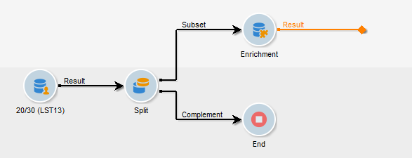

# Enriquecimiento de correo electrónico con campos de datos personalizados{#email-enrichment-with-custom-date-fields}

En este ejemplo, deseamos enviar un correo electrónico con campos de datos personalizados a los destinatarios que celebran su cumpleaños este mes. El correo electrónico incluirá un cupón válido una semana antes y después de su cumpleaños.

We need to target recipients from a list who will celebrate their birthdays this month with a **[!UICONTROL Split]** activity. Then, using the **[!UICONTROL Enrichment]** activity, the custom data field will act as validity dates in the email for the customer&#39;s special offer.


Para crear este ejemplo, aplique los pasos siguientes:

1. In the **[!UICONTROL Targeting and workflows]** tab of your campaign, drag and drop a **[!UICONTROL Read list]** activity to target your list of recipients.
1. La lista que se desea procesar se puede especificar explícitamente, calcularse por una secuencia de comandos o localizarse dinámicamente, según las opciones seleccionadas y los parámetros definidos aquí.

   

1. Add a **[!UICONTROL Split]** activity to differentiate recipients who will celebrate their birthdays this month from other recipients.
1. Para dividir la lista, en la **[!UICONTROL Filtering of selected records]** categoría, seleccione **[!UICONTROL Add a filtering condition on the inbound population]**. A continuación, haga clic en **[!UICONTROL Edit]**.

   

1. Select **[!UICONTROL Filtering conditions]** then click the **[!UICONTROL Edit expression]** button to filter the month of the recipient&#39;s birthday.

   

1. Haga clic **[!UICONTROL Advanced Selection]** y luego **[!UICONTROL Edit the formula using an expression]** agregue la siguiente expresión: Month(@bornDate).
1. En la **[!UICONTROL Operator]** columna, seleccione la **[!UICONTROL equal to]**.
1. Further filter your condition, by adding the **[!UICONTROL Value]** month of the current date: Month(GetDate()).

   Esto consulta a los destinatarios cuyo mes de cumpleaños corresponda al mes actual.

   

1. Haga clic **[!UICONTROL Finish]**. A continuación, en la **[!UICONTROL General]** ficha de su **[!UICONTROL Split]** actividad, haga clic en la **[!UICONTROL Generate complement]** en la **[!UICONTROL Results]** categoría.

   With the **[!UICONTROL Complement]** result, you can add a delivery activity or update a list. Here, we just added an **[!UICONTROL End]** activity.

   

You now need to configure your **[!UICONTROL Enrichment]** activity:

1. Add an **[!UICONTROL Enrichment]** activity after your subset to add your custom date fields.

   

1. Abra la **[!UICONTROL Enrichment]** actividad. En la **[!UICONTROL Complementary information]** categoría, haga clic en **[!UICONTROL Add data]**.

   

1. Seleccione **[!UICONTROL Data linked to the filtering dimension]** luego **[!UICONTROL Data of the filtering dimension]**.
1. Haga clic en el botón **[!UICONTROL Add]**.

   

1. Agregue un **[!UICONTROL Label]**. A continuación, en la **[!UICONTROL Expression]** columna, haga clic en **[!UICONTROL Edit expression]**.

   

1. En primer lugar, se debe establecer como objetivo la semana antes del cumpleaños como **Fecha de inicio de validez** con la siguiente **[!UICONTROL Expression]**: `SubDays([target/@birthDate], 7)`.

   

1. A continuación, para crear el campo de fecha personalizado **Fecha de fin de validez**, que abarca la semana después del cumpleaños, se debe agregar la **[!UICONTROL Expression]**: `AddDays([target/@birthDate], 7)`.

   Se puede añadir una etiqueta a la expresión.

   

1. Haga clic **[!UICONTROL Ok]**. El enriquecimiento está listo.

After your **[!UICONTROL Enrichment]** activity, you can add a delivery. En este caso, agregamos un envío por correo electrónico para enviar a los destinatarios una oferta especial con fechas de validez para los clientes que celebran su cumpleaños ese mes.

1. Drag and drop an **[!UICONTROL Email delivery]** activity after your **[!UICONTROL Enrichment]** activity.

   

1. Double-click your **[!UICONTROL Email delivery]** activity to start personalizing your delivery.
1. Add a **[!UICONTROL Label]** to your delivery and click **[!UICONTROL Continue]**.
1. Click **[!UICONTROL Save]** to create your email delivery.
1. Compruebe la **[!UICONTROL Approval]** ficha del envío por correo electrónico **[!UICONTROL Properties]** en la que **[!UICONTROL Confirm delivery before sending option]** está marcado.

   A continuación, inicie el flujo de trabajo para enriquecer la transición saliente con la información objetivo.

   

You can now start designing your email delivery with the custom date fields created in the **[!UICONTROL Enrichment]** activity.

1. Haga doble clic en su **[!UICONTROL Email delivery]** actividad.
1. Añada sus extensiones de destino al correo electrónico. Debe estar dentro de la siguiente expresión para configurar el formato de las fechas de validez:

   ```
   <%=
           formatDate(targetData.alias of your expression,"%2D.%2M")  %>
   ```

1. Haga clic  . Select **[!UICONTROL Target extension]** then the previously created custom validity dates with the **[!UICONTROL Enrichment]** activity to add your extension to the formatDate expression.

   

1. Configure su contenido de correo electrónico según sea necesario.

   

1. Previsualice el correo electrónico para comprobar si los campos de fecha personalizados se han configurado correctamente.

   

Su correo electrónico está listo. Puede comenzar a enviar las pruebas y confirmar su entrega para enviar sus correos electrónicos de cumpleaños.
