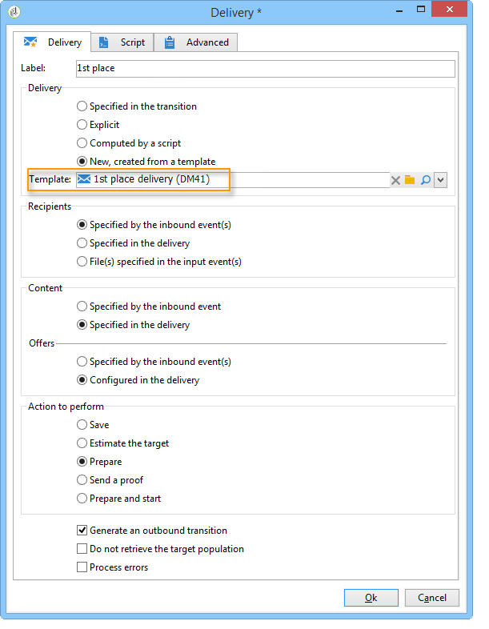

# Enriquecimiento de datos{#enriching-data}

## Acerca del enriquecimiento de datos {#about-enriching-data}

Este caso de uso detalla posibles usos de la actividad **[!UICONTROL Enrichment]** en un flujo de trabajo de objetivo. Para obtener más información sobre el uso de la actividad **[!UICONTROL Enrichment]**, consulte: [Enrichment](../../workflow/using/enrichment.md).

En [esta sección](../../workflow/using/email-enrichment-with-custom-date-fields.md)también encontrará un caso de uso para enriquecer un envío de correo electrónico con fechas personalizadas.

Se envía una invitación a los contactos de la base de datos de marketing para que participen en una competición a través de una aplicación web. Los resultados de la competición se recuperan en la tabla **[!UICONTROL Competition results]**. Esta tabla está vinculada a la tabla de contacto (**[!UICONTROL Recipients]**). The **[!UICONTROL Competition results]** table contains the following fields:

* Nombre de la competición (@game)
* Número de prueba (@trial)
* Puntuación (@score)

Se puede vincular un contacto de la tabla **[!UICONTROL Recipients]** a varias líneas de la tabla **[!UICONTROL Competition results]**. La relación entre estas dos tablas es de tipo 1-n. A continuación, se muestra un ejemplo de los registros de resultados de un destinatario:

El objetivo de este caso de uso es realizar envíos personalizados a las personas que forman parte de la competición más reciente según sus puntuaciones más altas. El destinatario con la máxima puntuación obtiene el primer premio, el destinatario con la segunda puntuación más alta obtiene un premio de consolación y todos los demás obtienen un mensaje que les desea mejor suerte para la próxima.

Para configurar este caso de uso, se ha creado el siguiente flujo de trabajo de objetivo:

Para crear el flujo de trabajo, siga los siguientes pasos:

1. Se agregan dos actividades **[!UICONTROL Query]** y una actividad **[!UICONTROL Intersection]** para dirigirse a los nuevos suscriptores que acaban de ingresar en la competición.
1. The **[!UICONTROL Enrichment]** activity enables us to add data stored in the **[!UICONTROL Competition results]** table. El campo **[!UICONTROL Score]** en el que se desea realizar la personalización de la entrega se agrega a la tabla de trabajo del flujo de trabajo.
1. La actividad **[!UICONTROL Split]** permite crear subconjuntos de destinatarios en función de puntuaciones.
1. Para cada subconjunto, se agrega una actividad **[!UICONTROL Delivery]**.

## Paso 1: Composición {#step-1--targeting}

La primera consulta permite dirigirse a los destinatarios que se agregaron a la base de datos en los últimos seis meses.

La segunda consulta permite dirigirse a los destinatarios que participaron en la última competición.

A continuación, se agrega una actividad **[!UICONTROL Intersection]** para dirigirse a los destinatarios agregados a la base de datos en los últimos seis meses y que ingresaron en la última competición.

## Paso 2: Composición {#step-2--enrichment}

En este ejemplo, se desea personalizar las entregas según el campo **[!UICONTROL Score]** almacenado en la tabla **[!UICONTROL Competition results]**. Esta tabla tiene una relación de tipo 1-n con la tabla de destinatarios. La actividad **[!UICONTROL Enrichment]** permite agregar datos de una tabla vinculada al entorno de filtrado con la tabla de trabajo del flujo de trabajo.

1. En la pantalla de edición de la actividad de enriquecimiento, seleccione **[!UICONTROL Add data]**, luego **[!UICONTROL Data linked to the filtering dimension]** haga clic en **[!UICONTROL Next]**.

   

1. A continuación, seleccione la **[!UICONTROL Data linked to the filtering dimension]** opción, seleccione la **[!UICONTROL Competition results]** tabla y haga clic en **[!UICONTROL Next]**.

   

1. Enter an ID and a label, and select the **[!UICONTROL Limit the line count]** option in the **[!UICONTROL Data collected]** field. In the **[!UICONTROL Lines to retrieve]** field, select &#39;1&#39; as a value. Para cada destinatario, la actividad de enriquecimiento agrega una sola línea desde la tabla **[!UICONTROL Competition results]** a la tabla de trabajo del flujo de trabajo. Haga clic **[!UICONTROL Next]**.

   

1. En este ejemplo, se desea recuperar la puntuación más alta del destinatario, pero solo para la última competición. Para ello, agregue un filtro al campo **[!UICONTROL Competition name]** para excluir todas las líneas relacionadas con competiciones anteriores. Haga clic **[!UICONTROL Next]**.

   

1. Vaya a la pantalla **[!UICONTROL Sort]** y haga clic en el botón **[!UICONTROL Add]**, seleccione el campo **[!UICONTROL Score]** y marque la casilla de la columna **[!UICONTROL descending]** para ordenar los elementos de los campos **[!UICONTROL Score]** en orden descendente. Para cada destinatario, la actividad de enriquecimiento agrega una línea que coincide con la puntuación más alta para el último juego. Haga clic **[!UICONTROL Next]**.

   

1. In the **[!UICONTROL Data to add]** window, double-click the **[!UICONTROL Score]** field. Para cada destinatario, la actividad de enriquecimiento agrega solamente el campo **[!UICONTROL Score]**. Haga clic **[!UICONTROL Finish]**.

   

Right-click the inbound transition of the enrichment activity and select **[!UICONTROL Display the target]**. La tabla de trabajo contiene los siguientes datos:

El esquema vinculado es:

Realice nuevamente esta operación en la transición saliente de la actividad de enriquecimiento. Se puede ver que se han agregado los datos vinculados a las puntuaciones del destinatario. Se ha recuperado la mayor puntuación de cada destinatario.

El esquema coincidente también se ha enriquecido.

## Paso 3: División y envío {#step-3--split-and-delivery}

Para ordenar los destinatarios según sus puntuaciones, se agrega una actividad **[!UICONTROL Split]** después del enriquecimiento.

1. Se ha definido un primer subconjunto (**Winner**) para incluir el destinatario con la máxima puntuación. Para ello, defina una limitación del número de registros, aplique una ordenación descendente a la puntuación y limite el número de registros a 1.

   

1. El segundo subconjunto (**Second place**) incluye el destinatario con la segunda puntuación más alta. La configuración es la misma que para el primer subconjunto.

   

1. El tercer subconjunto (**losers**) contiene todos los demás destinatarios. Vaya a la pestaña **[!UICONTROL General]** y marque la casilla **[!UICONTROL Generate complement]** para dirigirse a todos los destinatarios que no alcancen las dos puntuaciones más altas.

   

1. Agregue una actividad **[!UICONTROL Delivery]** para cada subconjunto mediante una plantilla de envío diferente para cada uno.

   

