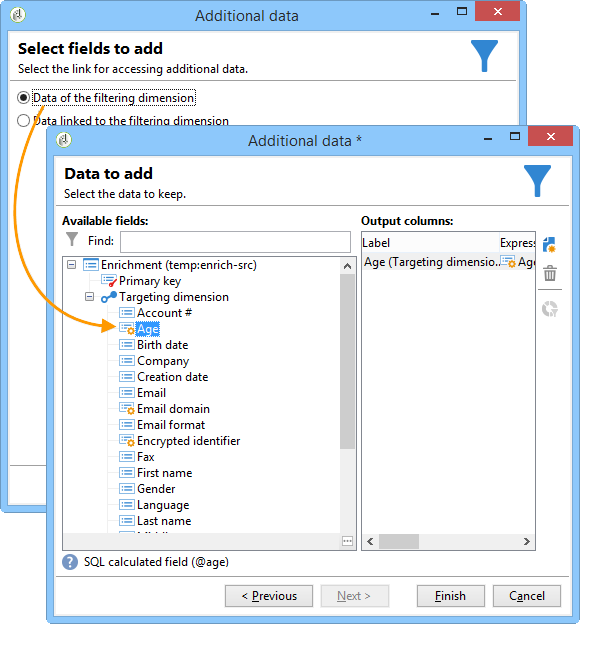
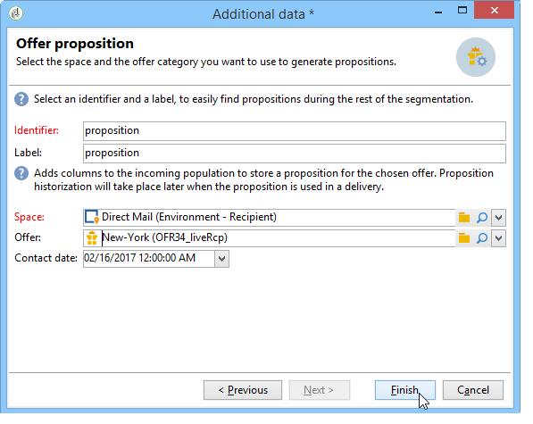

# Enriquecimiento{#enrichment}

The **[!UICONTROL Enrichment]** activity lets you add information to a profile list and links to an existing table (create a new join). También se pueden definir criterios de comparación con los perfiles de la base de datos.


## Definiciones {#definitions}

Para utilizar la actividad de enriquecimiento, debe estar familiarizado con las diversas opciones disponibles al agregar datos.


La **[!UICONTROL Data linked to the filtering dimension]** opción le permite acceder a:

* Datos de la dimensión de filtrado: acceso a los datos de la tabla de trabajo
* Datos vinculados a la dimensión del filtrado: acceso a los datos vinculados a la tabla de trabajo


The **[!UICONTROL A link]** option lets you create a join on any table of the database.


Existen cuatro tipos de enlaces:

* **[!UICONTROL Define a collection]**:: permite definir un vínculo con una cardinalidad 1-N entre las tablas.
* **[!UICONTROL Define a link whose target is still available]**:: permite definir un vínculo con una cardinalidad 1-1 entre tablas. Las condiciones de la unión deben estar definidas por un único registro en la tabla de destino.
* **[!UICONTROL Define a link whose target does not necessarily exist in the base]**:: permite definir un vínculo con una cardinalidad 0-1 entre tablas. La condición que los una debe definirse por el registro de 0 o 1 (máximo) en la tabla objetivo.

   Esta opción está configurada en la ficha a la que se puede acceder a través del **[!UICONTROL Simple Join]** vínculo de la **[!UICONTROL Edit additional data]** **[!UICONTROL Enrichment]** actividad.

* **[!UICONTROL Define a link by searching for a reference among several options]**:: este tipo de vínculo define una reconciliación hacia un registro único. Adobe Campaign crea un enlace a una tabla de destino agregando una clave externa en la tabla objetivo para almacenar una referencia del registro único.

   Esta opción está configurada en la ficha a la que se puede acceder a través del **[!UICONTROL Reconciliation and deduplication]** vínculo de la **[!UICONTROL Edit additional data]** **[!UICONTROL Enrichment]** actividad.

Los casos de uso de [Enriquecimiento de datos](../../workflow/using/enriching-data.md) y [Creación de una lista](../../workflow/using/creating-a-summary-list.md) resumida detallan el funcionamiento de las actividades de Enriquecimiento en su contexto.

## Adición de información {#adding-information}

Use the **[!UICONTROL Enrichment]** activity to add columns to a work table: this activity can be used as a complement to a query activity.

The configuration of additional columns is detailed in [Adding data](../../workflow/using/query.md#adding-data).

The **[!UICONTROL Primary set]** field lets you select the inbound transition: the data of this activity&#39;s worktable will be enriched.

Haga clic en el **[!UICONTROL Add data]** vínculo y seleccione el tipo de datos que desee agregar. La lista de tipos de datos ofrecidos depende de los módulos y las opciones instalados en la plataforma. En una configuración básica, siempre se pueden agregar datos vinculados a la dimensión de filtrado y al enlace.


En el ejemplo que se muestra a continuación, la transición saliente se ampliará con información sobre la edad de los perfiles destinatarios.



Haga clic con el botón derecho en la transición entrante de la actividad desarrollada para ver los datos antes de la fase de incremento.


La tabla de resultados contiene el esquema asociado y los siguientes datos:


Repita esta operación en la salida de la fase de ampliación.


Se puede ver que se han agregado los datos relativos a las edades:


El esquema coincidente también se ha enriquecido.

## Gestión de datos adicionales {#managing-additional-data}

Deselect the **[!UICONTROL Keep all additional data from the main set]** option if you do not want to keep the previously defined additional data. En este caso, solo las columnas adicionales seleccionadas en la actividad de ampliación se añadirán a la tabla de resultados saliente. La información adicional añadida a las actividades anteriores no se guardará.


Los datos y el esquema en la salida de la fase de ampliación serán los siguientes:


## Creación de un enlace {#creating-a-link}

Se puede utilizar la actividad de ampliación para crear un enlace entre los datos de trabajo y la base de datos de Adobe Campaign: será un enlace local al flujo de trabajo entre los datos entrantes.

Por ejemplo, si se cargan datos de un archivo que contiene el número de cuenta, el país y el correo electrónico de los destinatarios, se deberá crear un enlace hacia la lista del país para actualizar esta información en sus perfiles.

Para ello, siga los siguientes pasos:

1. Recopile y cargue el siguiente tipo de archivo:

   ```
   Account number;Country;Email
   18D65;FRANCE;agnes@gmail.com
   243PP;RUSSIA;paul@gmail.com
   55H87;CROATIA;dave@gmail.com
   56U81;USA;susan@gmail.com
   853PI;ITALY;anna@gmail.com
   890LP;FRANCE;robert@gmail.com
   83TY2;SWITZERLAND;mike@gmail.com
   ```

1. Edite la actividad de ampliación y haga clic en el enlace **Add data...** para establecer un vínculo con la lista del país.

   

1. Seleccione la **[!UICONTROL Link definition]** opción y haga clic en el **[!UICONTROL Next]** botón. Especifique el tipo de enlace que se va a crear. En este ejemplo, se desea enlazar el país del destinatario del archivo con un país en la lista de países disponibles de la lista de la base de datos. Elija la **[!UICONTROL Define a link by searching for a reference among several options]** opción. Select the country table in the **[!UICONTROL Target schema]** field.

   

1. Finalmente, seleccione los campos que le permitirán vincular los valores del archivo de origen a los de la base de datos.

   

En la salida de esta actividad de ampliación, el esquema temporal contendrá el enlace a la lista del país:


## Comparación de datos {#data-reconciliation}

La actividad de ampliación se puede utilizar para configurar la comparación de datos, incluso una vez cargados la información en la base de datos. In this case, the **[!UICONTROL Reconciliation]** tab lets you define the link between the data in the Adobe Campaign database and the data in the work table.

Select the **[!UICONTROL Identify the targeting document based on work data]** option, specify the schema you want to create a link to and define the joining conditions: to do this, select the fields to be reconciled in the work data (**[!UICONTROL Source expression]**) and in the targeting dimension (**[!UICONTROL Destination expression]**).

Se pueden utilizar uno o más criterios de comparación.


Si se especifican varias condiciones de vínculo, todas deben verificarse para que los datos puedan vincularse.

## Inserción de una propuesta de oferta {#inserting-an-offer-proposition}

La actividad de enriquecimiento permite añadir ofertas o enlaces a ofertas para los destinatarios del envío.

Para obtener más información sobre la actividad de enriquecimiento, consulte esta [sección](../../workflow/using/enrichment.md).

Por ejemplo, puede ampliar los datos de una consulta al destinatario antes de un envío.


Después de configurar la consulta (consulte esta [sección](../../workflow/using/query.md)):

1. Añada y abra una actividad de enriquecimiento.
1. En la **[!UICONTROL Enrichment]** ficha, seleccione **[!UICONTROL Add data]**.
1. Select **[!UICONTROL An offer proposition]** in the types of data to add.

   

1. Especifique un identificador y una etiqueta para la propuesta a añadir.
1. Especifique la selección de la oferta. Hay dos formas de hacerlo:

   * **[!UICONTROL Search for the best offer in a category]**:: marque esta opción y especifique los parámetros de llamada del motor de oferta (espacio de oferta, categoría o tema(s), fecha de contacto, número de ofertas que desea mantener). Según estos parámetros, el motor calculará automáticamente las ofertas a agregar. We recommend completing either the **[!UICONTROL Category]** or the **[!UICONTROL Theme]** field, rather than both at the same time.

      

   * **[!UICONTROL A predefined offer]**: marque esta opción y especifique un espacio de oferta, una oferta específica y una fecha de contacto para configurar directamente la oferta que desee añadir, sin recurrir al motor de oferta.

      

1. A continuación, configure una actividad de envío que corresponda al canal elegido. Consulte Entregas [](../../workflow/using/cross-channel-deliveries.md)multicanal.

   El número de propuestas disponibles para la vista previa depende de la configuración realizada en la actividad de enriquecimiento y no de cualquier configuración realizada directamente en el envío.

Para especificar propuestas de oferta, también se puede optar por hacer referencia al enlace de una oferta. Para obtener más información sobre esto, consulte la siguiente sección [Referencia a un vínculo a una oferta](#referencing-a-link-to-an-offer).

## Referencia al enlace de una oferta {#referencing-a-link-to-an-offer}

También puede hacer referencia a un enlace de oferta en una actividad de ampliación.

Para ello:

1. Seleccione **[!UICONTROL Add data]** en la **[!UICONTROL Enrichment]** ficha de la actividad.
1. In the window where you choose the type of data to add, select **[!UICONTROL A link]**.
1. Seleccione el tipo de enlace que desea establecer y su destino. En este caso, el destino es el esquema de oferta.

   

1. Especifique el vínculo entre los datos de la lista entrante en la actividad de ampliación (lista de destinatarios) y la lista de oferta. Por ejemplo, se puede vincular un código de oferta a un destinatario.

   

1. A continuación, configure una actividad de envío que corresponda al canal elegido. Consulte Entregas [](../../workflow/using/cross-channel-deliveries.md)multicanal.

   >[!NOTE]
   >
   >El número de propuestas disponibles para la vista previa depende de la configuración realizada en el envío.

## Almacenamiento de calificaciones y consideraciones de oferta {#storing-offer-rankings-and-weights}

De forma predeterminada, cuando se utiliza una actividad **enrichment** para entregar ofertas, sus calificaciones y sus consideraciones no se almacenan en la lista de propuestas.

The **[!UICONTROL Offer engine]** activity does store this information by default.

Sin embargo, se puede almacenar esta información de la siguiente manera:

1. Cree un recurso al motor de oferta en una actividad ampliada colocada después de una consulta y antes de una actividad de entrega. Consulte esta [sección](../../interaction/using/integrating-an-offer-via-a-workflow.md#specifying-an-offer-or-a-call-to-the-offer-engine).
1. En la ventana principal de la actividad, seleccione **[!UICONTROL Edit additional data...]**.

   

1. Add the **[!UICONTROL @rank]** columns for the ranking and **[!UICONTROL @weight]** for the offer weight.

   

1. Confirme su adición y guarde el flujo de trabajo.

La entrega almacena automáticamente la clasificación y las consideraciones de las ofertas. This information is visible in the delivery&#39;s **[!UICONTROL Offers]** tab.
