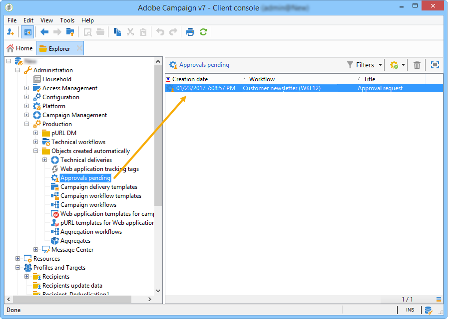

# Ejecución de un flujo de trabajo{#executing-a-workflow}

Las directrices para la resolución de problemas relacionados con la ejecución de flujos de trabajo están disponibles en [esta sección](../../production/using/workflow-execution.md).

## Inicio de un flujo de trabajo {#starting-a-workflow}

Un flujo de trabajo siempre se inicia manualmente. When started, it can however remain inactive depending on the information specified via a scheduler (see [Scheduler](../../workflow/using/scheduler.md)) or activity scheduling.

Las acciones relacionadas con la ejecución del flujo de trabajo de objetivos (inicio, detención, pausa, etc.) son procesos **asíncronos**: el comando se guarda y se aplica en cuanto el servidor esté disponible para su aplicación.

La barra de herramientas permite iniciar y rastrear la ejecución del flujo de trabajo.

The list of options available in the **[!UICONTROL Actions]** menu and the right-click menu are detailed below.

### Barra de herramientas de acciones {#actions-toolbar}

Los botones de la barra de herramientas se encuentran en esta [sección](../../campaign/using/marketing-campaign-deliveries.md#building-the-main-target-in-a-workflow). The **[!UICONTROL Actions]** button gives you access to additional execution options for acting on selected workflows. You can also use the **[!UICONTROL File > Actions]** menu, or right-click a workflow and select **[!UICONTROL Actions]**.


* **[!UICONTROL Start]**

   Esta acción le permite iniciar la ejecución de un flujo de trabajo: un flujo de trabajo que aparezca como **Finalizado**, **Edición en curso** o **En pausa** cambia de estado a **Iniciado**. El motor de flujo de trabajo gestiona entonces la ejecución de este flujo de trabajo. Si el flujo de trabajo estaba en pausa, se reanuda, pero de lo contrario el flujo de trabajo se inicia desde el principio y se activan las actividades iniciales.

   El inicio es un proceso asincrónico: La solicitud se guarda y se procesa lo antes posible mediante un servidor de flujo de trabajo.

* **[!UICONTROL Pause]**

   Esta acción establece el estado del flujo de trabajo como **En pausa**. No se activa ninguna actividad hasta que se reanuda el flujo de trabajo; sin embargo, las operaciones en curso no se detienen.

* **[!UICONTROL Stop]**

   Esta acción detiene un flujo de trabajo que se está ejecutando. El estado de la instancia se establece como **Finalizado**. Las operaciones en curso se detienen, si es posible. Las consultas SQL y las importaciones se cancelan inmediatamente.

   La detención es un proceso asíncrono. La solicitud se registra, y luego el servidor de flujo de trabajo o los servidores cancelan las operaciones en curso. Por lo tanto, la detención de una instancia de flujo de trabajo puede llevar tiempo, especialmente si el flujo de trabajo se ejecuta en varios servidores, cada uno de los cuales debe asumir el control para cancelar las tareas en curso.

* **[!UICONTROL Restart]**

   Esta acción detiene y reinicia el flujo de trabajo. En la mayoría de los casos, es posible reiniciarlo más rápido. También resulta útil automatizar el reinicio cuando la detención lleva una determinada cantidad de tiempo: esto sucede porque el comando “Detener” no está disponible cuando el flujo de trabajo se detiene.

   The **[!UICONTROL Start / Pause / Stop / Restart]** actions are also available via the execution icons in the toolbar. Para obtener más información, consulte [esta sección](../../campaign/using/marketing-campaign-deliveries.md#creating-a-targeting-workflow).

* **[!UICONTROL Purge history]**

   Esta acción permite depurar el historial del flujo de trabajo. For more on this, refer to [Purging the logs](../../workflow/using/monitoring-workflow-execution.md#purging-the-logs).

* **[!UICONTROL Start in simulation mode]**

   Esta opción permite iniciar el flujo de trabajo en modo de simulación, distinto del modo real. This means that when you enable this mode, only activities that do not impact the database or the file system are executed (e.g. **[!UICONTROL Query]**, **[!UICONTROL Union]**, **[!UICONTROL Intersection]**, etc.). Actividades que sí tienen impacto (p. ej. **[!UICONTROL Export]**, **[!UICONTROL Import]**, etc.) no se ejecutan ni los que se encuentran después de ellos (en la misma rama).

* **[!UICONTROL Execute pending tasks now]**

   Esta acción le permite iniciar todas las tareas pendientes lo antes posible. To start a specific task, right-click its activity and select **[!UICONTROL Execute pending task(s) now]**.

* **[!UICONTROL Unconditional stop]**

   This option changes the workflow status to **[!UICONTROL Finished]**. Esta acción debe utilizarse únicamente como último recurso si el proceso de detención normal falla tras varios minutos. Utilice únicamente la detención incondicional si está seguro de que no hay tareas de trabajos de flujo en curso.

   >[!CAUTION]
   >
   >Esta opción se reserva para usuarios expertos.

* **[!UICONTROL Save as template]**

   Esta acción crea una nueva plantilla de flujo de trabajo basada en el flujo de trabajo seleccionado. You need to specify the folder where it will be saved (in the **[!UICONTROL Folder]** field).

   Las opciones **[!UICONTROL Mass update of selected lines]** y **[!UICONTROL Merge selected lines]** son opciones de plataforma genéricas disponibles en todos los **[!UICONTROL Actions]** menús. Para obtener más información, consulte [esta sección](../../platform/using/updating-data.md).

### Menú del botón derecho {#right-click-menu}

Cuando haya seleccionado una o más actividades de flujo de trabajo, puede hacer clic con el botón derecho para actuar sobre la selección.


Las siguientes opciones están disponibles en el menú del botón derecho:

**[!UICONTROL Open]**:: esta opción le permite acceder a las propiedades de la actividad.

**[!UICONTROL Display logs:]** esta opción le permite ver el registro de ejecución de tareas de la actividad seleccionada. Consulte [Visualización de registros](../../workflow/using/monitoring-workflow-execution.md#displaying-logs).

**[!UICONTROL Execute pending task(s) now:]** esta acción le permite iniciar las tareas pendientes lo antes posible.

**[!UICONTROL Workflow restart from a task:]** esta opción le permite reiniciar el flujo de trabajo utilizando los resultados previamente almacenados para esta actividad.

**[!UICONTROL Cut/Copy/Paste/Delete:]** estas opciones le permiten cortar, copiar, pegar y eliminar actividades.

**[!UICONTROL Copy as bitmap:]** esta opción le permite tomar una captura de pantalla de todas las actividades.

**[!UICONTROL Normal execution / Enable but do not execute / Do not enable:]** estas opciones también están disponibles en la **[!UICONTROL Advanced]** ficha de las propiedades de la actividad. They are detailed in [Execution](../../workflow/using/advanced-parameters.md#execution).

**[!UICONTROL Save / Cancel:]** permite guardar o cancelar los cambios realizados en un flujo de trabajo.

>[!NOTE]
>
>Puede seleccionar un grupo de actividades y aplicar uno de estos comandos.

El menú contextual del botón derecho también se detalla en esta [sección](../../campaign/using/marketing-campaign-deliveries.md#executing-a-workflow).

## Ciclo de vida del flujo de trabajo {#workflow-life-cycle}

El ciclo de flujo de trabajo tiene tres pasos principales.

* **Edición en curso**

   Esta es la fase de diseño inicial: Cuando se crea un nuevo flujo de trabajo, su estado es &#39;En proceso de edición&#39;. El flujo de trabajo aún no se gestiona mediante el servidor y puede modificarse sin riesgo.

* **Inicio**

   Una vez completada la fase de inicial de diseño, se puede iniciar el flujo de trabajo. En esta fase, el servidor gestiona la instancia y se ejecutan las tareas individuales. El flujo de trabajo se puede seguir modificando, con ciertas precauciones.

* **Finalizado**

   Un flujo de trabajo está “Finalizado” cuando ya no hay tareas en curso o cuando un operador ha detenido explícitamente la instancia.

Por ejemplo, las actividades **Inicio** y **Envío** se destacan, mientras que la actividad de **Aprobación** parpadea en el flujo de trabajo inferior.


Esto significa que las dos primeras actividades se han ejecutado correctamente y que la aprobación está en curso, es decir, que se ha creado, pero aún no ha finalizado.

Los caracteres **574 -Ok** que se muestran encima de la transición a continuación de la actividad **Envío** indican que la preparación del envío se ha dirigido a 574 destinatarios y que la operación se ha completado correctamente. Esta información, que se añade a las transiciones cuando se ejecutan, se calcula mediante las actividades que procesan datos.

El flujo de trabajo se inicia y está esperando a que un operador que pertenezca al grupo especificado en la actividad **Aprobación** tome una decisión. Se notifica a los operadores que pertenecen al grupo y a los que tienen una dirección de correo electrónico o un número de teléfono móvil.

La administración del operador se explica en [esta sección](../../platform/using/access-management.md).

Para obtener más información sobre cómo supervisar los flujos de trabajo, consulte [esta sección](../../workflow/using/monitoring-workflow-execution.md).

## Ciclo de vida de datos {#data-life-cycle}

### Tabla de trabajo {#work-table}

En los flujos de trabajo, los datos que pasan de una actividad a otra se almacenan en una tabla de trabajo temporal.

Estos datos se pueden mostrar y analizar haciendo clic con el botón derecho en la transición correspondiente.


Para ello, seleccione el menú correspondiente:

* Visualización del público objetivo

   This menu displays the available data on the target population as well as the structure of the work table (**[!UICONTROL Schema]** tab).

   

   Para obtener más información sobre esto, consulte [Tablas de trabajo y esquema](../../workflow/using/monitoring-workflow-execution.md#worktables-and-workflow-schema)de flujo de trabajo.

* Análisis del público objetivo

   Este menú permite acceder al asistente de análisis descriptivo que permite producir las estadísticas y los informes sobre los datos de transición.

   Para obtener más información, consulte [esta sección](../../reporting/using/using-the-descriptive-analysis-wizard.md).

Los datos del público objetivo se depuran mientras se ejecuta el flujo de trabajo. Solo se puede acceder a la última tabla de trabajo. You can configure the workflow so that all work tables remain accessible: check the **[!UICONTROL Keep the result of interim populations between two executions]** option in the workflow properties.

Sin embargo, recomendamos que evite activar esta opción en caso de cantidades importantes de datos.


### Datos de destino {#target-data}

Los datos almacenados en la tabla de trabajo del flujo de trabajo están accesibles en los campos personalizados.

Esto permite utilizar datos recopilados mediante una lista o basados en las respuestas a una encuesta en un envío. Para ello, utilice la siguiente sintaxis:

```
%= targetData.FIELD %
```

**[!UICONTROL Target extension]** Los elementos de personalización de tipo (targetData) no están disponibles para los flujos de trabajo de segmentación. El objetivo del envío debe generarse en el flujo de trabajo y especificarse en la transición entrante del envío.

If you want to create delivery proofs, the proof target needs to be built based on the **[!UICONTROL Address substitution]** mode so that the personalization data can be entered. Para obtener más información, consulte [esta sección](../../delivery/using/steps-defining-the-target-population.md#using-address-substitution-in-proof).

En el siguiente ejemplo, recopilamos una lista de información sobre los clientes para utilizar en un correo electrónico personalizado.

Siga estos pasos:

1. Cree un flujo de trabajo para recopilar información, reconciliarla con los datos que ya se encuentran en la base de datos y, a continuación, iniciar un envío.

   

   En nuestro ejemplo, el contenido del archivo es el siguiente:

   ```
   Music,First name,Last name,Account,CD/DVD,Card
   Pop,David,BLAIR,4323,CD,0
   Rock,Daniel,ARCARI,3222,DVD,1
   Disco,Uma,ALTON,0488,DVD,0
   Jazz,Paul,BOLES,6475,CD,1
   Jazz,David,BOUKHARI,0841,DVD,1
   [...]
   ```

   Para cargar el archivo, siga los siguientes pasos:

   

1. Configure the **[!UICONTROL Enrichment]** type activity to reconcile the collected data with that already in the Adobe Campaign database.

   En este caso, la clave de la reconciliación es el número de cuenta:

   

1. Then configure the **[!UICONTROL Delivery]**: it is created based on a template, and the recipients are specified by the inbound transition.

   

   >[!CAUTION]
   >
   >Solo se pueden utilizar datos contenidos en la transición para personalizar el envío. **los campos de personalización de tipo targetData** solo están disponibles para la población entrante de la **[!UICONTROL Delivery]** actividad.

1. En la plantilla de envío, utilice los campos recopilados en el flujo de trabajo.

   To do this, insert **[!UICONTROL Target extension]** type personalization fields.

   

   Aquí, queremos insertar el género musical favorito del cliente y el tipo de medio (CD o DVD) como se indica en el archivo recopilado por el flujo de trabajo.

   Además, vamos a añadir un cupón para los titulares de la tarjeta de fidelidad. Por ejemplo, para los destinatarios para los que el valor “Tarjeta” sea igual a 1.

   

   **[!UICONTROL Target extension]** (targetData) los datos de tipo se insertan en las entregas utilizando las mismas características que todos los campos de personalización. También pueden utilizarse en el asunto, en las etiquetas de los enlaces o en los propios enlaces.

   Los mensajes dirigidos a los destinatarios recopilados contienen los datos siguientes:

   

## Definición de aprobaciones {#defining-approvals}

Las aprobaciones permiten a los operadores tomar las decisiones que rigen los flujos de trabajo o confirmar su ejecución continuada.

Se envía un mensaje a un grupo de operadores y el flujo de trabajo espera a recibir una respuesta antes de continuar. El flujo de trabajo no está detenido, y se pueden realizar otras operaciones. Por ejemplo, puede haber varias aprobaciones pendientes simultáneamente.

Una aprobación puede contener múltiples opciones para que el operador elija. Sin embargo, se puede restringir el número de opciones a una para enviar una tarea a un operador para que la realice, como, por ejemplo, realizar la segmentación. El operador puede responder después de realizar la tarea (el proceso se reanuda). El siguiente ejemplo ilustra estos tipos de aprobaciones:


En las operaciones, todas las etapas que requieren aprobación se basan en el mismo principio.


En esta [sección](../../campaign/using/marketing-campaign-approval.md#checking-and-approving-deliveries) se pueden encontrar ejemplos de aprobación.

Un operador puede responder de una de estas dos maneras: validar mediante la página web vinculada en el mensaje de correo electrónico o a través de la consola.

>[!NOTE]
>
>Una vez guardada la respuesta, no se puede modificar.

### Envío de correos electrónicos {#sending-emails}

Es posible recibir un mensaje de aprobación que contenga un enlace a una página web a través de la cual se puede responder. Para que el operador de destino reciba un correo electrónico de aprobación, se debe haber rellenado la dirección de correo electrónico del operador. Si no es así, el operador debe utilizar la consola para responder

La administración del operador se explica en [esta sección](../../platform/using/access-management.md).

Los correos electrónicos de aprobación se envían de forma continua. La plantilla de envío predeterminada es **[!UICONTROL notifyAssignee]**: Se guarda en la **[!UICONTROL Administration > Campaign management > Technical delivery templates]** carpeta. Este escenario se puede personalizar, y se recomienda realizar una copia y cambiar las plantillas para cada actividad.

Las entregas creadas mediante esta plantilla se almacenan en la **[!UICONTROL Administration > Production > Objects created automatically > Technical deliveries > Workflow notifications]** carpeta.

### Aprobación mediante la consola {#approval-via-the-console}

En las operaciones, los elementos que se vayan a aprobar se muestran en el panel de campañas.

For technical workflows, the tasks that the user can approve can be accessed from the tree structure in the **[!UICONTROL Administration > Production > Objects created automatically > Pending approvals]** folder.



### Grupos {#groups}

Se asigna una aprobación a un grupo de operadores, a un operador individual o a un conjunto de operadores seleccionados mediante una condición de filtrado.

1. Para la forma más sencilla de aprobación, la tarea finaliza en cuanto un operador responde. Cualquier otro operador que intente responder recibe una notificación avisando que alguien lo ha hecho ya.
1. Para varias aprobaciones, consulte [Aprobación](#multiple-approval)múltiple.

Los grupos de operadores para las aprobaciones deben designarse como roles o funciones en lugar de como personas con nombre. Por ejemplo, es preferible un grupo “Presupuesto de campañas” en vez de “grupo de Harry”. Se recomienda incluir a al menos dos personas en un grupo que puedan aprobar una tarea. De este modo, si una de ellas está ausente, la otra puede responder.

### Caducidad {#expirations}

Las caducidades son transiciones específicas que se utilizan en diferentes clases de actividades y, en particular, en las autorizaciones. Se puede utilizar una caducidad para activar una acción después de un periodo de tiempo determinado en ausencia de una respuesta o para llevar a cabo el flujo de trabajo (y asignar una aprobación a un grupo diferente, por ejemplo).

La segunda pestaña de las propiedades de aprobación de actividad permite definir una o varias caducidades. De hecho, puede definir varios tipos de caducidad.


To add a new expiration, click **[!UICONTROL Add]**. Se añade una transición a cada una de las caducidades creadas. Se puede:

* modificar los parámetros típicos directamente haciendo clic en una celda de la lista (o presionando F2),
* or edit the expression by clicking the **[!UICONTROL Detail...]** button.

>[!NOTE]
>
>No es necesario especificar un orden para las caducidades porque se procesan en orden cronológico.

The **[!UICONTROL Do not terminate the task]** option leaves the approval active when the delay is overrun. Este modo permite administrar los recordatorios y mantener la aprobación activa: los operadores aún pueden responder. Esta opción está desactivada de forma predeterminada, lo que significa que la tarea se considera finalizada cuando caduca y que los operadores ya no pueden responder.

Puede crear cuatro tipos de caducidades:

* **Retraso tras inicio** de tarea: La caducidad se calcula agregando un período de tiempo especificado a la fecha en la que se activa la aprobación.
* **Retraso después de una fecha** determinada: La caducidad se calcula agregando un período de tiempo a una fecha especificada.
* **Retraso antes de una fecha** determinada: La caducidad se calcula restando un período de tiempo de una fecha especificada.
* **Caducidad calculada por secuencia de comandos**: La caducidad se calcula mediante JavaScript.

   En el ejemplo siguiente se calcula una caducidad 24 horas antes de que se inicie el envío (identificado mediante **vars.deliveryId**):

   ```
   var delivery = nms.delivery.get(vars.deliveryId)
   var expiration = delivery.scheduling.contactDate
   var oneDay = 1000*60*60*24
   expiration.setTime(expiration.getTime() - oneDay)
   return expiration
   ```

### Aprobación múltiple {#multiple-approval}

La aprobación múltiple es un mecanismo que permite que todos los operadores de aprobación respondan. Se activa una transición para cada respuesta.

La aprobación múltiple resulta útil para los mecanismos de voto o de encuesta. Puede contar las respuestas y procesar el resultado después de un periodo determinado añadiendo una fecha límite.

### Derechos requeridos {#required-rights}

Los operadores de un grupo deben tener al menos los derechos siguientes para poder responder a una solicitud de aprobación:

* Permisos de escritura para el flujo de trabajo.
* Permisos de lectura y escritura para la carpeta que contiene las tareas que se van a aprobar.

El grupo “Ejecución del flujo de trabajo” tiene estos derechos. Un operador añadido a este grupo tiene derechos para responder a una solicitud de aprobación.

## Arquitectura {#architecture}

Los flujos de trabajo se gestionan mediante un módulo específico. Este módulo se puede iniciar en varios servidores para compartir la carga de procesamiento.


* El proceso “Workflow Instance Runner” (runwf) ejecuta todas las tareas de una instancia de flujo de trabajo determinada. Cuando no hay tareas para ejecutar, se vuelve “pasivo”, es decir, guarda su estado en la base de datos y se detiene.
* El módulo “Workflow Server” (wfserver) supervisa las instancias de flujo de trabajo actuales. Cuando hay una tarea para realizar, este módulo crea un proceso para activar (o reactivar) la instancia correspondiente.

Cuando un operador realiza una acción en un flujo de trabajo (inicio, detención, pausa, etc.), la acción no se ejecuta con el módulo “nlserver”, sino que se coloca en una cola para que la procese el módulo de flujo de trabajo.
