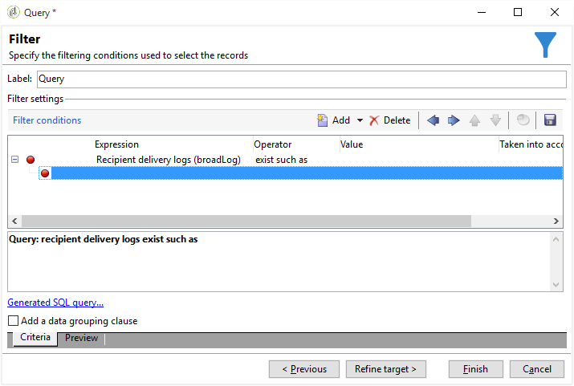

# Filtro de destinatarios duplicados {#filtering-duplicated-recipients}

En este ejemplo, deseamos filtrar los destinatarios que aparecen dos veces o más en una entrega para recuperar perfiles duplicados.

Para crear este ejemplo, aplique los pasos siguientes:

1. Arrastre y suelte una actividad **[!UICONTROL Query]** en un flujo de trabajo y ábrala.
1. Haga clic en **[!UICONTROL Edit query]** y configure las dimensiones de objetivo y filtrado en **[!UICONTROL Recipients]**.

   

1. Defina la siguiente condición de filtro para segmentar al destinatario que existe en el registro de envíos. Elija **Registro de destinatarios de envío (broadlog)** en la columna **Expresión**, elija **existe como** en la columna **Operador**.

   

1. Defina la siguiente condición de filtro para dirigir su envío. En la columna Expresión, elija **[!UICONTROL Internal name]** y luego, en la columna Operador, **[!UICONTROL equal to]** .
1. En la columna de valor, agregue el nombre interno de la entrega segmentado.

   

1. Con un operador **[!UICONTROL AND]**, repita las mismas operaciones para segmentar otros envíos.

   

La transición saliente contiene los destinatarios duplicados dirigidos en las entregas.
