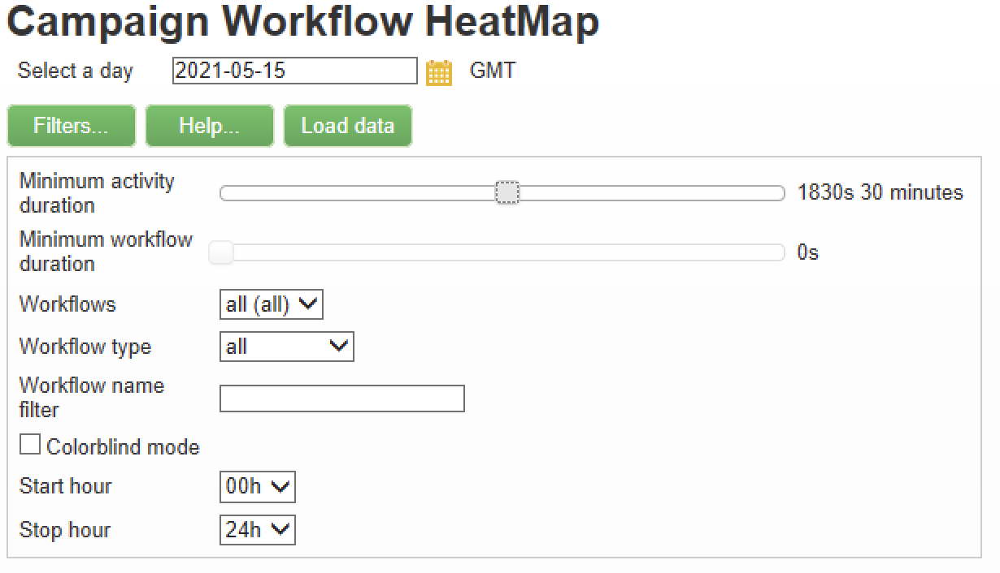
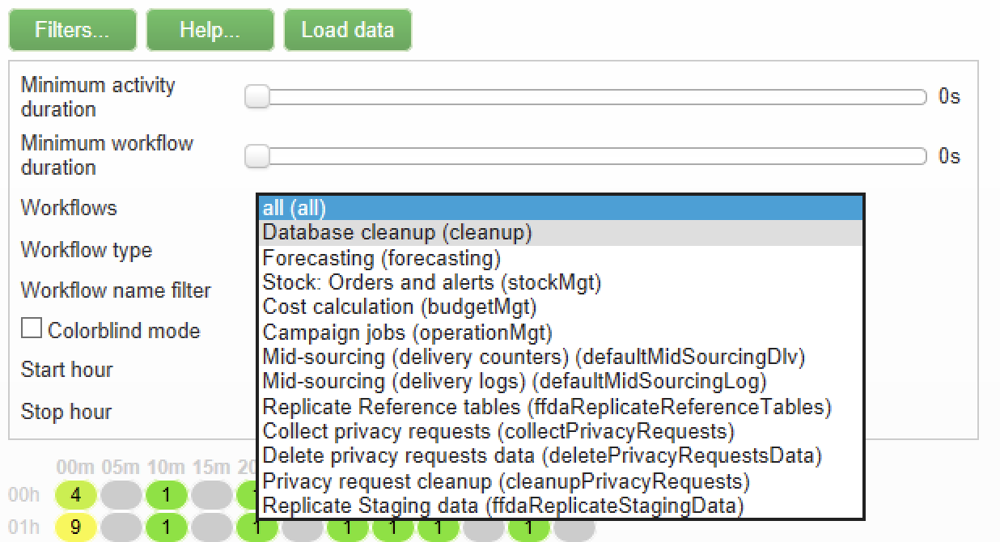

# Mapa de calor del flujo de trabajo {#workflow-heatmap}

El mapa de calor del flujo de trabajo de Adobe Campaign consiste en una representación gráfica con códigos de color de todos los flujos de trabajo que se están ejecutando actualmente. Solo está disponible para los administradores de instancia.

En [esta página](../../production/using/monitoring-guidelines.md) se presentan formas adicionales de monitorizar los diferentes procesos de Campaign.

## Acerca del mapa de calor del flujo de trabajo {#about-the-workflow-heatmap}

Al proporcionar información general rápida sobre el número de flujos de trabajo simultáneos, Workflow HeatMap permite a los administradores de la plataforma Adobe Campaign supervisar la carga en la instancia y planificar los flujos de trabajo en consecuencia.

Más precisamente, ayuda a los administradores de la plataforma a:

* Ver y comprender flujos de trabajo simultáneos
* Filtrar flujos de trabajo por duración para ver qué flujos de trabajo pueden encontrar problemas
* Filtrar actividades por duración para ver qué actividades pueden encontrar problemas
* Encuentre fácilmente flujos de trabajo individuales y todas las actividades relacionadas (con su duración)
* Búsqueda por tipo de flujo de trabajo ([flujos de trabajo técnicos](../../workflow/using/building-a-workflow.md#technical-workflows) o [flujos de trabajo de campaña](../../workflow/using/building-a-workflow.md#campaign-workflows))
* Buscar un flujo de trabajo específico para analizar

>[!NOTE]
>
>Además de **Mapa de calor del flujo de trabajo**, puede crear un flujo de trabajo que le permitirá supervisar el estado de un conjunto de flujos de trabajo y enviar mensajes recurrentes a los supervisores. Para obtener más información, consulte [la sección dedicada](../../workflow/using/supervising-workflows.md).

El uso del mapa de calor del flujo de trabajo requiere comprender bien los siguientes conceptos: Optimizaciones para [Flujos de trabajo](../../workflow/using/about-workflows.md), [Actividades](../../workflow/using/about-activities.md) y [Flujos de trabajo](../../workflow/using/workflow-best-practices.md).

El mapa de calor del flujo de trabajo está disponible de forma predeterminada en Adobe Campaign a partir de la versión 18.10. Si tiene una compilación entre 8700 y 8977 (18.10), también puede beneficiarse de esta capacidad. Para solicitar el paquete correspondiente, póngase en contacto con el [Servicio de atención al cliente de Adobe](https://support.neolane.net/) y siga las instrucciones de [esta página](https://helpx.adobe.com/es/campaign/kb/install-workflow-heatmap-package.html) para saber cómo instalarlo.

Cuando acceda por primera vez al Mapa de calor del flujo de trabajo, aparecerá la siguiente ventana emergente. Este acuerdo permite la transferencia y almacenamiento en Estados Unidos, lo que permite a Adobe Campaign:

* supervisar instancias para investigar cualquier problema de rendimiento.
* recopilar datos para la detección de anomalías.

Tenga en cuenta que la transferencia de datos solo está disponible para los usuarios que se conecten a Adobe Campaign con su Adobe ID.

Hay tres opciones disponibles:

* **[!UICONTROL Accept]** :: Al aceptar este acuerdo, autoriza a Adobe Campaign a recopilar sus datos y a transferirlos a los Estados Unidos para que pueda ayudarle en caso de detectar anomalías.
* **[!UICONTROL Refuse]** :: Al rechazar el acuerdo, los datos no se transferirán, pero aún puede utilizar Workflow Heatmap.
* **[!UICONTROL Do not show this message again]** :: Al hacer clic en **[!UICONTROL Do not show this message again]** , la ventana emergente dejará de mostrarse al acceder al mapa de calor del flujo de trabajo, pero aún está disponible desde el **[!UICONTROL Term of use]** botón.

This choice is not final, you can always change it by clicking the **[!UICONTROL Term of use]** button.

## Uso del mapa de calor {#using-the-heatmap}

>[!NOTE]
>
>Solo los usuarios con derechos de administración pueden acceder al mapa de calor del flujo de trabajo de campaña.

1. Vaya a **[!UICONTROL Monitoring]** y haga clic en el **[!UICONTROL Workflow HeatMap]** vínculo para mostrar la **[!UICONTROL Campaign Workflow HeatMap]** página.

   

1. Haga clic en el calendario para seleccionar un día.

   De forma predeterminada, la página muestra la actividad de flujo de trabajo del día actual. Puede cambiarlo y seleccionar cualquier día del pasado.

   >[!NOTE]
   >
   >Only the workflows that have not been deleted by the **[!UICONTROL Database cleanup]** workflow are visible. Para obtener más información sobre el flujo de trabajo de limpieza, consulte [esta sección](../../production/using/database-cleanup-workflow.md).\
   >De forma predeterminada, la zona horaria de mapa de calor del flujo de trabajo es la definida para el usuario administrador actual. Por ejemplo: puede que desee cambiarlo si no se encuentra en el mismo área que los usuarios de mercadotecnia con los que está trabajando.

1. Haga clic en el botón **[!UICONTROL Filters]**.

   

1. Utilice el control deslizante para establecer la duración mínima de 0 segundo a 1 hora. Esto le permite buscar únicamente flujos de trabajo que se ejecuten durante más de un determinado número de segundos o minutos.

   

1. You can also choose a specific workflow from the **[!UICONTROL Workflows]** list.

   

   >[!NOTE]
   >
   >Se aplica el **[!UICONTROL Min duration]** filtro. Si no encuentra un flujo de trabajo específico, restablezca la duración mínima a 0 para que todos los flujos de trabajo se muestren en la lista.

1. You can also filter on the **[!UICONTROL Workflow type]** :

   * **[!UICONTROL Technical]** :: Solo se muestran [los flujos de trabajo técnicos](../../workflow/using/building-a-workflow.md#technical-workflows) y los flujos de trabajo [de](../../workflow/using/targeting-data.md#data-management) gestión de datos predeterminados.
   * **[!UICONTROL Marketing]** : Solo se muestran los flujos de trabajo vinculados a una campaña de marketing, conocidos como flujos de trabajo [de ](../../workflow/using/building-a-workflow.md#campaign-workflows)campaña.

1. To search a specific workflow by name, you can also use the **[!UICONTROL Workflow name filter]** field.

   

1. If you edited some workflows in the time between, click the **[!UICONTROL Reload data]** button to refresh the data that are displayed in the grid.

## Leer el mapa de calor {#reading-the-heatmap}

El mapa de calor del flujo de trabajo de la campaña es una cuadrícula legible de forma natural de arriba a izquierda a abajo, lo que permite encontrar las &quot;zonas interactivas&quot; con un rango de color de verde a rojo.

* Las celdas rojas más oscuras corresponden a períodos en los que se está ejecutando un número elevado de flujos de trabajo al mismo tiempo.
* Las celdas grises corresponden a períodos en los que no se está ejecutando ningún flujo de trabajo.

To learn how the color code is applied and how to navigate the HeatMap, click the **[!UICONTROL Help]** button.

Cada fila representa una hora del día y cada celda representa 5 minutos de esa hora.

La cuadrícula muestra todos los flujos de trabajo que se ejecutan al mismo tiempo para cada uno de estos períodos de 5 minutos.

En el ejemplo siguiente, entre las 8:00 y las 8:05 a.m., se están ejecutando tres flujos de trabajo (independientemente de su duración individual):

1. Haga clic en una celda de color para mostrar los detalles de todos los flujos de trabajo simultáneos que se ejecutan durante este periodo.

   

   Para cada flujo de trabajo, se muestran todas las actividades que contiene, con su duración.

1. Haga clic en el nombre o ID del flujo de trabajo para abrir directamente un flujo de trabajo.
1. Para volver a la **[!UICONTROL Campaign Workflow HeatMap]** vista, haga clic en el **[!UICONTROL Home]** botón.

## Casos de uso: uso del mapa de calor para realizar acciones {#use-cases--using-the-heatmap-to-take-actions}

Existen dos casos principales en los que el mapa de calor del flujo de trabajo de campaña puede resultar útil.

### Reducción del número de flujos de trabajo simultáneos {#reducing-the-number-of-concurrent-workflows}

Como administrador de campañas, el mapa de calor del flujo de trabajo puede ayudarle a comprender la carga de la instancia y a planificar los flujos de trabajo existentes o nuevos en los momentos adecuados.

1. En la **[!UICONTROL Campaign Workflow HeatMap]** vista, haga clic en el **[!UICONTROL Filters]** botón.
1. Establezca la duración en unos segundos o en unos minutos.
1. Excluya los flujos de trabajo más cortos que no sean significativos aumentando el filtro de duración.

   

1. Explore los resultados para comprender la carga de la instancia y realizar las acciones correspondientes:

   * Si se producen problemas de rendimiento y se muestran una o más celdas rojas en la cuadrícula, considere la posibilidad de cambiar los tiempos de inicio de varios flujos de trabajo. Pida a los usuarios de mercadotecnia que pasen manualmente los flujos de trabajo de los períodos ocupados (&quot;activos&quot;) a los más disponibles. Esto debería mantener un nivel de actividad estable durante el día.
   * Para evitar picos y evitar que la instancia se sobrecargue, consulte el mapa de calor antes de planificar nuevos flujos de trabajo y elija el mejor momento. Considere los espacios de tiempo correspondientes a las celdas grises o verdes de la cuadrícula para iniciar nuevos flujos de trabajo.

### Búsqueda de flujos de trabajo de larga duración que afectan al rendimiento {#finding-long-running-workflows-that-impact-performance}

Como administrador de campañas, el mapa de calor del flujo de trabajo le ayuda a encontrar los flujos de trabajo más largos que pueden ralentizar la actividad.

1. En la **[!UICONTROL Campaign Workflow HeatMap]** vista, haga clic en el **[!UICONTROL Filters]** botón.
1. Establezca la duración en 1 hora.

   

1. Include more results by decreasing the **[!UICONTROL Min duration]** filter.
1. Explore los resultados para encontrar los flujos de trabajo más largos, que pueden tener un mayor impacto en los recursos del servidor y la base de datos (CPU, RAM, red, IOPS, etc.).
1. Realice las acciones apropiadas:

   * Aconseje a los usuarios de marketing que dividan los flujos de trabajo más largos para reducir el tiempo de procesamiento.
   * Inicie un análisis más profundo de flujos de trabajo específicos y actividades específicas (como JavaScript, importación, exportación, etc.) para aislar los problemas y resolverlos más fácilmente.

## Ejemplo: Uso del mapa de calor para mejorar la planificación del flujo de trabajo {#example--using-the-heatmap-to-improve-workflow-planning}

El ejemplo siguiente muestra cómo la planificación puede ser más eficiente y cómo se puede mejorar el rendimiento al utilizar el mapa de calor del flujo de trabajo de Adobe Campaign.

En este caso, muchos usuarios se quejan del rendimiento del flujo de trabajo. Debe comprobar qué está ralentizando la actividad y cómo resolver el problema.

1. Vaya a **[!UICONTROL Monitoring]** y haga clic en el **[!UICONTROL Workflows]** vínculo para mostrar la **[!UICONTROL Campaign Workflow HeatMap]** página.
1. Establezca el **[!UICONTROL Min duration]** filtro en 5 minutos.
1. Establezca el **[!UICONTROL Workflow type]** filtro en **[!UICONTROL Marketing]** .
1. Desde la cuadrícula de mapa de calor, observe lo siguiente:

   

   * Cincuenta flujos de trabajo de campaña de larga duración (más de 5 minutos) se ejecutan a las 10 de la mañana.
   * La mayoría de ellos tienen un estado pendiente (de forma predeterminada, el límite de concurrencia está establecido en 20).
   * Los flujos de trabajo pendientes deben reiniciarse manualmente todos los días.
   * El rendimiento es bajo.

1. En lugar de tener cincuenta flujos de trabajo a partir de las 10:00 a.m., distribuya los tiempos de inicio de los flujos de trabajo de forma uniforme durante el resto del día.
1. Vuelva a la **[!UICONTROL Campaign Workflow HeatMap]** página y haga clic en el **[!UICONTROL Reload data]** botón.
1. Ahora observe lo siguiente:

   

   * Sólo dieciocho flujos de trabajo de campaña de larga duración siguen funcionando a las 10:00.
   * No hay más flujos de trabajo en estado pendiente (el límite de concurrencia sigue establecido en 20).
   * Las horas de inicio del flujo de trabajo se distribuyen de forma uniforme a lo largo del día.
   * Ya no hay más usuarios que se quejen de problemas de rendimiento.
