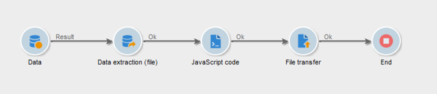
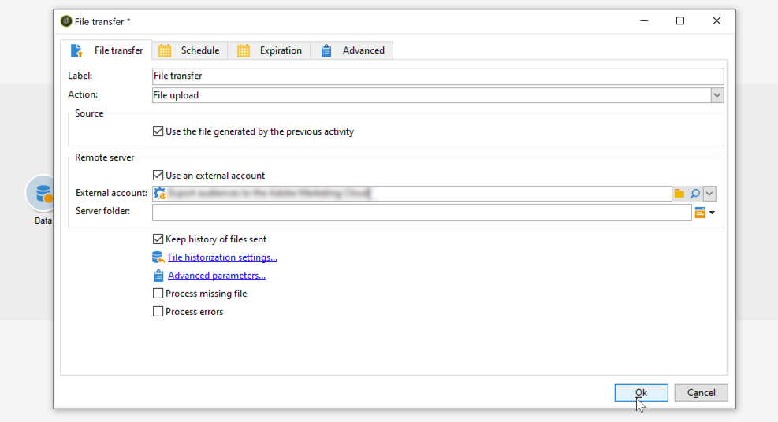

# Cómo utilizar los datos de flujo de trabajo{#how-to-use-workflow-data}

## Actualización de la base de datos {#updating-the-database}

Todos los datos recopilados pueden utilizarse para actualizar la base de datos o en las entregas. Por ejemplo, puede enriquecer las opciones de personalización del contenido del mensaje (incluir el número de los contratos en el mensaje, especificar el carro de la compra medio en el último año, etc.) o detallar la población objetivo (enviar un mensaje a los cotitulares del contrato, dirigirse a los 1000 mejores suscriptores de los servicios en línea, etc.). Estos datos también se pueden exportar o archivar en una lista.

### Listas y actualizaciones directas {#lists-and-direct-updates}

Los datos de la base de datos de Adobe Campaign y de las listas existentes pueden actualizarse mediante dos actividades específicas:

* La actividad **[!UICONTROL List update]** permite almacenar tablas de trabajo en una lista de datos.

   Puede seleccionar una lista existente o crearla. En este caso, se calculan el nombre y, posiblemente, la carpeta de registros.

   

   Consulte [Actualización de listas](../../workflow/using/list-update.md).

* La actividad **[!UICONTROL Update data]** realiza una actualización en masa de los campos de la base de datos.

   Para obtener más información, consulte [Actualización de datos](../../workflow/using/update-data.md).

### Gestión de suscripciones y bajas {#subscription-unsubscription-management}

Para obtener información sobre las suscripciones y las bajas de destinatarios de un servicio informativo a través de un flujo de trabajo, consulte [Servicios de suscripción](../../workflow/using/subscription-services.md).

## Envío a través de un flujo de trabajo {#sending-via-a-workflow}

### Actividad de envío {#delivery-activity}

La actividad de envío aparece detallada en [Envío](../../workflow/using/delivery.md).

### Enriquecimiento y establecimiento de objetivos de las entregas {#enriching-and-targeting-deliveries}

Los envíos pueden procesar datos de flujos de trabajo para personalizar el contenido o dentro del marco de selección de la población objetivo.

Por ejemplo, en el marco de una entrega de correo postal, puede incluir los datos adicionales, tomados de la manipulación de datos llevada a cabo en el flujo de trabajo, en el archivo de extracción:


Además de los campos de personalización habituales, puede añadir campos de personalización desde las fases del flujo de trabajo al contenido de la entrega. Los datos adicionales definidos en las actividades de flujo de trabajo se pueden conservar y se puede conceder acceso a ellos desde el asistente de envío, como se muestra en el ejemplo siguiente, para definir el nombre del archivo de salida dentro del marco de la distribución de correo postal:


Los datos contenidos en la tabla de flujo de trabajo se identifican con su nombre: siempre se compone del vínculo **targetData.** Para obtener más información, consulte [Datos de destinatario](../../workflow/using/data-life-cycle.md#target-data).

Dentro del marco de una entrega de correo electrónico, los campos de personalización también pueden utilizar datos de la extensión de grupo objetivo realizada en las fases del flujo de trabajo de objetivos, como se muestra en el ejemplo siguiente:


Si se especifica un código de segmento en una actividad de objetivo, se añade a una columna específica de la tabla de flujo de trabajo y se ofrece junto con los campos de personalización. Para mostrar todos los campos de personalización, haga clic en el enlace **[!UICONTROL Target extension > Other...]** al que se puede acceder con el botón de personalización.


## Exportación de datos {#exporting-data}

### Comprimir o encriptar un archivo {#zipping-or-encrypting-a-file}

Adobe Campaign permite exportar archivos comprimidos o encriptados. Al definir una exportación a través de una actividad **[!UICONTROL Data extraction (file)]**, puede definir un posprocesamiento para comprimir o encriptar el archivo.

Para poder hacerlo:

1. Instale un par de claves GPG para su instancia mediante el [Panel de control de Campaign](https://docs.adobe.com/content/help/es-ES/control-panel/using/instances-settings/gpg-keys-management.html#encrypting-data).

   >[!NOTE]
   >
   >Panel de control de Campaign está disponible para todos los clientes alojados en AWS (excepto para los clientes que alojan sus instancias de marketing on-Premise).

1. Si Adobe aloja la instalación de Adobe Campaign contáctese con atención al cliente de Adobe para que instalen las herramientas necesarias en el servidor.
1. Si la instalación de Adobe Campaign está in situ: instale la utilidad que desee utilizar (por ejemplo: GPG, GZIP) así como las claves necesarias (clave de cifrado) en el servidor de aplicaciones.

A continuación, puede utilizar comandos o código en la pestaña **[!UICONTROL Script]** de la actividad o en una actividad **[!UICONTROL JavaScript code]** . A continuación se muestra un ejemplo en el caso de uso.

**Temas relacionados:**

* [Descompresión o desencriptado de un archivo antes de procesarlo](../../workflow/using/importing-data.md#unzipping-or-decrypting-a-file-before-processing)
* [Actividad de extracción de datos (archivo)](../../workflow/using/extraction--file-.md).

### Caso de uso: codificación y exportación de datos con una clave instalada en el Panel de control de Campaign {#use-case-gpg-encrypt}

En este caso de uso, crearemos un flujo de trabajo para codificar y exportar los datos con una clave instalada en el Panel de control de Campaign.

 [Descubra esta función en vídeo](#video)

Los pasos para realizar este caso de uso son los siguientes:

1. genere un par de claves GPG (públicas/privadas) utilizando una utilidad GPG, luego instale la clave pública en Panel de control de Campaign. Encontrará los pasos detallados en la documentación [del](https://docs.adobe.com/content/help/es-ES/control-panel/using/instances-settings/gpg-keys-management.html#encrypting-data) Panel de control de Campaign.

1. En Campaign Classic, genere un flujo de trabajo para exportar los datos y cifrarlos con la clave privada que se ha instalado mediante el Panel de control de Campaign. Para ello, crearemos un flujo de trabajo de la siguiente manera:

   

   * **[!UICONTROL Query]** actividad: En este ejemplo, queremos ejecutar una consulta para un destinatario de los datos de la base de datos que queremos exportar.
   * **[!UICONTROL Data extraction (file)]** actividad: extrae los datos en un archivo.
   * **[!UICONTROL JavaScript code]** actividad: codifica los datos que se van a extraer.
   * **[!UICONTROL File transfer]** actividad: envía los datos a un origen externo (en este ejemplo, un servidor SFTP).

1. Configure la actividad **[!UICONTROL Query]** para destinatario de los datos deseados de la base de datos. Para obtener más información, consulte [esta sección](../../workflow/using/query.md).

1. Abra la actividad **[!UICONTROL Data extraction (file)]** y configúrela según sus necesidades. Los conceptos globales sobre cómo configurar la actividad están disponibles en [esta sección](../../workflow/using/extraction--file-.md).

   

1. Abra la actividad **[!UICONTROL JavaScript code]** y copie y pegue el comando siguiente para cifrar los datos que desee extraer.

   >[!IMPORTANT]
   >
   >Asegúrese de reemplazar el valor de la **huella** del comando por la huella digital de la clave pública instalada en el Panel de control de Campaign.

   ```
   var cmd='gpg ';
   cmd += ' --trust-model always';
   cmd += ' --batch --yes';
   cmd += ' --recipient fingerprint';
   cmd += ' --encrypt --output ' + vars.filename + '.gpg ' + vars.filename;
   execCommand(cmd,true);
   vars.filename=vars.filename + '.gpg'
   ```

   

1. Abra la actividad **[!UICONTROL File transfer]** y especifique el servidor SFTP al que desea enviar el archivo. Los conceptos globales sobre cómo configurar la actividad están disponibles en [esta sección](../../workflow/using/file-transfer.md).

   

1. Ahora puede ejecutar el flujo de trabajo. Una vez ejecutado, el destinatario de datos de la consulta se exportará al servidor SFTP en un archivo .gpg cifrado.

### Videotutorial {#video}

Este vídeo muestra cómo utilizar una clave GPG para cifrar datos y también está disponible en

>[!VIDEO](https://video.tv.adobe.com/v/36399?quality=12&captions=spa)

Hay disponibles más vídeos de procedimientos para Campaign Classic [aquí](https://experienceleague.adobe.com/docs/campaign-classic-learn/tutorials/overview.html?lang=es).
