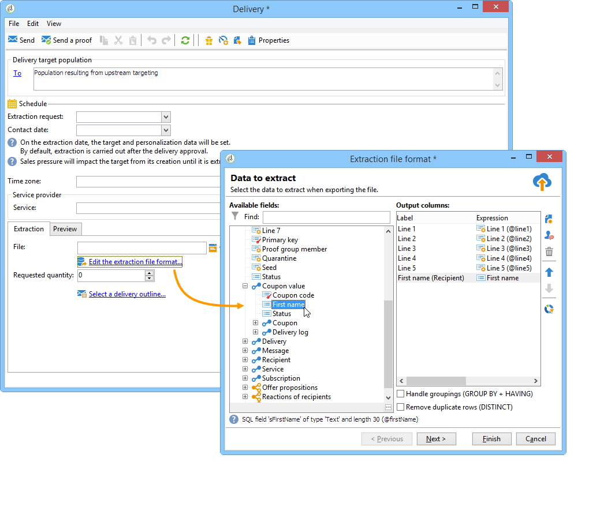

# Cómo utilizar los datos de flujo de trabajo{#how-to-use-workflow-data}

## Actualización de la base de datos {#updating-the-database}

Todos los datos recopilados pueden utilizarse para actualizar la base de datos o en las entregas. Por ejemplo, puede enriquecer las opciones de personalización del contenido del mensaje (incluir el número de los contratos en el mensaje, especificar el carro de la compra medio en el último año, etc.) o detallar la población objetivo (enviar un mensaje a los cotitulares del contrato, dirigirse a los 1000 mejores suscriptores de los servicios en línea, etc.). Estos datos también se pueden exportar o archivar en una lista.

### Listas y actualizaciones directas {#lists-and-direct-updates}

Los datos de la base de datos de Adobe Campaign y de las listas existentes pueden actualizarse mediante dos actividades específicas:

* La actividad **[!UICONTROL List update]** permite almacenar tablas de trabajo en una lista de datos.

   Puede seleccionar una lista existente o crearla. En este caso, se calculan el nombre y, posiblemente, la carpeta de registros.

   

   Consulte [Actualización de listas](../../workflow/using/list-update.md).

* La actividad **[!UICONTROL Update data]** realiza una actualización en masa de los campos de la base de datos.

   Para obtener más información, consulte [Actualización de datos](../../workflow/using/update-data.md).

### Gestión de suscripciones y bajas {#subscription-unsubscription-management}

Para obtener información sobre las suscripciones y las bajas de destinatarios de un servicio informativo a través de un flujo de trabajo, consulte [Servicios de suscripción](../../workflow/using/subscription-services.md).

## Envío a través de un flujo de trabajo {#sending-via-a-workflow}

### Actividad de envío {#delivery-activity}

La actividad de envío aparece detallada en [Envío](../../workflow/using/delivery.md).

### Enriquecimiento y establecimiento de objetivos de las entregas {#enriching-and-targeting-deliveries}

Los envíos pueden procesar datos de flujos de trabajo para personalizar el contenido o dentro del marco de selección de la población objetivo.

Por ejemplo, en el marco de una entrega de correo postal, puede incluir los datos adicionales, tomados de la manipulación de datos llevada a cabo en el flujo de trabajo, en el archivo de extracción:

Además de los campos de personalización habituales, puede añadir campos de personalización desde las fases del flujo de trabajo al contenido de la entrega. Los datos adicionales definidos en las actividades de flujo de trabajo se pueden conservar y se puede conceder acceso a ellos desde el asistente de envío, como se muestra en el ejemplo siguiente, para definir el nombre del archivo de salida dentro del marco de la distribución de correo postal:

Los datos contenidos en la tabla de flujo de trabajo se identifican con su nombre: siempre se compone del vínculo **targetData.** Para obtener más información, consulte [Datos de destinatario](../../workflow/using/data-life-cycle.md#target-data).

Dentro del marco de una entrega de correo electrónico, los campos de personalización también pueden utilizar datos de la extensión de grupo objetivo realizada en las fases del flujo de trabajo de objetivos, como se muestra en el ejemplo siguiente:

Si se especifica un código de segmento en una actividad de objetivo, se añade a una columna específica de la tabla de flujo de trabajo y se ofrece junto con los campos de personalización. Para mostrar todos los campos de personalización, haga clic en el enlace **[!UICONTROL Target extension > Other...]** al que se puede acceder con el botón de personalización.

