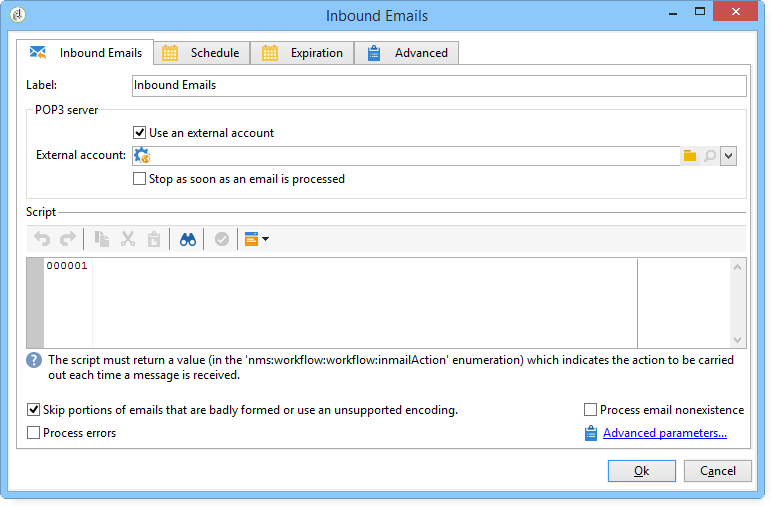

# Correos electrónicos entrantes{#inbound-emails}

La actividad **Inbound emails** permite descargar y procesar correos electrónicos desde un servidor de correo POP3.

La primera pestaña de la actividad **Inbound Emails** permite introducir los parámetros del servidor POP3 e introducir la secuencia de comandos que se ejecutará al recibir cada mensaje. La segunda pestaña permite asignar una programación a la actividad y la tercera define las condiciones de caducidad de la actividad.

1. **[!UICONTROL Inbound Emails]**

   * **[!UICONTROL Use an external account]**

      Cuando esta opción está activada, se puede seleccionar una cuenta POP3 externa en lugar de introducir los parámetros de conexión. El campo **[!UICONTROL External account]** especifica la cuenta POP3 externa que se utilizará para conectar con el servicio de correo electrónico. Este campo solo está visible si está activada la opción “Usar una cuenta externa”.

      Si no se selecciona esta opción, se deberán especificar los siguientes parámetros:

      

      * **[!UICONTROL POP3 server]**

         Nombre del servidor POP3.

      * **[!UICONTROL POP3 account]**

         Nombre del usuario.

      * **[!UICONTROL Password]**

         Contraseña de la cuenta de usuario.

      * **[!UICONTROL Port]**

         Número de puerto de conexión POP3. El puerto predeterminado es 110.
   * **[!UICONTROL Stop as soon as email is processed]**

      Esta opción le permite procesar los correos electrónicos uno por uno. La actividad activa su transición una sola vez y luego finaliza el procesamiento, dejando los mensajes sin procesar en el servidor.

1. **[!UICONTROL Script]**

   La secuencia de comandos permite procesar el mensaje y realizar varias operaciones que dependen del contenido del mensaje. La secuencia de comandos se ejecuta para cada mensaje y se puede determinar la operación a realizar (dejar o eliminar el mensaje) y la activación de la transición saliente.

   El código de retorno debe tener uno de los valores siguientes:

   * 1 - Elimina el mensaje del servidor y activa la transición saliente.
   * 2 - Deja el mensaje en el servidor y activa la transición saliente.
   * 3 - Elimina el mensaje del servidor.
   * 4 - Deja el mensaje en el servidor.
   Se puede acceder al contenido del mensaje desde la variable global **[!UICONTROL mailMessage]**.

1. **[!UICONTROL Schedule]**

   To define a schedule for the activity, click the **[!UICONTROL Scheduling]** tab and check **[!UICONTROL Plan execution]**. Haga clic en el botón **[!UICONTROL Change]** para configurar la programación.

   La configuración de programación es la misma que para la actividad de programación. Consulte [Programador](../../workflow/using/scheduler.md).

1. **[!UICONTROL Expiration]**

   Puede definir los retrasos de caducidad a través de la pestaña **[!UICONTROL Expiration]**

   

   La configuración es la misma que para la actividad de programación. Consulte [Caducidad](../../workflow/using/defining-approvals.md).

