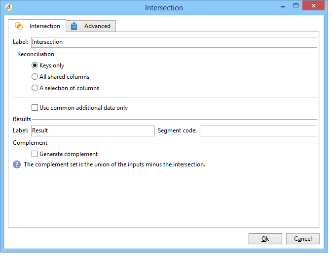
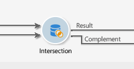

# Intersección{#intersection}

>[!CONTEXTUALHELP]
>id="ac_workflow_intersection"
>title="Actividad de intersección"
>abstract="Una actividad del tipo Intersección crea un destinatario a partir de la intersección de los destinatarios recibidos. Una intersección permite extraer solamente la población común a todos los resultados de actividad entrante."

Una actividad del tipo **Intersection** crea un objetivo a partir de la intersección de los objetivos recibidos.

Una intersección permite extraer solamente la población común a todos los resultados de actividad entrante. El objetivo se crea con todos los resultados recibidos: por lo tanto todas las actividades anteriores deben finalizar antes de ejecutar la intersección. Para configurar esta actividad, debe introducir una etiqueta para él así como las opciones relacionadas con el resultado.

Para obtener más información sobre la configuración y el uso de la actividad de intersección, consulte [Extracción de datos conjuntos (intersección)](targeting-data.md#extracting-joint-data--intersection-).

Seleccione la opción **[!UICONTROL Generate complement]** si desea procesar la población restante. El complemento contendrá la unión de los resultados de todas las actividades entrantes menos la intersección. A continuación, se agregará una transición saliente adicional a la actividad de la siguiente manera:

## Ejemplo de intersección {#intersection-example}

En el ejemplo siguiente, el objetivo de la intersección es calcular los destinatarios comunes a tres consultas simples para crear una lista.

1. Después de tres consultas simples, inserte una actividad de tipo **[!UICONTROL Intersection]**.

   En este ejemplo, las consultas se dirigen respectivamente a hombres, a destinatarios que viven en París y a destinatarios que tienen entre 18 y 30 años.

1. Configure la intersección. Para ello, seleccione el método de reconciliación **[!UICONTROL Keys only]** ya que las poblaciones resultantes de las consultas contienen datos coherentes.
1. Si ha añadido datos adicionales para las consultas, puede elegir conservar solo aquellos que son compartidos por los destinatarios marcando el cuadro correspondiente.
1. Si desea utilizar el resto de los datos (en relación con las consultas pero no su intersección), marque el cuadro **[!UICONTROL Generate complement]**.
1. Agregue una actividad de actualización de lista después del resultado de la intersección. También puede añadir una actualización de lista al complemento si desea utilizarlo.
1. Ejecución de un flujo de trabajo. En este caso, dos destinatarios se aplican a las tres consultas introducidas al mismo tiempo. El complemento está formado por cinco destinatarios que solo se aplican a una o dos de las tres consultas.

   El resultado de la intersección se envía a la primera actualización de la lista. Si decide utilizar el complemento, también se envía a la segunda actualización de lista.

   

## Parámetros de entrada {#input-parameters}

* tableName
* esquema

Cada evento entrante debe especificar un objetivo definido por estos parámetros.

## Parámetros de salida {#output-parameters}

* tableName
* esquema
* recCount

Este conjunto de tres valores identifica el objetivo resultante de la intersección. **[!UICONTROL tableName]** es el nombre de la tabla que registra los identificadores de destinatario, **[!UICONTROL schema]** es el esquema de la población (normalmente **[!UICONTROL nms:recipient]**) y **[!UICONTROL recCount]** es el número de elementos de la tabla.

