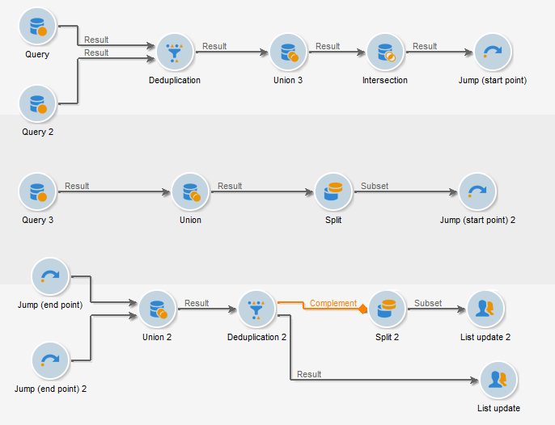

# Saltos (puntos iniciales y finales){#jump-start-point-and-end-point}

Los objetos del tipo gráficos **[!UICONTROL Jump]** se utilizan para mejorar la legibilidad de un diagrama complejo, especialmente uno con transiciones de cruce.

Los saltos son transiciones sin flechas.

Pasan de una actividad a otra, como en el ejemplo siguiente:

Para cada transición de tipo “punto inicial”, se debe colocar una transición de tipo “punto final”.

Puede insertar varios saltos de punto iniciales y finales en el mismo flujo de trabajo. Se identifican con un número que se debe introducir en los parámetros:

Para mejorar la legibilidad del diagrama, puede cambiar la imagen asociada a los saltos para mostrar el número relacionado. Consulte [Cambio de imágenes de actividad](managing-activity-images.md).
