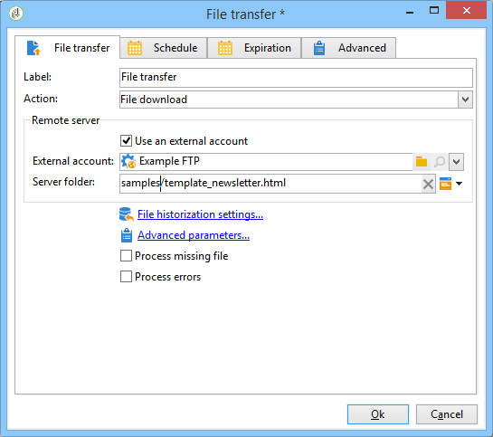

# Carga de contenido de entrega{#loading-delivery-content}

Si el contenido de la entrega está disponible en un archivo HTML ubicado en los servidores Amazon S3, FTP o SFTP, se puede cargar fácilmente este contenido en las entregas de Adobe Campaign.

Para ello:

1. If you haven&#39;t already defined a connection between Adobe Campaign and the (S)FTP server hosting the content files, create a new S3, FTP or SFTP external account in **[!UICONTROL Administration]** > **[!UICONTROL Platform]** > **[!UICONTROL External Accounts]**. Especifique en esta cuenta externa la dirección y las credenciales utilizadas para establecer la conexión con el servidor S3 o (S)FTP.

   A continuación, se muestra un ejemplo de una cuenta externa S3:

   

1. Create a new workflow, for example from **[!UICONTROL Profiles and Targets]** > **[!UICONTROL Jobs]** > **[!UICONTROL Targeting workflows]**.
1. Añada una actividad **[!UICONTROL File transfer]** al flujo de trabajo y configúrela especificando:

   * La cuenta externa que se utiliza para conectar con el servidor S3 o (S)FTP.
   * La ruta del archivo en el servidor S3 o (S)FTP.

   

1. Add a **[!UICONTROL Delivery]** activity and connect it to the outbound transition of the **[!UICONTROL File transfer]** activity. Configúrela como se indica a continuación:

   * Delivery: Según las necesidades, puede ser una entrega específica que ya se ha creado en el sistema o uno nuevo en función de una plantilla existente.
   * Recipients: En este ejemplo, se considera que el objetivo está especificado en el propio envío.
   * Content: Even if the content is imported in the previous activity, select **[!UICONTROL Specified in the delivery]**. Ya que el contenido se importa directamente desde un archivo ubicado en un servidor remoto, no tiene identificador cuando el flujo de trabajo lo procesa y no se puede identificar como procedente del evento entrante.
   * Action to perform: Select **[!UICONTROL Save]** to save the delivery and be able to access it from **[!UICONTROL Campaign management]** > **[!UICONTROL Deliveries]** once the workflow is executed.

   

1. En la pestaña **[!UICONTROL Script]** de la actividad **[!UICONTROL Delivery]**, añada el siguiente comando para cargar el contenido del archivo importado en la entrega:

   ```
   delivery.content.md.source=loadFile(vars.filename)
   ```

   

1. Guarde y ejecute el flujo de trabajo. A new delivery with the loaded content is created under **[!UICONTROL Campaign management]** > **[!UICONTROL Deliveries]**.

>[!NOTE]
>
>Las prácticas recomendadas y la solución de problemas en el uso del servidor SFTP se describen [en esta página](../../platform/using/sftp-server-usage.md).
