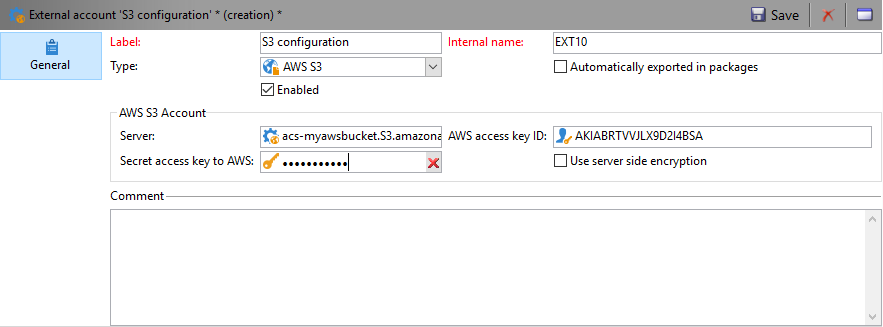

# Carga de contenido de envío{#loading-delivery-content}

Si el contenido del envío está disponible en un archivo HTML ubicado en los servidores Amazon S3, FTP o SFTP, se puede cargar fácilmente este contenido en los envíos de Adobe Campaign.

Para ello:

1. If you haven&#39;t already defined a connection between Adobe Campaign and the (S)FTP server hosting the content files, create a new S3, FTP or SFTP external account in **[!UICONTROL Administration]** > **[!UICONTROL Platform]** > **[!UICONTROL External Accounts]**. Especifique en esta cuenta externa la dirección y las credenciales utilizadas para establecer la conexión con el servidor S3 o (S)FTP.

   A continuación, se muestra un ejemplo de una cuenta externa S3:

   

1. Cree un nuevo flujo de trabajo, por ejemplo desde **[!UICONTROL Profiles and Targets]** > **[!UICONTROL Jobs]** > **[!UICONTROL Targeting workflows]**.
1. Add a **[!UICONTROL File transfer]** activity into your workflow, and configure it by specifying

   * La cuenta externa que se utiliza para conectar con el servidor S3 o (S)FTP.
   * La ruta del archivo en el servidor S3 o (S)FTP.
   

1. Add a **[!UICONTROL Delivery]** activity and connect it to the outbound transition of the **[!UICONTROL File transfer]** activity. Configúrela como se indica a continuación:

   * Entrega: Según sus necesidades, puede ser una entrega específica que ya se ha creado en el sistema o una nueva entrega basada en una plantilla existente.
   * Destinatarios: En este ejemplo, se considera que el objetivo se especifica en la propia entrega.
   * Content: Even if the content is imported in the previous activity, select **[!UICONTROL Specified in the delivery]**. Ya que el contenido se importa directamente desde un archivo ubicado en un servidor remoto, no tiene identificador cuando el flujo de trabajo lo procesa y no se puede identificar como procedente del evento entrante.
   * Acción para realizar: Seleccione **[!UICONTROL Save]** para guardar la entrega y poder acceder a ella desde **[!UICONTROL Campaign management]** > **[!UICONTROL Deliveries]** una vez ejecutado el flujo de trabajo.
   

1. In the **[!UICONTROL Script]** tab of the **[!UICONTROL Delivery]** activity, add the following command to load the content of the imported file in the delivery:

   ```
   delivery.content.md.source=loadFile(vars.filename)
   ```

   

1. Guarde y ejecute el flujo de trabajo. A new delivery with the loaded content is created under **[!UICONTROL Campaign management]** > **[!UICONTROL Deliveries]**.

>[!NOTE]
>
>Las prácticas recomendadas y la solución de problemas en el uso del servidor SFTP se describen [en esta página](../../platform/using/sftp-server-usage.md).

