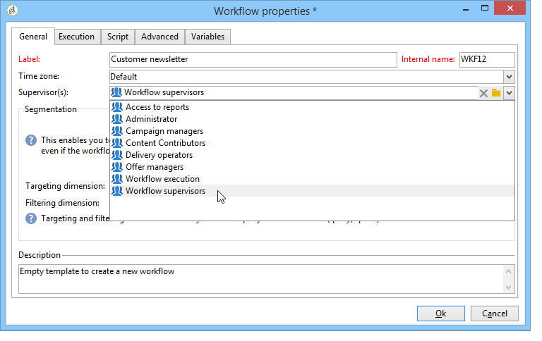

# Control de la ejecución del flujo de trabajo {#monitoring-workflow-execution}

Esta sección presenta información sobre cómo supervisar la ejecución de los flujos de trabajo.

También hay disponible un caso de uso sobre cómo crear un flujo de trabajo que le permite supervisar el estado de un conjunto de flujos de trabajo &quot;en pausa&quot;, &quot;detenidos&quot; o &quot;con errores&quot; en [esta sección](../../workflow/using/supervising-workflows.md#supervising-workflows).

Además, los administradores de la instancia pueden utilizar la pista **de** auditoría para comprobar las actividades y las últimas modificaciones realizadas en los flujos de trabajo, el estado de los mismos. Para obtener más información, consulte [la sección dedicada](../../production/using/audit-trail.md).

En [esta página](https://helpx.adobe.com/campaign/kb/acc-maintenance.html)se presentan formas adicionales de monitorear los diferentes procesos de Campaña.

## Visualización del progreso {#displaying-progress}

Puede monitorizar la ejecución mediante la visualización del progreso con el icono correspondiente de la barra de herramientas.

The **[!UICONTROL Display progress information]** icon lets you display the status and the activity result in the execution screen.


Cuando se selecciona esta opción, las actividades ejecutadas se muestran en azul, las actividades pendientes parpadean, las advertencias se muestran en naranja y los errores en rojo. Esta opción también muestra el resultado de las actividades en su transición saliente, seguido de la etiqueta del resultado como se establece en las propiedades de la actividad y la duración del trabajo si esta es superior a un segundo


## Visualización de “logs”{#displaying-logs}

El “log” contiene el historial o la pista de auditoría del flujo de trabajo. Registra todas las acciones del usuario, todas las operaciones realizadas y los errores encontrados. Se puede:

* Select the **[!UICONTROL Tracking]** tab in the detail. Esta lista contiene todos los mensajes del flujo de trabajo.

   

* Filtrado de los mensajes de “log” por actividad. Para ello, haga clic en **[!UICONTROL Display the tasks and the log]** en la barra de herramientas situada encima del diagrama para mostrar las fichas **[!UICONTROL Log]** y **[!UICONTROL Tasks]** debajo del diagrama. Seleccione una actividad para ver todos los mensajes relacionados. Esta lista contiene todos los mensajes cuando no hay actividad seleccionada.

   

   >[!NOTE]
   >
   >Haga clic en el fondo del diagrama para anular la selección de todos los elementos.

* Visualice solo los mensajes vinculados a una tarea determinada. To do this, select the **[!UICONTROL Tasks]** tab, and then select an activity in the diagram in order to restrict the list. Haga doble clic en una tarea para mostrar la información; la última pestaña de la ventana contiene el “log”.

   

   The **[!UICONTROL Details...]** button lets you display all additional information on activity execution. Por ejemplo, se puede ver el operador de validación y, cuando corresponda, el comentario que ha introducido durante la aprobación, como en el ejemplo siguiente:

   

>[!NOTE]
>
>El “log” no se depura cuando se reinicia un flujo de trabajo. Todos los mensajes se mantienen. Si desea descartar los mensajes de una ejecución anterior, debe depurar el historial.

El “log” muestra la lista de mensajes de ejecución relacionados con las actividades de flujo de trabajo de objetivos.

* “Log” de una campaña de objetivos

   Once a targeting campaign has been executed, click the **[!UICONTROL Tracking]** tab to view the execution trace.

   

   Se muestran todos los mensajes de campaña: campañas realizadas, así como advertencias o errores.

* “Log” de una actividad

   También puede ver el “log” de ejecución y los detalles de cada actividad. Hay dos formas de hacerlo:

   1. Seleccione la actividad de destino y haga clic en el **[!UICONTROL Display the tasks and the log]** icono .

      

      La sección inferior del diagrama muestra dos fichas: Registro y tareas.

      Las actividades seleccionadas dentro del diagrama actúan como filtros en la lista de “logs” y tareas.

      

   1. Right-click the targeted activity and select **[!UICONTROL Display logs]**.

      

      El “log” se muestra en una ventana independiente.

## Depuración de “logs”{#purging-the-logs}

El historial del flujo de trabajo no se purga automáticamente: todos los mensajes se mantienen de forma predeterminada. History can be purged via the **[!UICONTROL File > Actions]** menu or by clicking the **[!UICONTROL Actions]** button located in the toolbar above the list. Select **[!UICONTROL Purge history]**. Las opciones disponibles en el **[!UICONTROL Actions]** menú se detallan en la sección de la barra de herramientas [](../../workflow/using/executing-a-workflow.md#actions-toolbar) Acciones.


## Esquema tablas de trabajo y flujo de trabajo {#worktables-and-workflow-schema}

El flujo de trabajo transmite tablas de trabajo que se pueden manipular mediante determinadas actividades. Adobe Campaign le permite, a través de las actividades de gestión de datos, modificar, cambiar el nombre y enriquecer las columnas de las tablas de trabajo del flujo de trabajo, por ejemplo, para alinearlas con la nomenclatura dependiendo de las necesidades del cliente, para recoger información adicional sobre el cobeneficiario de un contrato, etc.

También es posible crear enlaces entre diferentes dimensiones de trabajo y definir los cambios de dimensión. Por ejemplo, para cada contrato registrado en la base de datos, diríjase al titular principal y utilice los datos del copropietario en la información adicional.

Las tablas de trabajo del flujo de trabajo se eliminan automáticamente cuando el flujo de trabajo se pasiva. If you wish to keep a work table, save it in a list via the **[!UICONTROL List update]** activity (refer to [List update](../../workflow/using/list-update.md)).

## Gestión de errores {#managing-errors}

Cuando se produce un error, el flujo de trabajo se detiene y la actividad que se está ejecutando cuando se produce el error parpadea en rojo. In the workflow overview (**[!UICONTROL Monitoring]** universe > **[!UICONTROL Workflows]** link) you can display workflows with errors only, as shown below.


In the Adobe Campaign Explorer, the workflow list displays a **[!UICONTROL Failed]** column by default.


Cuando un flujo de trabajo sufre un error, se notifica por correo electrónico a los operadores que pertenecen al grupo de supervisión del flujo de trabajo, siempre y cuando su dirección de correo electrónico se muestre en su perfil. This group is selected in the **[!UICONTROL Supervisor(s)]** field of the workflow properties.



El contenido de la notificación está configurado en la plantilla predeterminada **[!UICONTROL Workflow manager notification]** : Esta plantilla está seleccionada en la **[!UICONTROL Execution]** ficha de las propiedades del flujo de trabajo. La notificación muestra el nombre del flujo de trabajo de error y la tarea correspondiente.

Ejemplo de notificación:


El enlace le permite acceder a la consola de Adobe Campaign en el modo Web y trabajar con el flujo de trabajo del error una vez que haya iniciado sesión.


Puede configurar el flujo de trabajo para que no se detenga y continúe la ejecución en caso de errores. Para ello, edite el flujo de trabajo **[!UICONTROL Properties]** y, en la **[!UICONTROL Error management]** sección , seleccione la **[!UICONTROL Ignore]** opción en el **[!UICONTROL In case of error]** campo. Puede especificar el número de errores consecutivos que se pueden omitir antes de que se ponga en pausa el proceso.

En este caso, se anula la tarea de error. Este modo es especialmente apropiado para los flujos de trabajo diseñados para volver a probar la campaña más tarde (acciones periódicas).


>[!NOTE]
>
>Puede aplicar esta configuración individualmente para cada actividad. To do this, edit activity properties and select the error management mode in the **[!UICONTROL Advanced]** tab.

Para obtener más información sobre la resolución de problemas de ejecución de flujos de trabajo, consulte la sección [](../../production/using/workflow-execution.md)dedicada.

## Procesamiento de errores {#processing-errors}

Concerning activities, the **[!UICONTROL Process errors]** option displays a specific transition which will be enabled if an error is generated. En este caso, el flujo de trabajo no se abre en modo de error y la ejecución continúa.

Los errores que se tienen en cuenta son los errores del sistema de archivos (el archivo no se puede mover, no se puede acceder a un directorio, etc.).

Esta opción no procesa los errores relacionados con la configuración de la actividad, es decir, valores no válidos. Los errores relacionados con una configuración defectuosa no activan esta transición (el directorio no existe, etc.).

If a workflow is paused (manually or automatically after an error), the **[!UICONTROL Start]** button restarts the workflow execution where it was stopped. La actividad errónea (o actividad pausada) se vuelve a ejecutar. Las actividades anteriores no se vuelven a ejecutar.

To re-execute all of the workflow activities, use the **[!UICONTROL Restart]** button.

Si modifica las actividades que ya se han ejecutado, los cambios no se tienen en cuenta al reiniciar la ejecución del flujo de trabajo.

Si modifica las actividades no ejecutadas, estas se tienen en cuenta cuando se reinicia la ejecución del flujo de trabajo.

Si modifica las actividades en pausa, los cambios no se tienen en cuenta correctamente cuando se reinicia el flujo de trabajo.

Si es posible, se recomienda reiniciar el flujo de trabajo después de realizar las modificaciones.

## Supervisión de la instancia {#instance-supervision}

The **[!UICONTROL Instance supervision]** page lets you view the Adobe Campaign server activity and display the list of workflows and deliveries with errors.

To access this page, go to the **[!UICONTROL Monitoring]** universe and click the **[!UICONTROL General view]** link.


To display all the workflows, click the **[!UICONTROL Workflows]** link. Utilice la lista desplegable para mostrar los flujos de trabajo en la plataforma según su estado.


Haga clic en el enlace de un flujo de trabajo con errores para abrirlo y ver su “log”.


## Prevención de las ejecuciones múltiples simultáneas {#preventing-simultaneous-multiple-executions}

Un único flujo de trabajo puede tener varias ejecuciones a la vez. En algunos casos debe evitar que esto ocurra.

Por ejemplo, puede hacer que un programador active la ejecución del flujo de trabajo cada hora, pero a veces la ejecución del flujo de trabajo completo tarda más de una hora. Puede preferir omitir la ejecución si el flujo de trabajo ya se está ejecutando.

Si tiene una actividad de señal al comienzo del flujo de trabajo, puede que desee omitir la señal si el flujo de trabajo se está ejecutando.

El principio general es el siguiente:


La solución consiste en utilizar una variable de instancia. Las variables de instancia se comparten en todas las ejecuciones paralelas de los flujos de trabajo.

A continuación se muestra un sencillo flujo de trabajo de prueba:


The **[!UICONTROL Scheduler]** is triggering an event every minute. The following **[!UICONTROL Test]** activity is going to test the **isRunning** instance variable to decide whether or not to continue the execution:


>[!NOTE]
>
>**isRunning** es un nombre de variable elegido para este ejemplo. Esta no es una variable integrada.

The activity immediately following the **[!UICONTROL Test]** in the **yes** branch must set the instance variable in its **Initialization script**:

```
instance.vars.isRunning = true
```

La última actividad en la rama **sí** debe revertir la variable para establecerla en “falso” en la **Secuencia de comandos de inicialización**:

```
instance.vars.isRunning = false
```

Tenga en cuenta que:

* Puede comprobar el valor actual de la variable de instancia mediante la pestaña **Variables** en el flujo de trabajo **Propiedades**.
* Las variables de instancia se restablecen al reiniciar un flujo de trabajo.
* En JavaScript, un valor indefinido es falso en una prueba, lo que permite probar la variable de instancia incluso antes de haberla inicializado.
* Se pueden monitorizar las actividades que no se procesan debido a este mecanismo con tan solo añadir una instrucción de registro a la secuencia de comandos de inicialización del final “no”.

   ```
   logInfo("Workflow already running, parallel execution not allowed.");
   ```

En esta sección se presenta un caso de uso: [Coordinación de las actualizaciones](../../workflow/using/coordinating-data-updates.md)de datos.

## Mantenimiento de la base de datos {#database-maintenance}

Los flujos de trabajo utilizan muchas tablas de trabajo que consumen espacio y terminan por ralentizar la plataforma completa si no se realiza un mantenimiento. Para obtener más información sobre el mantenimiento de la base de datos, consulte [esta sección](../../production/using/tables-to-maintain.md).

El flujo de trabajo **Limpieza de la base de datos**, accesible a través del nodo **Administración, Producción, Flujos de trabajo técnicos**, permite eliminar datos obsoletos para evitar el crecimiento exponencial de la base de datos. El flujo de trabajo se activa automáticamente sin intervención del usuario. Consulte esta [sección](../../production/using/database-cleanup-workflow.md).

También puede crear flujos de trabajo técnicos específicos para depurar los datos innecesarios que consumen espacio. Consulte esta [sección](../../production/using/application-objects.md) y esta [página](#purging-the-logs).

## Gestión de los flujos de trabajo en pausa {#handling-of-paused-workflows}

De forma predeterminada, si un flujo de trabajo está en pausa, sus tablas de trabajo nunca se depuran. Desde la versión 8880, los flujos de trabajo en estado pausado durante demasiado tiempo se detienen automáticamente y se depuran sus tablas de trabajo. Este comportamiento se activa de la siguiente manera:

* Los flujos de trabajo que llevan en pausa durante más de 7 días aparecen como advertencia en el panel de monitorización (y la API de monitorización) y se envía una notificación al grupo del supervisor.
* The same happens every week, when the **[!UICONTROL cleanupPausedWorkflows]** technical workflow is triggered. Para obtener más información sobre los flujos de trabajo, consulte [esta sección](../../workflow/using/delivery.md).
* Después de 4 notificaciones (es decir, un mes en estado pausado, de forma predeterminada), el flujo de trabajo se detiene incondicionalmente. Aparece un “log” en el flujo de trabajo una vez que se ha detenido. The tables are purged at the next execution **[!UICONTROL cleanup]** workflow

Estos periodos se pueden configurar mediante la opción NmsServer_PausedWorkflowPeriod.

Se notifica a los supervisores del flujo de trabajo. También reciben una notificación el creador y el último usuario que modificó el flujo de trabajo. Los administradores no reciben notificaciones.

## Filtrado de flujos de trabajo según su estado{#filtering-workflows-status}

La interfaz de Campaign Classic permite supervisar el estado de ejecución de todos los flujos de trabajo de la instancia mediante **vistas** predefinidas. Para acceder a estas vistas, abra el nodo **[!UICONTROL Administration]**/**[!UICONTROL Audit]**/**[!UICONTROL Workflows Status]**.

Hay disponibles las siguientes vistas:

* **[!UICONTROL Running]**: enumera todos los flujos de trabajo en ejecución.
* **[!UICONTROL Paused]**: enumera todos los flujos de trabajo en pausa.
* **[!UICONTROL Failed]**: enumera todos los flujos de trabajo fallidos.
* **[!UICONTROL Start Pending]**: enumera todos los flujos de trabajo que están esperando iniciarse en el proceso operationMgt. Esta vista solo está disponible con el paquete de campañas **de** marketing (consulte [Instalación de paquetes](../../installation/using/installing-campaign-standard-packages.md)estándar de campaña).


De forma predeterminada, estas vistas son accesibles en la **[!UICONTROL Audit]** carpeta. Sin embargo, puede volver a crearlas en la ubicación que elija en el árbol de carpetas. De esta manera, estarán disponibles para los usuarios estándar sin derecho de administración.

Para ello:

1. Haga clic con el botón secundario en la carpeta donde desee agregar la vista.
1. En **[!UICONTROL Add new folder]**/**[!UICONTROL Administration]**, seleccione la vista que desee agregar.
1. Una vez agregada la carpeta al árbol, asegúrese de configurarla como una vista para que muestre todos los flujos de trabajo, independientemente de la carpeta de origen.Para obtener más información sobre cómo configurar las vistas, consulte [esta sección](../../platform/using/access-management.md#adding-folders-and-creating-views).

Además de estas vistas, puede configurar carpetas de filtros que le permitirán filtrar la lista de flujos de trabajo según su estado de ejecución. Para ello:

1. Acceda a una carpeta de tipo de flujo de trabajo y, a continuación, seleccione el **[!UICONTROL Filters]** menú / **[!UICONTROL Advanced filter]** .
1. Configure el filtro para que el **[!UICONTROL @status]** campo del flujo de trabajo sea igual al estado que elija.
1. Guarde y asigne un nombre al filtro. Luego estará disponible directamente desde la lista de filtros.


Para obtener más información, consulte estas secciones:

* [Creación de filtros avanzados](../../platform/using/creating-filters.md#creating-an-advanced-filter)
* [Guardar filtros](../../platform/using/creating-filters.md#saving-a-filter)
