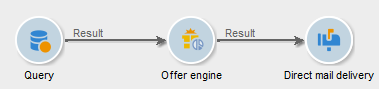

# Motor de oferta{#offer-engine}

The **[!UICONTROL Offer engine]** activity lets you define a call to the offer engine prior to a delivery.

Esta actividad funciona con el mismo principio que la actividad de enriquecimiento con acceso al motor, enriquece los datos de población entrantes con una oferta calculada por el motor antes de un envío.

Después de configurar la consulta (consulte esta [sección](../../workflow/using/query.md)):

1. Add and open an **[!UICONTROL Offer engine]** activity.
1. Complete los diferentes campos disponibles para especificar el uso de los parámetros del motor de oferta (ofrecer espacio, categoría o tema, fecha de contacto, número de ofertas que desea mantener). Según estos parámetros, el motor calculará automáticamente las ofertas a agregar.

   >[!CAUTION]
   >
   >Si utiliza esta actividad, solo se almacenará la oferta que se haya utilizado en el envío.

   

1. A continuación, configure una actividad de envío que corresponda al canal elegido. Consulte Entregas multicanal.

