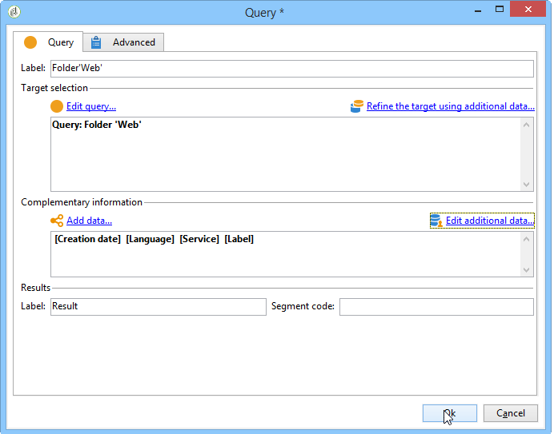
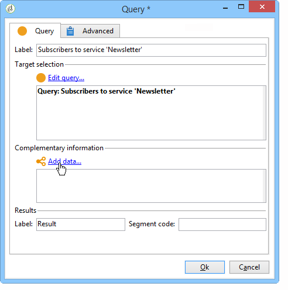
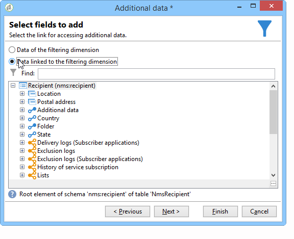

# Consulta{#query}

## Creación de consultas {#creating-a-query}

Una consulta le permite seleccionar un objetivo según los criterios. Puede asociar un código de segmento al resultado de la consulta e insertar datos adicionales en él.
Para obtener más información sobre los ejemplos de consultas, consulte esta [sección](../../workflow/using/querying-recipient-table.md).

>[!NOTE]
>
>Las actividades de consulta no son compatibles con los campos CLOB al utilizar Oracle.

For more on using and managing additional data, refer to [Adding data](#adding-data).

The **[!UICONTROL Edit query...]** link lets you define the targeting type, the restrictions, and the selection criteria for the population in the following way:

1. Seleccione la dimensión de segmentación y filtrado. De forma predeterminada, el objetivo se selecciona en los destinatarios. La lista de filtros de restricción es la misma que la utilizada para el objetivo de la entrega.

   La dimensión de establecimiento de objetivos coincide con el tipo de elemento en el que se trabajará, por ejemplo la población objetivo de la operación.

   La dimensión de filtrado permite recopilar estos elementos, por ejemplo información relacionada con la persona de destino (contratos, liquidaciones totales y definitivas, etc.).

   Para obtener más información sobre esto, consulte [Segmentación y filtrado de dimensiones](../../workflow/using/building-a-workflow.md#targeting-and-filtering-dimensions).

   

   A query can be based on data from the inbound transition, if necessary, by selecting **[!UICONTROL Temporary schema]** when choosing targeting and filtering dimensions.

   

1. Defina las poblaciones mediante el asistente. Los campos que se van a introducir pueden variar según el tipo de destino. You can preview the targeted population with your current criteria using the **[!UICONTROL Preview]** tab.

   Consulte esta [sección](../../platform/using/filtering-options.md)para obtener más información sobre la creación y el uso de filtros o consultas.

   

1. If you have selected **[!UICONTROL Filtering conditions]** at step 1 or using the **[!UICONTROL Filters]** > **[!UICONTROL Advanced filter...]** option, then you will have to manually add filtering criteria later on.

   También puede agregar condiciones de agrupación de datos marcando el cuadro correspondiente. Para ello, la dimensión del filtro debe ser diferente a la dimensión de objetivos de la consulta. Para obtener más información sobre la agrupación, consulte esta [sección](../../workflow/using/querying-using-grouping-management.md).

   También puede agregar más criterios utilizando el generador de expresiones y combinándolo con las opciones lógicas AND, OR y EXCEPT. You can then preview the **[!UICONTROL Corresponding SQL query...]** for your criteria combination. Consulte esta [sección](../../platform/using/defining-filter-conditions.md#building-expressions)para obtener más información.

   Guarde el filtro si desea volver a utilizarlo más tarde.

   

## Añadir datos {#adding-data}

Las columnas adicionales permiten recopilar información adicional sobre la población de destino, por ejemplo, números de contrato, suscripciones a boletines o código fuente. Estos datos se pueden almacenar en la base de datos de Adobe Campaign o en una base de datos externa.

The **[!UICONTROL Add data...]** link lets you select the additional data to collect.

Para empezar, seleccione el tipo de datos que desea añadir:

* Seleccione **[!UICONTROL Data linked to the filtering dimension]** para seleccionar los datos en la base de datos de Adobe Campaign.
* Select **[!UICONTROL External data]** to add data from an external database. Esta opción solo está disponible si ha comprado la opción **Federated Data Access.** Para obtener más información sobre esto, consulte [Acceso a una base de datos externa (FDA)](../../workflow/using/accessing-an-external-database--fda-.md).
* Select the **[!UICONTROL An offer proposition]** option to add a set of columns which let you store the best proposition generated by the offer engine. Esta opción solo está disponible si ha comprado el módulo **Interaction**.

Si no hay un módulo opcional instalado en la plataforma, este paso no se muestra. Se le dirigirá al siguiente paso.

Para agregar datos de la base de datos de Adobe Campaign:

1. Seleccione el tipo de datos que desea añadir. Pueden ser datos de la dimensión o datos almacenados en tablas enlazadas.

   

1. Si los datos pertenecen a la dimensión de filtrado de la consulta, simplemente selecciónelos en la lista de campos disponibles para mostrarlos en las columnas de salida.

   

   Puede añadir:

   * Campo calculado basado en los datos tomados desde la población de destino o un agregado (número de compras pendientes en el último mes, cantidad promedio de un recibo, etc.). Por ejemplo, vaya a [Seleccionar datos](../../workflow/using/targeting-data.md#selecting-data).
   * A new field, created using the **[!UICONTROL Add]** button to the right of the list of output columns.

      También puede añadir una colección de información, por ejemplo una lista de contratos, los últimos 5 envíos, etc. Las colecciones coinciden con los campos que pueden tener múltiples valores para el mismo perfil (relación 1-N). Para obtener más información sobre esto, consulte [Edición de datos](../../workflow/using/targeting-data.md#editing-additional-data)adicionales.

Para añadir una colección de información enlazada a una población de destino:

1. En el primer paso del asistente, seleccione la **[!UICONTROL Data linked to the filtering dimension]** opción:
1. Select the table which contains the information you want to collect and click **[!UICONTROL Next]**.

   

1. If necessary, specify the number of elements of the collection that you want to keep by selecting one of the values in the **[!UICONTROL Data collected]** field. De forma predeterminada, todas las líneas de la colección se recuperan y luego se filtran de acuerdo con las condiciones especificadas en el siguiente paso.

   * If a single element of the collection coincides with the filtering conditions for this collection, select **[!UICONTROL Single row]** in the **[!UICONTROL Data collected]** field.

      >[!IMPORTANT]
      >
      >Este modo optimiza la consulta SQL generada gracias a una coyuntura directa en los elementos de la colección.
      >
      >Si no se respeta la condición inicial, el resultado puede ser defectuoso (falta de líneas o líneas superpuestas).

   * If you choose to recover several lines (**[!UICONTROL Limit the line count]**) you can specify the number of lines to collect.
   * Si las columnas recopiladas contienen agregados, por ejemplo, el número de errores declarados, el gasto promedio en un sitio, etc. puede utilizar el **[!UICONTROL Aggregates]** valor.
   

1. Especifique la selección de la colección. Por ejemplo: solo compras durante los últimos 15 días.

   

1. If you have selected the **[!UICONTROL Limit the line count]** option, define the order in which the collected data is to be filtered. Una vez que el número de líneas recopiladas es mayor que el número de líneas que especificó mantener, el orden de filtrado le permite especificar qué líneas mantener.

## Example: Targeting on simple recipient attributes {#example--targeting-on-simple-recipient-attributes}

En el siguiente ejemplo, la consulta busca identificar hombres de entre 18 y 30 años que viven en Francia. Esta consulta se utilizará en un flujo de trabajo para que sea una oferta exclusiva, por ejemplo.

>[!NOTE]
>
>En [esta sección](../../workflow/using/querying-recipient-table.md) se presentan ejemplos de consultas.

1. Name your query then select the **[!UICONTROL Edit query...]** link.
1. Select **[!UICONTROL Filtering conditions]** in the list of types of filter available.
1. Introduzca los diferentes criterios para el objetivo propuesto. Los siguientes criterios se combinan con la opción AND. Para que se incluya en la selección, los destinatarios deberán cumplir las cuatro condiciones siguientes:

   * Destinatarios cuyo título es “Sr.” (también se puede encontrar utilizando el campo **Género** y seleccionar el valor **Hombre**).
   * Destinatarios menores de 30 años.
   * Destinatarios mayores de 18 años.
   * Destinatarios que viven en Francia.
   

   Puede ver el SQL que coincide con su combinación de criterios:

   

1. Puede verificar que sus criterios son correctos si obtiene una vista previa de los destinatarios que coinciden con su consulta en la pestaña correspondiente:

   

1. Save your filters so that you can use them again at a later date by clicking **[!UICONTROL Finish]** > **[!UICONTROL OK]**.
1. Siga editando el flujo de trabajo añadiendo otras actividades. Una vez que se haya iniciado y haya finalizado el paso anterior, se mostrará el número de destinatarios encontrados. You can display further details using the mouse pop-up menu (right click the transition > **[!UICONTROL Display the target...]**).

   

## Parámetros de salida {#output-parameters}

* tableName
* esquema
* recCount

Este conjunto de tres valores identifica la población objetivo de la consulta. **[!UICONTROL tableName]** es el nombre de la tabla que registra los identificadores de destino, **[!UICONTROL schema]** es el esquema de la población (normalmente nms:Recipiente) y **[!UICONTROL recCount]** es el número de elementos de la tabla.

Este valor es el esquema de la tabla de trabajo. This parameter is valid for all transitions with **[!UICONTROL tableName]** and **[!UICONTROL schema]**.

## Optimización de las consultas {#optimizing-queries}

La sección siguiente ofrece optimizaciones para optimizar las consultas que se ejecutan en Adobe Campaign a fin de limitar la carga de trabajo en la base de datos y mejorar la experiencia del usuario.

### Uniones e índices {#joins-and-indexes}

* Las consultas eficientes se basan en índices.
* Utilice un índice para todas las combinaciones.
* La definición de vínculos en el esquema determinará las condiciones de combinación. La tabla vinculada debe tener un índice único en la clave principal y la combinación debe estar en este campo.
* Para realizar combinaciones, defina las claves en campos numéricos en lugar de campos de cadena.
* Evite realizar uniones externas. Siempre que sea posible, utilice el registro de cero ID para lograr la funcionalidad de unión externa.
* Utilice el tipo de datos correcto para las uniones.

   Asegúrese de que la `where` cláusula es del mismo tipo que el campo.

   Un error común es: `iBlacklist='3'` donde `iBlacklist` es un campo numérico y `3` significa un valor de texto.

   Asegúrese de saber cuál será el plan de ejecución de la consulta. Evite los análisis de tabla completos, especialmente para consultas en tiempo real o consultas en tiempo real que se ejecuten cada minuto.

Para obtener más información sobre esto, consulte[las secciones Prácticas](https://helpx.adobe.com/campaign/kb/acc-data-model-best-practices.html) recomendadas del modelo de datos y Asignación de [bases de datos](../../configuration/using/database-mapping.md) .

### Funciones {#functions}

* Cuidado con funciones como `Lower(...)`. Cuando se utiliza la función Lower (Inferior), no se utiliza Index (Índice).
* Compruebe las consultas utilizando la instrucción &quot;me gusta&quot; o las instrucciones &quot;superior&quot; o &quot;inferior&quot; cuidadosamente. Aplique &quot;Superior&quot; en la entrada del usuario, no en el campo de la base de datos.

   For more on functions, refer to [this section](../../platform/using/defining-filter-conditions.md#list-of-functions).

### Filtrado de dimensiones {#filtering-dimensions}

Utilice la dimensión de filtrado de la consulta en lugar de utilizar el operador &quot;existe como&quot;.

En las consultas, las condiciones de &quot;existe como&quot; en los filtros no son eficaces. Son el equivalente de una subconsulta en SQL:

`select iRecipientId from nmsRecipient where iRecipientId IN (select iRecipientId from nmsBroadLog where (...))`

Lo mejor es utilizar la dimensión de filtrado de la consulta:

El equivalente de la dimensión de filtrado en SQL es la unión interna:

`select iRecipientId from nmsRecipient INNER JOIN nmsBroadLog ON (...)`

For more on filtering dimensions, refer to [this section](../../workflow/using/building-a-workflow.md#targeting-and-filtering-dimensions).

### Arquitectura {#architecture}

* Cree una plataforma de desarrollo con volúmenes, parámetros y arquitectura similares a los de la plataforma de producción.
* Utilice los mismos valores para los entornos de desarrollo y producción. Utilice lo mismo en la medida de lo posible:

   * Sistema operativo,
   * Versión,
   * Datos,
   * Aplicación,
   * Volúmenes.
   >[!NOTE]
   >
   >Es posible que una función que funciona en un entorno de desarrollo no funcione en un entorno de producción en el que los datos puedan ser diferentes. Intente identificar las principales diferencias para anticipar los riesgos y preparar soluciones.

* Realice configuraciones que coincidan con los volúmenes de destino. Los volúmenes grandes requieren configuraciones específicas. Una configuración que funcionó para 100.000 destinatarios puede que no funcione para 10.000.000 destinatarios.

   Considere la escala del sistema cuando se ponga en marcha. Sólo porque algo funcione a pequeña escala no significa que sea adecuado con mayores volúmenes. Las pruebas deben realizarse con volúmenes similares al volumen de producción. También debe evaluar el efecto de los cambios en los volúmenes (número de llamadas, tamaño de la base de datos) en las horas pico, los días pico y a lo largo de la vida del proyecto.
