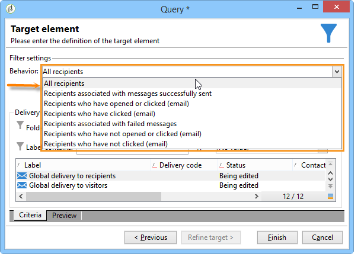

# Consulta de información de envío {#querying-delivery-information}

## Número de clics de un envío específico {#number-of-clicks-for-a-specific-delivery}

En este ejemplo, se busca recuperar el número de clics de un envío específico. Estos clics se registran gracias a los registros de seguimiento de destinatarios realizados durante un período determinado. El destinatario se identifica mediante su dirección de correo electrónico. Esta consulta utiliza la **[!UICONTROL Recipient tracking logs]** tabla.

* ¿Qué tabla se debe seleccionar?

   La tabla de seguimiento de registro de destinatarios (**[!UICONTROL nms:trackingLogRcp]**)

* ¿Campos que se desea seleccionar para las columnas de salida?

   Clave principal (con recuento) y correo electrónico

* ¿En función de qué criterios se filtra la información?

   Un periodo específico y un elemento de la etiqueta de envío.

Para llevar a cabo este ejemplo, aplique los siguientes pasos:

1. Abra el **[!UICONTROL Generic query editor]** y seleccione el **[!UICONTROL Recipient tracking logs]** esquema.

   

1. In the **[!UICONTROL Data to extract]** window, we want to create an aggregate to collect information. Para ello, agregue la clave principal (ubicada encima del **[!UICONTROL Recipient tracking logs]** elemento principal): El recuento de registros de seguimiento se realiza en este **[!UICONTROL Primary key]** campo. La expresión editada será **[!UICONTROL x=count(primary key)]**. Vincula la suma de diversos registros de seguimiento a una sola dirección de correo electrónico.

   Para ello:

   * Haga clic en el **[!UICONTROL Add]** icono a la derecha del **[!UICONTROL Output columns]** campo. En la **[!UICONTROL Formula type]** ventana, seleccione la **[!UICONTROL Edit the formula using an expression]** opción y haga clic en **[!UICONTROL Next]**. En la **[!UICONTROL Field to select]** ventana, haga clic en **[!UICONTROL Advanced selection]**.

      

   * In the **[!UICONTROL Formula type]** window, run a process on the aggregate function. Este proceso es un recuento de clave principal.

      Seleccione **[!UICONTROL Process on an aggregate function]** en la **[!UICONTROL Aggregate]** sección y haga clic en **[!UICONTROL Count]**.

      

      Haga clic **[!UICONTROL Next]**.

   * Seleccione el **[!UICONTROL Primary key (@id)]** campo. Se ha configurado la columna **[!UICONTROL count (primary key)]** de salida.

      

1. Seleccione el otro campo que se desea mostrar en la columna de salida. En la **[!UICONTROL Available fields]** columna, abra el **[!UICONTROL Recipient]** nodo y elija **[!UICONTROL Email]**. Check the **[!UICONTROL Group]** box to **[!UICONTROL Yes]** to group the tracking logs by email address: this group links each log to its recipient.

   

1. Configure la ordenación de columnas para que se muestren primero los destinatarios más activos (con la mayoría de registros de seguimiento). Compruebe **[!UICONTROL Yes]** la **[!UICONTROL Descending sort]** columna.

   

1. A continuación, se debe filtrar los registros de interés, es decir, aquellos que tengan menos de 2 semanas y que impliquen envíos relacionados con ventas.

   Para ello:

   * Configure el filtrado de datos. Para ello, seleccione **[!UICONTROL Filter conditions]** y haga clic en **[!UICONTROL Next]**.

      

   * Recupere los registros de seguimiento durante un período determinado para un envío específico. Se necesitan tres condiciones de filtrado: dos condiciones de fecha para establecer el período de búsqueda entre 2 semanas antes de la fecha actual y el día antes de la fecha actual; y otra condición para restringir la búsqueda a un envío específico.

      In the **[!UICONTROL Target element]** window, configure the date starting from which tracking logs will be taken into account. Haga clic **[!UICONTROL Add]**. Se muestra una línea de condición. Edite la **[!UICONTROL Expression]** columna haciendo clic en la **[!UICONTROL Edit expression]** función. En la **[!UICONTROL Field to select]** ventana, elija **[!UICONTROL Date (@logDate)]**.

      

      Seleccione el **[!UICONTROL greater than]** operador. En la **[!UICONTROL Value]** columna, haga clic en **[!UICONTROL Edit expression]** y, en la **[!UICONTROL Formula type]** ventana, seleccione **[!UICONTROL Process on dates]**. Finalmente, en **[!UICONTROL Current date minus n days]**, introduzca &quot;15&quot;.

      Haga clic **[!UICONTROL Finish]**.

      

   * To select the tracking log search end date, create a second condition by clicking **[!UICONTROL Add]**. En la **[!UICONTROL Expression]** columna, elija **[!UICONTROL Date (@logDate)]** nuevamente.

      Seleccione el **[!UICONTROL less than]** operador. En la **[!UICONTROL Value]** columna, haga clic en **[!UICONTROL Edit expression]**. Para el procesamiento de fechas, vaya a la **[!UICONTROL Formula type]** ventana, introduzca &quot;1&quot; en **[!UICONTROL Current date minus n days]**.

      Haga clic **[!UICONTROL Finish]**.

      

      Ahora, se desea configurar la tercera condición de filtro; es decir, la etiqueta de envío que abarca la consulta.

   * Click the **[!UICONTROL Add]** function to create another filtering condition. En la **[!UICONTROL Expression]** columna, haga clic en **[!UICONTROL Edit expression]**. En la **[!UICONTROL Field to select]** ventana, elija **[!UICONTROL Label]** en el **[!UICONTROL Delivery]** nodo.

      Haga clic **[!UICONTROL Finish]**.

      

      Busque un envío que contenga la palabra “ventas”. Since you don&#39;t remember its exact label, you can choose the **[!UICONTROL contains]** operator and enter &quot;sales&quot; in the **[!UICONTROL Value]** column.

      

1. Click **[!UICONTROL Next]** until you get to the **[!UICONTROL Data preview]** window: no formatting is necessary here.
1. En la **[!UICONTROL Data preview]** ventana, haga clic en **[!UICONTROL Start the preview of the data]** para ver el número de registros de seguimiento de cada destinatario de la entrega.

   El resultado se muestra en orden descendente.

   

   El número mayor de registros para un usuario es 6 para este envío. Cinco usuarios diferentes han abierto el correo electrónico de envío o han hecho clic en uno de los enlaces del mismo.

## Destinatarios que no han abierto ningún envío {#recipients-who-did-not-open-any-delivery}

En este ejemplo, se desea filtrar los destinatarios que no hayan abierto un correo electrónico en los últimos 7 días.

Para crear este ejemplo, aplique los pasos siguientes:

1. Drag and drop a **[!UICONTROL Query]** activity in a workflow and open the activity.
1. Click **[!UICONTROL Edit query]** and set the target and filtering dimensions to **[!UICONTROL Recipients]**.

   

1. Seleccione **[!UICONTROL Filtering conditions]** y haga clic en **[!UICONTROL Next]**.
1. Haga clic en el **[!UICONTROL Add]** botón y seleccione **[!UICONTROL Tracking logs]**.
1. Establezca el valor **[!UICONTROL Operator]** de la **[!UICONTROL Tracking logs]** expresión en **[!UICONTROL Do not exist such as]**.

   

1. Agregue otra expresión. Seleccione **[!UICONTROL Type]** en la **[!UICONTROL URL]** categoría.
1. Luego, establezca su **[!UICONTROL Operator]** a **[!UICONTROL equal to]** y su **[!UICONTROL Value]** a **[!UICONTROL Open]**.

   

1. Add another expression and select **[!UICONTROL Date]**. **[!UICONTROL Operator]** debe establecerse en **[!UICONTROL on or after]**.

   

1. To set the value last 7 days, click the **[!UICONTROL Edit expression]** button in the **[!UICONTROL Value]** field.
1. In the **[!UICONTROL Function]** category, select **[!UICONTROL Current date minus n days]** and add the number of days you want to target. En este caso, se busca fijar como objetivo los últimos 7 días.

   

La transición saliente contiene destinatarios que no han abierto un correo electrónico en los últimos 7 días.

Si, por el contrario, se desea filtrar los destinatarios que hayan abierto al menos un correo electrónico, la consulta debe ser la siguiente: Please note that, in this case, the **[!UICONTROL Filtering dimension]** shoud be set to **[!UICONTROL Tracking logs (Recipients)]**.

## Destinatarios que han abierto un envío {#recipients-who-have-opened-a-delivery}

El ejemplo siguiente muestra cómo dirigirse a perfiles que han abierto un envío en las últimas 2 semanas:

1. Para segmentar perfiles que hayan abierto una entrega, debe utilizar los registros de seguimiento. se almacenan en una tabla vinculada: comience seleccionando esta tabla en la lista desplegable del **[!UICONTROL Filtering dimension]** campo, como se muestra a continuación:

   

1. Concerning filtering conditions, click the **[!UICONTROL Edit expression]** icon of the criteria shown in the sub-tree structure of the tracking logs. Seleccione el **[!UICONTROL Date]** campo.

   

   Haga clic en **[!UICONTROL Finish]** para confirmar la selección.

   In order to recover only the tracking logs less than two weeks old, select the **[!UICONTROL Greater than]** operator.

   

   Then click the **[!UICONTROL Edit expression]** icon in the **[!UICONTROL Value]** column to define the calculation formula to be applied. Select the **[!UICONTROL Current date minus n days]** formula and enter 15 in the related field.

   

   Click the **[!UICONTROL Finish]** button of the formula window. In the filtering window, click the **[!UICONTROL Preview]** tab to check targeting criteria.

   

## Filtrado del comportamiento de los destinatarios después de un envío {#filtering-recipients--behavior-folllowing-a-delivery}

In a workflow, the **[!UICONTROL Query]** and **[!UICONTROL Split]** boxes let you select a behavior following a previous delivery. This selection is carried out via the **[!UICONTROL Delivery recipient]** filter.

* Objetivo del ejemplo

   En un flujo de trabajo de envío, hay varias formas de realizar seguimiento a una primera comunicación por correo electrónico. This type of operation involves using the **[!UICONTROL Split]** box.

* Contexto

   Se envía una “Oferta de deportes de verano”. Cuatro días después del envío, se realizan otros dos envíos. Uno de ellos es “Oferta de deportes acuáticos”, el otro es un seguimiento del primer envío “Oferta de deportes de verano”.

   El envío “Oferta de deportes acuáticos” se realiza a los destinatarios que han hecho clic en el enlace “Deportes acuáticos” en el primer envío. Estos clics muestran que el destinatario está interesado en el tema. Esto tiene sentido para dirigirlos a ofertas similares. Sin embargo, los destinatarios que no hayan hecho clic en “Oferta de deportes de verano” reciben el mismo contenido nuevamente.

The following steps show you how to configure the **[!UICONTROL Split]** box by integrating two different behaviors:

1. Insert the **[!UICONTROL Split]** box into the workflow. Esta casilla desglosa los destinatarios del primer envío en los dos envíos siguientes. El desglose se produce en función de las condiciones de filtrado vinculadas al comportamiento del destinatario durante el primer envío.

   

1. Abra el **[!UICONTROL Split]** cuadro. En la **[!UICONTROL General]** ficha, introduzca una etiqueta: **Dividir según el comportamiento** , por ejemplo.

   

1. In the **[!UICONTROL Subsets]** tab, define the first split branch. Por ejemplo, introduzca la etiqueta en los que se ha hecho **clic** para esta rama.
1. Seleccione la **[!UICONTROL Add a filtering condition on the incoming population]** opción. Haga clic **[!UICONTROL Edit]**.
1. En la **[!UICONTROL Targeting and filtering dimension]** ventana, haga doble clic en el **[!UICONTROL Recipients of a delivery]** filtro.

   

1. In the **[!UICONTROL Target element]** window, select the behavior you want to apply to this branch: **[!UICONTROL Recipients having clicked (email)]**.

   A continuación, seleccione la **[!UICONTROL Delivery specified by the transition]** opción. Esta funcionalidad recupera automáticamente a los destinatarios segmentados durante el primer envío.

   Este es el envío “Oferta de deportes acuáticos”.

   

1. Defina la segunda rama. Esta rama incluye el correo electrónico de seguimiento con el mismo contenido que para el primer envío. Vaya a la **[!UICONTROL Subsets]** ficha y haga clic en **[!UICONTROL Add]** para crearla.

   

1. Se muestra otra subpestaña. Denomínela “**No han hecho clic**”.
1. Haga clic **[!UICONTROL Add a filtering condition for the incoming population]**. A continuación, haga clic en **[!UICONTROL Edit...]**.

   

1. Haga clic **[!UICONTROL Delivery recipients]** en la **[!UICONTROL Targeting and filtering dimension]** ventana.
1. En la **[!UICONTROL Target element]** ventana, seleccione el **[!UICONTROL Recipients who did not click (email)]** comportamiento. Seleccione la **[!UICONTROL Delivery specified by the transition]** opción como se muestra para la última rama.

   The **[!UICONTROL Split]** box is now fully configured.

   

A continuación, se muestra la lista de los distintos componentes configurados de forma predeterminada:

* **[!UICONTROL All recipients]**
* **[!UICONTROL Recipients of successfully sent messages,]**
* **[!UICONTROL Recipients who opened or clicked (email),]**
* **[!UICONTROL Recipients who clicked (email),]**
* **[!UICONTROL Recipients of a failed message,]**
* **[!UICONTROL Recipients who didn't open or click (email),]**
* **[!UICONTROL Recipients who didn't click (email).]**

   
