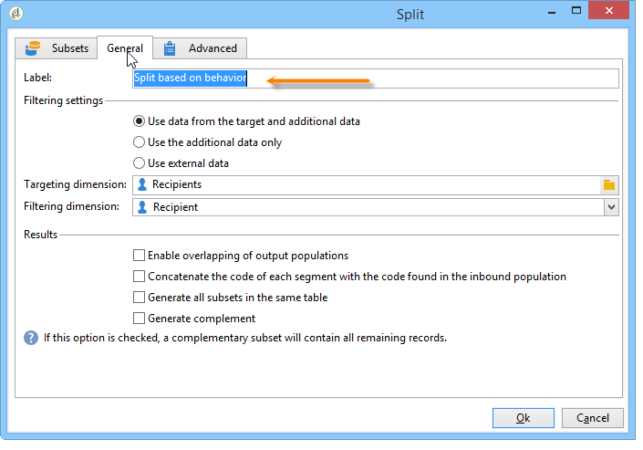

# Consulta de información de entrega {#querying-delivery-information}

## Número de clics de una entrega específica {#number-of-clicks-for-a-specific-delivery}

En este ejemplo, se busca recuperar el número de clics de una entrega específica. Estos clics se registran gracias a los registros de seguimiento de destinatarios realizados durante un periodo determinado. El destinatario se identifica mediante su dirección de correo electrónico. This query uses the **[!UICONTROL Recipient tracking logs]** table.

* ¿Qué tabla se debe seleccionar?

   The recipient log tracking table (**[!UICONTROL nms:trackingLogRcp]**)

* ¿Campos que se desea seleccionar para las columnas de salida?

   Clave principal (con recuento) y correo electrónico

* ¿En función de qué criterios se filtra la información?

   Un periodo específico y un elemento de la etiqueta de entrega.

Para llevar a cabo este ejemplo, aplique los siguientes pasos:

1. Abra el **[!UICONTROL Generic query editor]** y seleccione el **[!UICONTROL Recipient tracking logs]** esquema.

   

1. In the **[!UICONTROL Data to extract]** window, we want to create an aggregate to collect information. To do this, add the primary key (located above the main **[!UICONTROL Recipient tracking logs]** element): Tracking log count is carried out on this **[!UICONTROL Primary key]** field. The edited expression will be **[!UICONTROL x=count(primary key)]**. Vincula la suma de diversos registros de seguimiento a una sola dirección de correo electrónico.

   Para ello:

   * Click the **[!UICONTROL Add]** icon to the right of the **[!UICONTROL Output columns]** field. In the **[!UICONTROL Formula type]** window, select the **[!UICONTROL Edit the formula using an expression]** option and click **[!UICONTROL Next]**. En la ventana **[!UICONTROL Field to select]**, haga clic en **[!UICONTROL Advanced selection]**.

      

   * En la ventana **[!UICONTROL Formula type]**, ejecute un proceso en la función de acumulado. Este proceso es un recuento de clave principal.

      Seleccione **[!UICONTROL Process on an aggregate function]** en la **[!UICONTROL Aggregate]** sección y haga clic en **[!UICONTROL Count]**.

      

      Haga clic en **[!UICONTROL Next]**.

   * Select the **[!UICONTROL Primary key (@id)]** field. The **[!UICONTROL count (primary key)]** output column is configured.

      

1. Seleccione el otro campo que se desea mostrar en la columna de salida. In the **[!UICONTROL Available fields]** column, open the **[!UICONTROL Recipient]** node and choose **[!UICONTROL Email]**. Marque la casilla **[!UICONTROL Group]** en **[!UICONTROL Yes]** para agrupar los registros de seguimiento por dirección de correo electrónico: este grupo relaciona cada registro con su destinatario.

   

1. Configure la ordenación de columnas para que se muestren primero los destinatarios más activos (con la mayoría de registros de seguimiento). Compruebe **[!UICONTROL Yes]** la **[!UICONTROL Descending sort]** columna.

   

1. A continuación, se debe filtrar los registros de interés, es decir, aquellos que tengan menos de 2 semanas y que impliquen envíos relacionados con ventas.

   Para ello:

   * Configure el filtrado de datos. Para ello, seleccione **[!UICONTROL Filter conditions]** y haga clic en **[!UICONTROL Next]**.

      

   * Recupere los registros de seguimiento durante un periodo determinado para una entrega específica. Se necesitan tres condiciones de filtrado: dos condiciones de fecha para establecer el periodo de búsqueda entre 2 semanas antes de la fecha actual y el día antes de la fecha actual; y otra condición para restringir la búsqueda a una entrega específica.

      En la ventana **[!UICONTROL Target element]**, configure la fecha empezando desde la cual se deben tomar en cuenta los registros de seguimiento. Haga clic en **[!UICONTROL Add]**. Se muestra una línea de condición. Edit the **[!UICONTROL Expression]** column by clicking the **[!UICONTROL Edit expression]** function. In the **[!UICONTROL Field to select]** window, choose **[!UICONTROL Date (@logDate)]**.

      

      Seleccione el **[!UICONTROL greater than]** operador. En la **[!UICONTROL Value]** columna, haga clic en **[!UICONTROL Edit expression]** y, en la **[!UICONTROL Formula type]** ventana, seleccione **[!UICONTROL Process on dates]**. Finalmente, en **[!UICONTROL Current date minus n days]**, introduzca &quot;15&quot;.

      Haga clic en **[!UICONTROL Finish]**.

      

   * Para seleccionar la fecha de finalización de la búsqueda del registro de seguimiento, cree una segunda condición haciendo clic en **[!UICONTROL Add]**. En la **[!UICONTROL Expression]** columna, elija **[!UICONTROL Date (@logDate)]** nuevamente.

      Seleccione el **[!UICONTROL less than]** operador. In the **[!UICONTROL Value]** column, click **[!UICONTROL Edit expression]**. For date processing, go to the **[!UICONTROL Formula type]** window, enter &quot;1&quot; in **[!UICONTROL Current date minus n days]**.

      Haga clic en **[!UICONTROL Finish]**.

      

      Ahora, se desea configurar la tercera condición de filtro; es decir, la etiqueta de envío que abarca la consulta.

   * Haga clic en la función **[!UICONTROL Add]** para crear otra condición de filtrado. In the **[!UICONTROL Expression]** column, click **[!UICONTROL Edit expression]**. En la **[!UICONTROL Field to select]** ventana, elija **[!UICONTROL Label]** en el **[!UICONTROL Delivery]** nodo.

      Haga clic en **[!UICONTROL Finish]**.

      

      Busque una entrega que contenga la palabra “ventas”. Como no recuerda su etiqueta exacta, puede elegir el operador **[!UICONTROL contains]** e introducir “sales” en la columna **[!UICONTROL Value]**.

      

1. Click **[!UICONTROL Next]** until you get to the **[!UICONTROL Data preview]** window: no formatting is necessary here.
1. In the **[!UICONTROL Data preview]** window, click **[!UICONTROL Start the preview of the data]** to see the number of tracking logs for each delivery recipient.

   El resultado se muestra en orden descendente.

   

   El número mayor de registros para un usuario es 6 para esta entrega. Cinco usuarios diferentes han abierto el correo electrónico de entrega o han hecho clic en uno de los vínculos del mismo.

## Destinatarios que no han abierto ninguna entrega {#recipients-who-did-not-open-any-delivery}

En este ejemplo, se desea filtrar los destinatarios que no hayan abierto un correo electrónico en los últimos 7 días.

Para crear este ejemplo, aplique los pasos siguientes:

1. Arrastre y suelte una actividad **[!UICONTROL Query]** en un flujo de trabajo y ábrala.
1. Click **[!UICONTROL Edit query]** and set the target and filtering dimensions to **[!UICONTROL Recipients]**.

   

1. Seleccione **[!UICONTROL Filtering conditions]** y haga clic en **[!UICONTROL Next]**.
1. Haga clic en el botón **[!UICONTROL Add]** y seleccione **[!UICONTROL Tracking logs]**.
1. Defina el valor **[!UICONTROL Operator]** de la **[!UICONTROL Tracking logs]** expresión en **[!UICONTROL Do not exist such as]**.

   

1. Agregue otra expresión. Select **[!UICONTROL Type]** in the **[!UICONTROL URL]** category.
1. Then, set its **[!UICONTROL Operator]** to **[!UICONTROL equal to]** and its **[!UICONTROL Value]** to **[!UICONTROL Open]**.

   

1. Añada otra expresión y seleccione **[!UICONTROL Date]**. **[!UICONTROL Operator]** debe establecerse en **[!UICONTROL on or after]**.

   

1. To set the value last 7 days, click the **[!UICONTROL Edit expression]** button in the **[!UICONTROL Value]** field.
1. In the **[!UICONTROL Function]** category, select **[!UICONTROL Current date minus n days]** and add the number of days you want to target. En este caso, se busca fijar como objetivo los últimos 7 días.

   

La transición saliente contiene destinatarios que no han abierto un correo electrónico en los últimos 7 días.

Si, por el contrario, se desea filtrar los destinatarios que hayan abierto al menos un correo electrónico, la consulta debe ser la siguiente: Please note that, in this case, the **[!UICONTROL Filtering dimension]** shoud be set to **[!UICONTROL Tracking logs (Recipients)]**.

## Destinatarios que han abierto una entrega {#recipients-who-have-opened-a-delivery}

El ejemplo siguiente muestra cómo dirigirse a perfiles que han abierto una entrega en las últimas 2 semanas:

1. Para segmentar perfiles que hayan abierto una entrega, debe utilizar los registros de seguimiento. se almacenan en una tabla relacionada: comience seleccionando esta tabla en la lista desplegable del campo **[!UICONTROL Filtering dimension]**, como se muestra a continuación:

   

1. Con respecto a las condiciones de filtrado, haga clic en el icono **[!UICONTROL Edit expression]** de los criterios que se muestran en la estructura de sub-árbol de los registros de seguimiento. Select the **[!UICONTROL Date]** field.

   

   Click **[!UICONTROL Finish]** to confirm selection.

   Para recuperar únicamente los registros de seguimiento con menos de dos semanas, seleccione el operador **[!UICONTROL Greater than]**.

   

   A continuación, haga clic en el icono **[!UICONTROL Edit expression]** de la columna **[!UICONTROL Value]** para definir la fórmula de cálculo que se desea aplicar. Select the **[!UICONTROL Current date minus n days]** formula and enter 15 in the related field.

   

   Haga clic en el botón **[!UICONTROL Finish]** de la ventana de la fórmula. En la ventana de filtrado, haga clic en la pestaña **[!UICONTROL Preview]** para comprobar los criterios de objetivo.

   

## Filtrado del comportamiento de los destinatarios después de una entrega {#filtering-recipients--behavior-folllowing-a-delivery}

En un flujo de trabajo, las casillas **[!UICONTROL Query]** y **[!UICONTROL Split]** permiten seleccionar un comportamiento después de una entrega previa. This selection is carried out via the **[!UICONTROL Delivery recipient]** filter.

* Objetivo del ejemplo

   En un flujo de trabajo de entrega, hay varias formas de realizar seguimiento a una primera comunicación por correo electrónico. Este tipo de operación implica el uso de la casilla **[!UICONTROL Split]**.

* Contexto

   Se envía una “Oferta de deportes de verano”. Cuatro días después de la entrega, se realizan otras dos entregas. Uno de ellos es “Oferta de deportes acuáticos”, el otro es un seguimiento de la primera entrega “Oferta de deportes de verano”.

   La entrega “Oferta de deportes acuáticos” se realiza a los destinatarios que han hecho clic en el vínculo “Deportes acuáticos” en la primera entrega. Estos clics muestran que el destinatario está interesado en el tema. Esto tiene sentido para dirigirlos a ofertas similares. Sin embargo, los destinatarios que no hayan hecho clic en “Oferta de deportes de verano” reciben el mismo contenido nuevamente.

Los siguientes pasos muestran cómo configurar la casilla **[!UICONTROL Split]** integrando dos comportamientos diferentes:

1. Inserte la casilla **[!UICONTROL Split]** en el flujo de trabajo. Esta casilla desglosa los destinatarios de la primera entrega en los dos envíos siguientes. El desglose se produce en función de las condiciones de filtrado vinculadas al comportamiento del destinatario durante la primera entrega.

   

1. Open the **[!UICONTROL Split]** box. En la pestaña **[!UICONTROL General]**, introduzca una etiqueta: **Split based on behavior**, por ejemplo.

   

1. En la pestaña **[!UICONTROL Subsets]**, defina la primera rama de división. Por ejemplo, introduzca la etiqueta en los que se ha hecho **clic** para esta rama.
1. Seleccione la opción **[!UICONTROL Add a filtering condition on the incoming population]**. Haga clic en **[!UICONTROL Edit]**.
1. In the **[!UICONTROL Targeting and filtering dimension]** window, double-click the **[!UICONTROL Recipients of a delivery]** filter.

   

1. In the **[!UICONTROL Target element]** window, select the behavior you want to apply to this branch: **[!UICONTROL Recipients having clicked (email)]**.

   Below, select the **[!UICONTROL Delivery specified by the transition]** option. Esta funcionalidad recupera automáticamente a los destinatarios segmentados durante la primera entrega.

   Este es la entrega “Oferta de deportes acuáticos”.

   

1. Defina la segunda rama. Esta rama incluye el correo electrónico de seguimiento con el mismo contenido que para la primera entrega. Go to the **[!UICONTROL Subsets]** tab and click **[!UICONTROL Add]** to create it.

   

1. Se muestra otra subpestaña. Denomínela “**No han hecho clic**”.
1. Haga clic en **[!UICONTROL Add a filtering condition for the incoming population]**. A continuación, haga clic en **[!UICONTROL Edit...]**.

   

1. Haga clic **[!UICONTROL Delivery recipients]** en la **[!UICONTROL Targeting and filtering dimension]** ventana.
1. In the **[!UICONTROL Target element]** window, select the **[!UICONTROL Recipients who did not click (email)]** behavior. Select the **[!UICONTROL Delivery specified by the transition]** option as shown for the last branch.

   La casilla **[!UICONTROL Split]** ahora está totalmente configurada.

   

A continuación, se muestra la lista de los distintos componentes configurados de forma predeterminada:

* **[!UICONTROL All recipients]**
* **[!UICONTROL Recipients of successfully sent messages,]**
* **[!UICONTROL Recipients who opened or clicked (email),]**
* **[!UICONTROL Recipients who clicked (email),]**
* **[!UICONTROL Recipients of a failed message,]**
* **[!UICONTROL Recipients who didn't open or click (email),]**
* **[!UICONTROL Recipients who didn't click (email).]**

   
