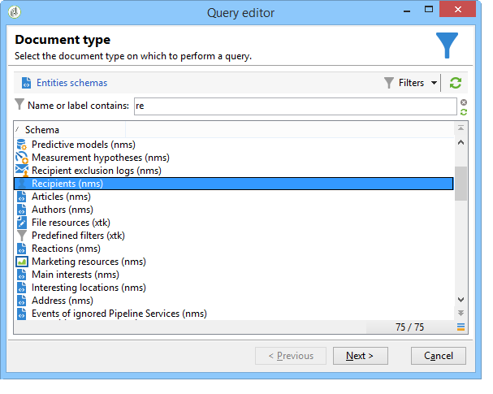

# Realización de consultas mediante la administración de agrupación {#querying-using-grouping-management}

En este ejemplo, se desea ejecutar una consulta para buscar todos los dominios de correo electrónico que han sido objetivos más de 30 veces durante las entregas anteriores.

* ¿Qué tabla se debe seleccionar?

  La tabla de destinatario (nms:recipient).

* ¿Campos que se van a seleccionar en las columnas de salida?

  Dominio de correo electrónico y clave principal (con recuento).

* ¿Agrupación de datos?

  En función del dominio de correo electrónico con un recuento de claves principales por encima de 30. Esta operación se lleva a cabo con la opción **[!UICONTROL Group by + Having]**. **[!UICONTROL Group by + Having]** permite agrupar los datos (“Group by”) y realizar una selección de lo que se ha agrupado (“Having”).

Para crear este ejemplo, aplique los pasos siguientes:

1. Abra **[!UICONTROL Generic query editor]** y seleccione la tabla de destinatarios (**nms:recipient**).

   

1. En la ventana **[!UICONTROL Data to extract]**, seleccione los campos **[!UICONTROL Email domain]** y **[!UICONTROL Primary key]**. Ejecute un recuento en el campo **[!UICONTROL Primary key]**.

   Para obtener más información sobre el recuento de claves principales, consulte [esta sección](../../platform/using/defining-filter-conditions.md#building-expressions).

1. Marque la casilla **[!UICONTROL Handle groupings (GROUP BY + HAVING)]**.

   

1. En la ventana **[!UICONTROL Sorting]**, ordene los dominios de correo electrónico en orden descendente. Para ello, seleccione **[!UICONTROL Yes]** en la columna **[!UICONTROL Descending sort]**. Haga clic en **[!UICONTROL Next]**.

   

1. En **[!UICONTROL Data filtering]**, seleccione **[!UICONTROL Filtering conditions]**. Vaya a la ventana **[!UICONTROL Target elements]** y haga clic en **[!UICONTROL Next]**.
1. En la ventana **[!UICONTROL Data grouping]**, seleccione la opción **[!UICONTROL Email domain]** haciendo clic en **[!UICONTROL Add]**.

   Esta ventana de agrupamiento de datos solo se muestra si se ha marcado la casilla **[!UICONTROL Handle groupings (GROUP BY + HAVING]**.

   

1. En la ventana **[!UICONTROL Grouping condition]**, indique un recuento de clave principal mayor que 30, ya que solo se desea que los dominios de correo electrónico que han sido objetivos más de 30 veces sean devueltos como resultados.

   Esta ventana aparece cuando se ha marcado la casilla **[!UICONTROL Manage groupings (GROUP BY + HAVING)]**: aquí es donde se filtra el resultado de la agrupación (HAVING).

   

1. En la ventana **[!UICONTROL Data formatting]**, haga clic en **[!UICONTROL Next]**: aquí no es necesario ningún formato.
1. En la ventana de vista previa de datos, haga clic en **[!UICONTROL Launch data preview]**: aquí se devuelven tres dominios de correo electrónico que han sido objetivos más de 30 veces.

   
