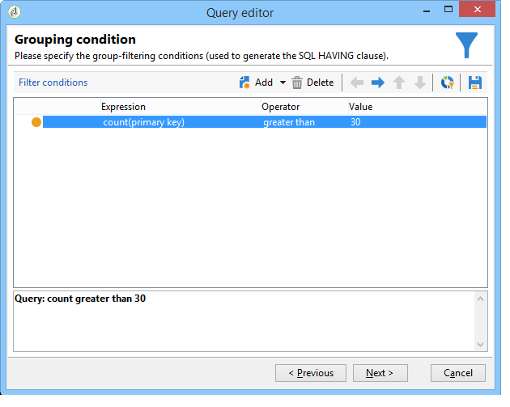

# Realización de consultas mediante la administración de agrupación {#querying-using-grouping-management}

En este ejemplo, se desea ejecutar una consulta para buscar todos los dominios de correo electrónico que han sido objetivos más de 30 veces durante los envíos anteriores.

* ¿Qué tabla se debe seleccionar?

   La tabla de destinatario (nms:recipient).

* ¿Campos que se van a seleccionar en las columnas de salida?

   Dominio de correo electrónico y clave principal (con recuento).

* ¿Agrupación de datos?

   En función del dominio de correo electrónico con un recuento de claves principales por encima de 30. This operation is carried out with the **[!UICONTROL Group by + Having]** option. **[!UICONTROL Group by + Having]** le permite agrupar datos (&quot;agrupar por&quot;) y realizar una selección de lo que se agrupó (&quot;tener&quot;).

Para crear este ejemplo, aplique los pasos siguientes:

1. Open the **[!UICONTROL Generic query editor]** and choose the Recipient table (**nms:recipient**).

   

1. En la **[!UICONTROL Data to extract]** ventana, seleccione los campos **[!UICONTROL Email domain]** y **[!UICONTROL Primary key]** . Ejecute un recuento en el **[!UICONTROL Primary key]** campo.

   Para obtener más información sobre el recuento de claves principales, consulte [esta sección](../../platform/using/defining-filter-conditions.md#building-expressions).

1. Marque la **[!UICONTROL Handle groupings (GROUP BY + HAVING)]** casilla.

   

1. In the **[!UICONTROL Sorting]** window, sort email domains in descending order. Para ello, desproteja **[!UICONTROL Yes]** la **[!UICONTROL Descending sort]** columna. Haga clic **[!UICONTROL Next]**.

   

1. En **[!UICONTROL Data filtering]**, seleccione **[!UICONTROL Filtering conditions]**. Vaya a la **[!UICONTROL Target elements]** ventana y haga clic en **[!UICONTROL Next]**.
1. En la **[!UICONTROL Data grouping]** ventana, seleccione la opción **[!UICONTROL Email domain]** haciendo clic en **[!UICONTROL Add]**.

   This data grouping window is only displayed if the **[!UICONTROL Handle groupings (GROUP BY + HAVING]**) box was checked.

   

1. In the **[!UICONTROL Grouping condition]** window, indicate a primary key count greater than 30 since we only want email domains targeted more than 30 times to be returned as results.

   This window appears when the **[!UICONTROL Manage groupings (GROUP BY + HAVING)]** box was checked: this is where the grouping result is filtered (HAVING).

   

1. En la **[!UICONTROL Data formatting]** ventana, haga clic en **[!UICONTROL Next]**: no es necesario aplicar formato aquí.
1. In the data preview window, click **[!UICONTROL Launch data preview]**: here, three different email domains targeted over 30 times are returned.

   
