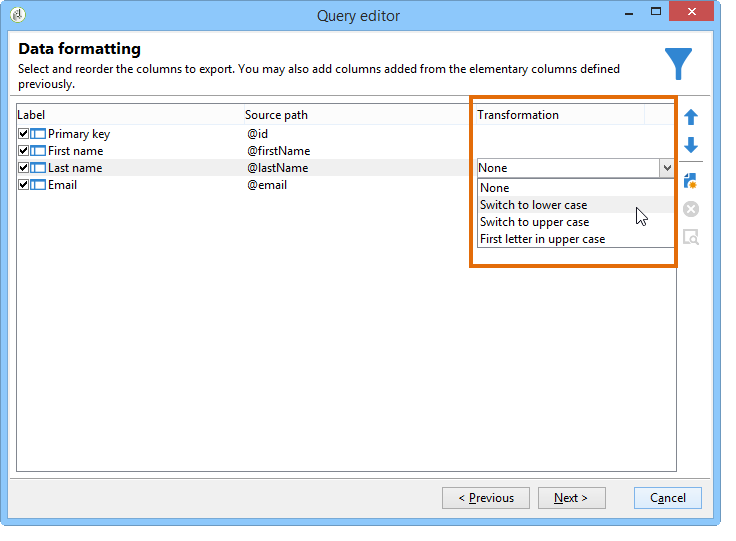
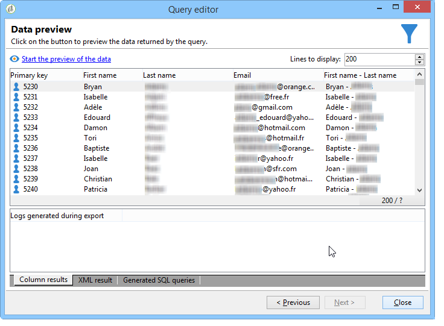

# Realización de consultas con una relación de varios a varios {#querying-using-a-many-to-many-relationship}

En este ejemplo, se desea recuperar los destinatarios no contactados durante los últimos 7 días. Esta consulta se refiere a todas las entregas.

En este ejemplo también muestra el modo de configurar un filtro relacionado con la selección de un elemento de recopilación (o nodo naranja). Collection elements are available in the **[!UICONTROL Field to select]** window.

* ¿Qué tabla se debe seleccionar?

   La tabla de destinatario (**nms:recipient**).

* Campos que se desea seleccionar para la columna de salida.

   Clave principal, Apellido, Nombre y Correo electrónico.

* ¿En función de qué criterios se filtra la información?

   En función de los registros de entrega de los destinatarios que van desde los 7 días anteriores a la fecha actual.

Siga estos pasos:

1. Abra el Editor de consultas genérico y seleccione la tabla de destinatarios **[!UICONTROL (nms:recipient)]**.
1. In the **[!UICONTROL Data to extract]** window, select **[!UICONTROL Primary key]**, **[!UICONTROL First name]**, **[!UICONTROL Last name]** and **[!UICONTROL Email]**.

   

1. En la ventana de ordenación, ordene los nombres alfabéticamente.

   

1. In the **[!UICONTROL Data filtering]** window, select **[!UICONTROL Filtering conditions]**.
1. En la ventana **[!UICONTROL Target element]**, la condición de filtrado para extraer perfiles sin registro de seguimiento para los últimos 7 días implica dos pasos. El elemento que se debe seleccionar es un vínculo de varios a varios.

   * Start by selecting the **[!UICONTROL Recipient delivery logs (broadlog)]** collection element (orange node) for the first **[!UICONTROL Value]** column.

      

      Seleccione el **[!UICONTROL do not exist as]** operador. No es necesario seleccionar un segundo valor en esta línea.

   * El contenido de la segunda condición de filtrado depende de la primera. Here, the **[!UICONTROL Event date]** field is offered directly in the **[!UICONTROL Recipient delivery logs]** table since there is a link to this table.

      

      Se selecciona **[!UICONTROL Event date]** con el **[!UICONTROL greater than or equal to]** operador. Select the **[!UICONTROL DaysAgo (7)]** value. To do this, click **[!UICONTROL Edit expression]** in the **[!UICONTROL Value]** field. En la **[!UICONTROL Formula type]** ventana, seleccione **[!UICONTROL Process on dates]** y **[!UICONTROL Current date minus n days]**, dando &quot;7&quot; como valor.

      

      Se ha configurado la condición de filtro.

      

1. En la ventana **[!UICONTROL Data formatting]**, cambie los apellidos a mayúscula. Click the **[!UICONTROL Last name]** line in the **[!UICONTROL Transformation]** column and select **[!UICONTROL Switch to upper case]** in the drop-down menu.

   

1. Use the **[!UICONTROL Add a calculated field]** function to insert a column into the data preview window.

   En este ejemplo, agregue un campo calculado con los nombres y apellidos de los destinatarios en una sola columna. Haga clic en la **[!UICONTROL Add a calculated field]** función. In the **[!UICONTROL Export calculated field definition]** window, enter a label and an internal name and choose the **[!UICONTROL JavaScript Expression]** type. A continuación, introduzca la siguiente expresión:

   ```
   var rep = source._firstName+" - "+source._lastName
   return rep
   ```

   

   Haga clic en **[!UICONTROL OK]**. The **[!UICONTROL Data formatting]** window is configured.

   Para obtener más información sobre la adición de campos calculados, consulte esta sección.

1. The result is shown in the **[!UICONTROL Data preview]** window. Los destinatarios que no hayan sido contactados en los últimos 7 días se muestran en orden alfabético. Los nombres se muestran en mayúsculas y se ha creado la columna con el nombre y los apellidos.

   
