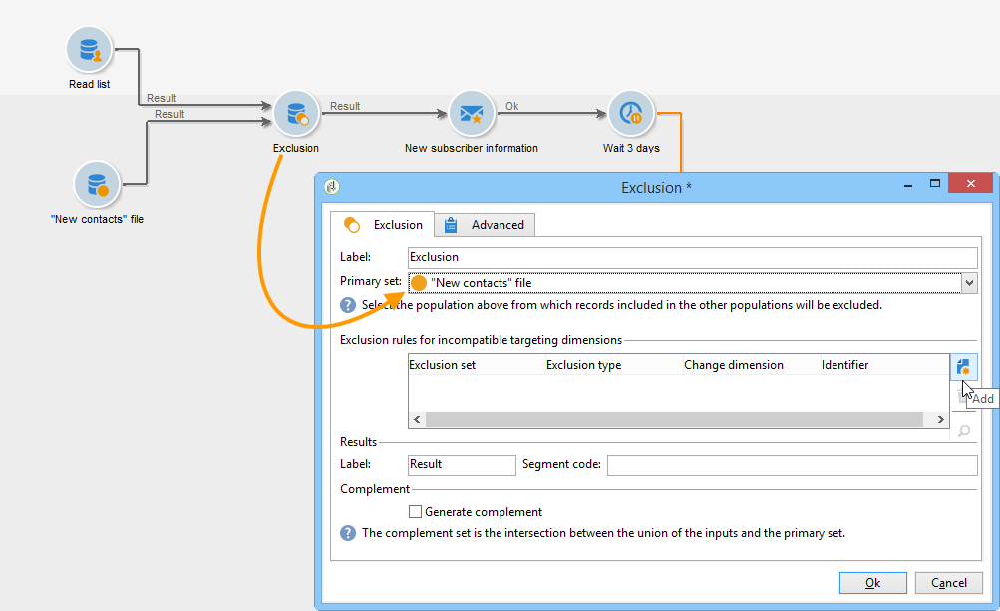

# Lista de lectura{#read-list}

Los datos procesados en un flujo de trabajo pueden proceder de listas en las que se han preparado o estructurado los datos (después de una segmentación previa o carga de archivo).

The **[!UICONTROL Read list]** activity lets you copy the data from a list in the workflow worktable, like data from a query. Entonces es accesible a través del flujo de trabajo.

The list to be processed can be specified explicitly, computed by a script or localized dynamically, according to options selected and parameters defined in a **[!UICONTROL Read list]** activity.

Si la lista no se especifica explícitamente, debe proporcionar una lista que se utilizará como plantilla para averiguar su estructura.

Once the list selection has been configured, you can add a filter using the **[!UICONTROL Edit query]** option to keep one part of the population for the next workflow.

>[!CAUTION]
>
>Para poder crear un filtro en una actividad de lista de lectura, la lista relevante debe ser un tipo de “archivo”.

The lists can be created directly in Adobe Campaign via the **[!UICONTROL Profiles and Targets > Lists]** link of the home page. They can also be created in a workflow using the **[!UICONTROL List update]** activity.

**Ejemplo: Excluir una lista de direcciones de envío**

El ejemplo siguiente permite utilizar una lista de direcciones de correo electrónico para excluir del destino de envío de correo electrónico.

Los perfiles contenidos en la carpeta **New contacts** deben ser dirigidos a una acción de envío. Las direcciones de correo electrónico que se excluirán del destino se almacenan en una lista externa. En nuestro ejemplo, solo se necesita la información sobre las direcciones de correo electrónico para la exclusión.

1. La consulta de selección de la carpeta **New Contact** s debe permitirle cargar las direcciones de correo electrónico de los perfiles seleccionados, con el fin de permitir la alineación con la información de la lista.

   

1. En este caso, la lista se almacena en la carpeta **Lists** y se calcula su etiqueta.

   

1. Para excluir las direcciones de correo electrónico de la lista externa desde el destino principal, debe configurar la actividad de exclusión y especificar que la carpeta **New Contacts** contenga los datos que se van a mantener. Los datos conjuntos entre este conjunto y cualquier otro conjunto entrante de la actividad de exclusión se eliminarán del objetivo.

   

   Las reglas de exclusión se configuran en la sección central de la herramienta de edición. Click the **[!UICONTROL Add]** button to define the type of exclusion to be applied.

   Puede definir varias exclusiones en función del número de transiciones entrantes de la actividad.

1. In the **[!UICONTROL Exclusion set]** field, select the **[!UICONTROL Read list]** activity: the data in this activity is to be excluded from the main set.

   En nuestro ejemplo, tenemos una exclusión en las combinaciones: los datos contenidos en la lista se reconciliarán con los datos del conjunto principal a través del campo que contiene la dirección de correo electrónico. Para configurar la unión, seleccione **[!UICONTROL Joins]** en el **[!UICONTROL Change dimension]** campo.

   

1. A continuación, seleccione el campo correspondiente a la dirección de correo electrónico en los dos conjuntos (origen y destino). Las columnas se enlazan y los destinatarios cuya dirección de correo electrónico se encuentre en la lista de direcciones importadas se excluirán del objetivo.

