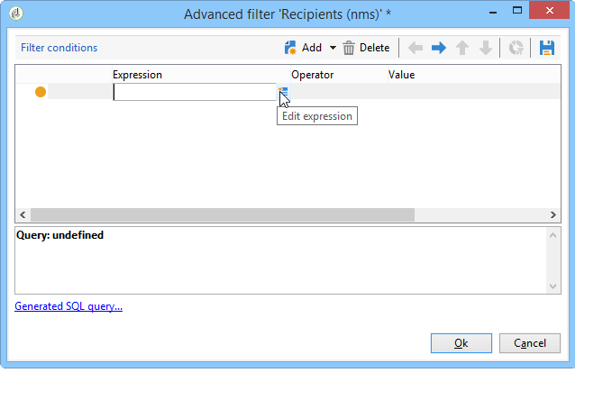

# Envío de correo electrónico de cumpleaños{#sending-a-birthday-email}

## Introducción {#introduction}

Este caso de uso detalla cómo planificar el envío de un correo electrónico recurrente a una lista de destinatarios en el día de su cumpleaños.

Para configurar este caso de uso, se ha creado el siguiente flujo de trabajo de objetivo:


Este flujo de trabajo (de ejecución diaria) selecciona todos los destinatarios que tienen su cumpleaños en la fecha actual.

Este caso de uso también se puede encontrar en forma de vídeo. Para obtener más información, consulte el vídeo [Creación de un flujo de trabajo](https://docs.campaign.adobe.com/doc/AC/en/Videos/Videos.html).

To do this, create a campaign and click the **[!UICONTROL Targeting and workflows]** tab. Para obtener más información sobre esto, consulte la sección [Generación del destino principal en un flujo de trabajo](../../campaign/using/marketing-campaign-deliveries.md#building-the-main-target-in-a-workflow) .

A continuación, siga estos pasos:

## Programación del envío {#configuring-the-scheduler}

1. First, add a **Scheduler** to trigger sending the delivery every day. En el siguiente ejemplo, el envío se crea cada día a las 6 a. m.

   


## Identificación de destinatarios que cumplen años {#identifying-recipients-whose-birthday-it-is}

After configuring the **[!UICONTROL Scheduler]** activity so that the workflow starts every day, identify all of the recipients whose date of birth equals the current date.

Para ello, siga los siguientes pasos:

1. Drag and drop a **[!UICONTROL Query]** activity into the workflow and double-click it.
1. Click the **Edit query** link and select **[!UICONTROL Filtering conditions]**.

   

1. Click the first cell of the **[!UICONTROL Expression]** column and click **[!UICONTROL Edit expression]** to open the expression editor.

   

1. Haga clic **[!UICONTROL Advanced selection]** para seleccionar el modo de filtrado.

   

1. Seleccione **[!UICONTROL Edit the formula using an expression]** y haga clic en **[!UICONTROL Next]** para mostrar el editor de expresiones.
1. En la lista de funciones, haga doble clic **[!UICONTROL Day]**, a la que se puede acceder a través del **[!UICONTROL Date]** nodo. Esta función devuelve el número que representa el día correspondiente a la fecha establecida como parámetro.

   

1. In the list of available fields, double-click **[!UICONTROL Birth date]**. A continuación, la sección superior del editor muestra la siguiente fórmula:

   ```
   Day(@birthDate)
   ```

   Click **[!UICONTROL Finish]** to confirm.

1. In the query editor, in the first cell of the **[!UICONTROL Operator]** column, select **[!UICONTROL equal to]**.

   

1. Next, click the first cell of the second column (**[!UICONTROL Value]**), and click **[!UICONTROL Edit expression]** to open the expression editor.
1. En la lista de funciones, haga doble clic **[!UICONTROL Day]**, a la que se puede acceder a través del **[!UICONTROL Date]** nodo.
1. Double-click the **[!UICONTROL GetDate]** function to retrieve the current date.

   

   La sección superior del editor muestra la siguiente fórmula:

   ```
   Day(GetDate())
   ```

   Click **[!UICONTROL Finish]** to confirm.

1. Repita este procedimiento para recuperar el mes de nacimiento correspondiente al mes actual. Para ello, haga clic en el **[!UICONTROL Add]** botón y repita los pasos del 3 al 10, reemplazando **[!UICONTROL Day]** por **[!UICONTROL Month]**.

   La consulta completa es la siguiente:

   

Link the result of the **[!UICONTROL Query]** activity to an **[!UICONTROL Email delivery]** activity to send an email to the list of all of your recipients on their birthday.

## Inclusión de destinatarios nacidos el 29 de febrero (opcional) {#including-recipients-born-on-february-29th--optional-}

Si se desea incluir todos los destinatarios nacidos el 29 de febrero, este caso de uso detalla cómo planificar el envío de un correo electrónico recurrente a una lista de destinatarios para su cumpleaños, ya sea un año bisiesto o no.

Los pasos de implementación principales para este caso de uso son:

* Selección de destinatarios
* Selección de año bisiesto o no
* Selección de cualquier destinatario nacido el 29 de febrero

Para configurar este caso de uso, se ha creado el siguiente flujo de trabajo de objetivo:


Si el año actual **no es un año bisiesto** y el flujo de trabajo se ejecuta el 1 de marzo, se necesita seleccionar todos los destinatarios que hubieran tenido su cumpleaños el día anterior (29 de febrero) y añadirlos a la lista de destinatarios. En cualquier otro caso no se requiere ninguna acción adicional.

### Paso 1: Selección de los destinatarios {#step-1--selecting-the-recipients}

After configuring the **[!UICONTROL Scheduler]** activity so that the workflow starts every day, identify all of the recipients whose anniversary is the current day.

>[!NOTE]
>
>Si el año actual es un año bisiesto, se incluyen automáticamente todos los destinatarios nacidos el 29 de febrero.


La selección de los destinatarios cuyo cumpleaños corresponde a la fecha actual se presenta en la sección [Identificación de los destinatarios cuyo cumpleaños es](#identifying-recipients-whose-birthday-it-is) .

### Step 2: Select whether or not it is a leap year {#step-2--select-whether-or-not-it-is-a-leap-year}

The **[!UICONTROL Test]** activity allows you to check whether or not it is a leap year and whether the current date is March 1st.

If the test is verified (the year is not a leap year - there is no February 29th - and the current date is indeed March 1st), the **[!UICONTROL True]** transition is enabled and the recipients born on February 29th will be added to the March 1st delivery. Otherwise, the **[!UICONTROL False]** transition is enabled and only the recipients born on the current date will receive the delivery.

Copy and paste the code below into the **[!UICONTROL Initialization script]** section of the **[!UICONTROL Advanced]** tab.

```
function isLeapYear(iYear)
{
    if(iYear/4 == Math.floor(iYear/4))
    {
        if(iYear/100 != Math.floor(iYear/100))
        {
            // Divisible by 4 only -> Leap Year
            return 1;
        }
        else
        {
            if(iYear/400 == Math.floor(iYear/400))
            {
                // Divisible by 4, 100 and 400 -> Leap year
                return 1;
            }
        }
    }
    // all others: no leap year
    return 0;
}

// Return today's date and time
var currentTime = new Date()
// returns the month (from 0 to 11)
var month = currentTime.getMonth() + 1
// returns the day of the month (from 1 to 31)
var day = currentTime.getDate()
// returns the year (four digits)
var year = currentTime.getFullYear()

// is current year a leap year?
vars.currentIsALeapYear = isLeapYear(year);

// is current date the first of march?
if(month == 3 && day == 1) {
  // today is 1st of march
vars.firstOfMarch = 1;
}
```


Add the following condition in the **[!UICONTROL Conditional forks]** section:

```
vars.currentIsALeapYear == 0 && vars.firstOfMarch == 1
```


### Step 3: Select any recipients born on February 29th {#step-3--select-any-recipients-born-on-february-29th}

Create a **[!UICONTROL Fork]** activity and link one of the outbound transitions to a **[!UICONTROL Query]** activity.

En esta consulta, seleccione todos los destinatarios cuya fecha de nacimiento sea el 29 de febrero.


Combine the results with a **[!UICONTROL Union]** activity.

Link the results of the two **[!UICONTROL Test]** activity branches to an **[!UICONTROL Email delivery]** activity to send an email to the list of all of your recipients on their birthday, even to those born on February 29th during a non-leap year.

## Creación de una entrega recurrente {#creating-a-recurring-delivery-in-a-targeting-workflow}

Agregue una actividad de **Recurring delivery** basada en la plantilla de correo electrónico de cumpleaños que desee enviar.

>[!CAUTION]
>
>Para que se ejecuten los flujos de trabajo, se deben iniciar los flujos de trabajo técnicos relacionados con el proceso de campaña. Para obtener más información sobre esto, consulte la sección [Lista de flujos de trabajo](../../workflow/using/campaign.md) de procesos de campaña.
>
>Si los pasos de aprobación están habilitados para la campaña, los envíos solo se realizan una vez que estén confirmados los pasos. Para obtener más información sobre esto, consulte la sección [Elección de los procesos que se van a aprobar](../../campaign/using/marketing-campaign-approval.md#choosing-the-processes-to-be-approved) .


