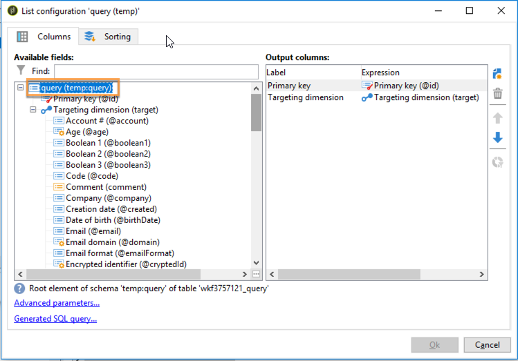
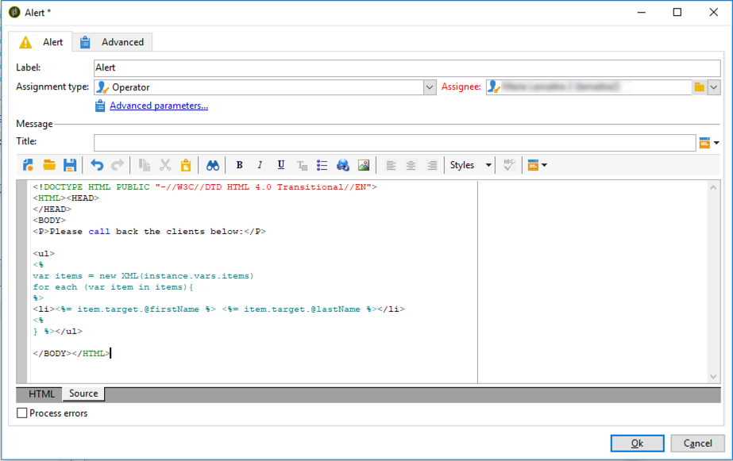

# Envío de alertas personalizadas a operadores{#sending-personalized-alerts-to-operators}

En este ejemplo, deseamos enviar una alerta a un operador que contendrá el nombre de los perfiles que abrieron un boletín informativo, pero que no hicieron clic en el vínculo que contenía.

Los campos de nombre y apellido de los perfiles se vinculan al entorno de segmentación de los **[!UICONTROL Destinatarios]**, mientras que la actividad **[!UICONTROL Alerta]** está vinculada al entorno de segmentación del **[!UICONTROL Operador]**. Como resultado, no hay ningún campo disponible entre los dos entornos de segmentación para realizar una conciliación y recuperar los campos Nombre y Apellido, y mostrarlos en la actividad de Alerta.

El proceso consiste en crear un flujo de trabajo como se muestra a continuación:

1. Utilice una actividad **[!UICONTROL Consulta]** para segmentar los datos.
1. Añadir una actividad **[!UICONTROL Código JavaScript]** al flujo de trabajo para guardar la población de la consulta en la variable de la instancia.
1. Utilice una actividad **[!UICONTROL Test]** para comprobar el recuento de población.
1. Utilice una actividad **[!UICONTROL Alert]** para enviar una alerta a un operador, según el resultado de la actividad **[!UICONTROL Test]**.


## Registro de población en la variable de instancia {#saving-the-population-to-the-instance-variable}

Agregue el código siguiente a la actividad **[!UICONTROL JavaScript code]**.

```
var query = xtk.queryDef.create(  
    <queryDef schema="temp:query" operation="select">  
      <select>  
       <node expr="[target/recipient.@firstName]"/>  
       <node expr="[target/recipient.@lastName]"/>  
      </select>  
     </queryDef>  
  );  
  var items = query.ExecuteQuery();
```

Asegúrese de que el código Javascript corresponde con la información de su flujo de trabajo:

* La etiqueta **[!UICONTROL queryDef schema]** debe corresponder al nombre de la dimensión de segmentación utilizado en la actividad de consulta.
* La etiqueta **[!UICONTROL node expr]** debe corresponder al nombre de los campos que se desea recuperar.


Para recuperar dicha información, siga los pasos siguientes:

1. Haga clic con el botón derecho en la transición saliente desde la actividad **[!UICONTROL Query]** y seleccione **[!UICONTROL Display the target]**.

   

1. Haga clic con el botón derecho en la lista y, luego, seleccione **[!UICONTROL Configure list]**.

   

1. Los nombres de las dimensiones y los campos de objetivos de consulta se muestran en la lista.

   

## Prueba del recuento de población {#testing-the-population-count}

Añadir el código siguiente a la actividad **[!UICONTROL Prueba]** para comprobar si la población objetivo contiene al menos 1 perfil.

```
var.recCount>0
```


## Configuración de la alerta {#setting-up-the-alert}

Ahora que la población ha sido añadida a la variable de la instancia con los campos deseados, puede añadir esta información en la actividad **[!UICONTROL Alerta]**.

Para ello, añadir a la pestaña **[!UICONTROL Fuente]** el siguiente código:

```
<ul>
<%
var items = new XML(instance.vars.items)
for each (var item in items){
%>
<li><%= item.target.@firstName %> <%= item.target.@lastName %></li>
<%
} %></ul>
```

>[!NOTE]
>
>El **[!UICONTROL &lt;%= item.target.recipient.@fieldName %>]** permite agregar uno de los campos que se han guardado en la variable de instancia a través de la actividad **[!UICONTROL Código JavaScript]**.\
>Puede agregar tantos campos como desee, siempre que se hayan insertado en el código JavaScript.



