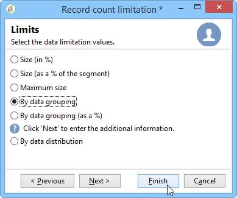
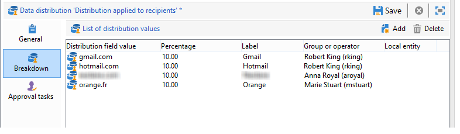

# División{#split}

La actividad del tipo **Split** permite dividir un segmento en varios subconjuntos. El segmento se construye con todos los resultados recibidos: todas las actividades anteriores deben terminar para que se ejecute esta actividad.

Esta actividad no desencadena una unión de poblaciones entrantes. If several transitions land in one split activity, we recommend inserting a **[!UICONTROL Union]** activity in front of it.

Para ver un ejemplo de la actividad dividida que se está utilizando, consulte [Creación de subconjuntos mediante la actividad](../../workflow/using/targeting-data.md#creating-subsets-using-the-split-activity)Dividir.

En [esta sección](../../workflow/using/cross-channel-delivery-workflow.md) se describe un ejemplo que muestra cómo usar la actividad Partición para segmentar el objetivo en diferentes poblaciones utilizando condiciones de filtrado.

An example showing how to use an instance variable in a Split activity is available in [this section](../../workflow/using/javascript-scripts-and-templates.md).

To configure this activity, define the subset content and label in the **[!UICONTROL Subsets]** tab, then choose the target dimension in the **[!UICONTROL General]** tab.

## Creación de subconjuntos {#creating-subsets}

Para crear un subconjunto:

1. Haga clic en la etiqueta del campo correspondiente y seleccione el filtro que desea aplicar.
1. Para filtrar la población entrante, seleccione la **[!UICONTROL Add a filtering condition]** opción y haga clic en el **[!UICONTROL Edit...]** vínculo.

   Seleccione el tipo de filtro que se aplicará a los datos para incluirlos en este conjunto.

   El proceso es el mismo que para una actividad de tipo **Query**.

   >[!NOTE]
   >
   >Puede filtrar los datos en un máximo de dos bases de datos externas (FDA).

1. Puede especificar el número máximo de registros que se extraerán del destino para crear el subconjunto. Para ello, marque la **[!UICONTROL Limit the selected records]** opción y haga clic en el **[!UICONTROL Edit...]** vínculo.

   Un asistente le permite elegir el modo de selección para los registros de este subconjunto. Los pasos se encuentran en [Limitación del número de registros](#limiting-the-number-of-subset-records)de subconjuntos.

   

1. If you wish, you can **add other subsets** using the **[!UICONTROL Add]** button.

   

   >[!NOTE]
   >
   >If the **[!UICONTROL Enable overlapping of output populations]** option is not checked, subsets are created in the order of the tabs. Utilice las flechas de la sección superior derecha de esta ventana para moverlas. Si el primer subconjunto recupera el 70% de la población inicial, por ejemplo, el siguiente subconjunto aplicará sus criterios de selección solo al 30% restante, y así sucesivamente.

   Para cada subconjunto creado, se agregará una transición saliente a la actividad dividida.

   

   You can choose to generate a single outbound transition (and identify sets using the segment code, for example): to do this, select the **[!UICONTROL Generate subsets in the same table]** option in the **[!UICONTROL General]** tab.

   Si se completa, el código de segmento de cada subconjunto se almacena automáticamente en una columna adicional. Se podrá acceder a esta columna en los campos personalizados en el nivel de envío.

## Limitación del número de registros de subconjunto {#limiting-the-number-of-subset-records}

Si no desea utilizar toda la población contenida en un subconjunto, puede limitar el número de registros que contendrá.

1. En la ventana de edición de subconjuntos, marque la **[!UICONTROL Limit the selected records]** opción y haga clic en el **[!UICONTROL Edit...]** vínculo.
1. Seleccione el tipo de límite que desee:

   * **[!UICONTROL Activate random sampling]**:: esta opción toma una muestra aleatoria de los registros. El tipo de muestreo aleatorio depende del motor de la base de datos.
   * **[!UICONTROL Keep only the first records after sorting]**:: esta opción le permite definir una limitación en función de uno o varios pedidos de clasificación. If you select the **[!UICONTROL Age]** field as a sorting criterion and 100 as the limit, only the youngest 100 recipients will be kept.
   * **[!UICONTROL Keep the first ones after sorting (criteria, random)]**: Esta opción combina las dos opciones anteriores. Permite definir una limitación basada en uno o más pedidos de ordenación y, a continuación, aplicar una selección aleatoria en los primeros registros si alguno de los registros tiene los mismos valores que los criterios definidos.

      For example, if you select the **[!UICONTROL Age]** field as a sorting criteria, and you then define a limit of 100, but the 2000 youngest recipients in the database are all 18, then 100 recipients will be randomly selected out of those 2000.
   

1. Si desea definir los criterios de ordenación, un paso adicional le permite definir las columnas y el orden de clasificación.

   

1. A continuación, elija el método de limitación de datos.

   

   Hay dos formas de hacerlo:

   * **[!UICONTROL Size (in %)]**:: un porcentaje de registros. Por ejemplo, la configuración a continuación extrae el 10% de la población total.

      El porcentaje se aplica a la población inicial, no al resultado de la actividad.

   * **[!UICONTROL Size (as a % of the segment)]**:: un porcentaje de registros relativos únicamente a los subconjuntos y no a la población inicial.
   * **[!UICONTROL Maximum size]**:: un número máximo de registros.
   * **[!UICONTROL By data grouping]**:: puede establecer un límite en el número de registros, en función de los valores de un campo especificado de la población entrante. Para obtener más información sobre este tema, consulte [Limitación del número de registros de subconjuntos por agrupación](#limiting-the-number-of-subset-records-by-data-grouping)de datos.
   * **[!UICONTROL By data grouping (in %)]**:: puede establecer un límite en el número de registros, en función de los valores de un campo especificado de la población entrante, mediante un porcentaje. Para obtener más información sobre este tema, consulte [Limitación del número de registros de subconjuntos por agrupación](#limiting-the-number-of-subset-records-by-data-grouping)de datos.
   * **[!UICONTROL By data distribution]**:: Si los campos de agrupación tienen demasiados valores o si desea evitar introducir los valores nuevamente para cada nueva actividad de división, Adobe Campaign permite configurar una **[!UICONTROL By data distribution]** limitación (módulo opcional de marketing distribuido). Para obtener más información sobre esto, consulte [Limitación del número de registros de subconjuntos por distribución](#limiting-the-number-of-subset-records-per-data-distribution)de datos.

1. Click **[!UICONTROL Finish]** to approve the record selection criteria. La configuración definida se muestra en la ventana intermedia del editor.

## Limitación del número de registros de subconjunto por lote de datos {#limiting-the-number-of-subset-records-by-data-grouping}

Puede limitar el número de registros por lote de datos. Este límite se puede realizar con un valor fijo o un porcentaje.

For instance, if you select the **[!UICONTROL Language]** field as a group field, you can define a list of records for each language.

1. Después de seleccionar los valores de limitación de datos, seleccione **[!UICONTROL By data grouping]** o **[!UICONTROL By data grouping (as a %)]** haga clic en **[!UICONTROL Next]**.

   

1. Then select the grouping field(s) (the **[!UICONTROL Language]** field for instance) and click **[!UICONTROL Next]**.

   

1. Finalmente, especifique los umbrales de agrupación de datos (mediante los valores fijos o porcentajes según el método de agrupación seleccionado previamente). To set the same threshold for every value, for example if you wish to set the number of records for each language to 10, select the **[!UICONTROL All data groupings are the same size]** option. To set a different limit for every value, select the **[!UICONTROL Limitations by grouping value]** option. Esto le permitirá elegir una limitación diferente para inglés, francés, etc.

   

1. Click **[!UICONTROL Finish]** to approve the limitation and return to editing the split activity.

## Limitación del número de registros de subconjunto por distribución de datos {#limiting-the-number-of-subset-records-per-data-distribution}

Si los campos de agrupación contienen un número elevado de valores o si desea evitar valores de restablecimiento para cada nueva actividad dividida, Adobe Campaign permite crear una limitación por cada distribución de datos. When selecting data limitation values (for more on this subject see the [Creating subsets](#creating-subsets) section), select the **[!UICONTROL By data distribution]** option and select a template from the drop-down menu. A continuación se muestra la creación de una plantilla de distribución de datos.

Para ver un ejemplo de la **[!UICONTROL Local approval]** actividad con una plantilla de distribución, consulte [Uso de la actividad](../../workflow/using/using-the-local-approval-activity.md)de aprobación local.

>[!IMPORTANT]
>
>Para utilizar esta función, es necesario adquirir el módulo Distributed Marketing, que es una opción de Campaign. Compruebe el acuerdo de licencia.

La plantilla de distribución de datos permite limitar el número de registros usando una lista de valores de agrupación. Para crear una plantilla de distribución de datos, siga los siguientes pasos:

1. Para crear la plantilla de distribución de datos, vaya al **[!UICONTROL Resources > Campaign management > Data distribution]** nodo y haga clic en **[!UICONTROL New]**.

   

1. The **[!UICONTROL General]** tab lets you enter the label and the execution context of the distribution (targeting dimension, distribution field).

   

   Se deben introducir los campos siguientes:

   * **[!UICONTROL Label]**:: para la plantilla de distribución.
   * **[!UICONTROL Targeting dimension]**:: introduzca la dimensión de objetivo a la que se aplicará la distribución de datos, **[!UICONTROL Recipient]** por ejemplo. Este esquema siempre debe ser compatible con los datos utilizados en el flujo de trabajo de segmentación.
   * **[!UICONTROL Distribution field]**:: seleccione un campo mediante la dimensión de objetivo. For instance, if you select the **[!UICONTROL Email domain]** field, the list of recipients will be broken down by domain.
   * **[!UICONTROL Distribution type]**:: seleccione la forma en que se desglosará el valor de limitación del destino en la **[!UICONTROL Distribution]** ficha: **[!UICONTROL Percentage]** o **[!UICONTROL Set]**.
   * **[!UICONTROL Assignment type]**:: seleccione el tipo de asignación de distribución de datos. Puede elegir entre asignación por grupo o operador o asignación por entidad local. La asignación por entidad local se utiliza en **Distributed Marketing**. Para obtener más información, consulte esta [sección](../../campaign/using/about-distributed-marketing.md).
   * **[!UICONTROL Approval storage]**:: si utiliza una **[!UICONTROL Local approval]** actividad en el flujo de trabajo de segmentación (consulte Aprobación local), introduzca el esquema en el que se almacenarán los resultados de aprobación. Debe especificar un esquema de almacenamiento por esquema de segmentación. Si utiliza el esquema **[!UICONTROL Recipients]** de objetivo, introduzca el esquema **[!UICONTROL Local approval of recipients]** de almacenamiento predeterminado.

      In case of a simple limitation by data grouping without local approval, you do not need to enter the **[!UICONTROL Approvals storage]** field.

1. Si está utilizando una **[!UICONTROL Local approval]** actividad (consulte Aprobación local), introduzca el valor **[!UICONTROL Advanced settings]** para la plantilla de distribución:

   

   Se deben introducir los campos siguientes:

   * **[!UICONTROL Approve targeted messages]**:: marque esta opción si desea que todos los destinatarios estén preseleccionados en la lista de destinatarios que desea aprobar. Si no selecciona esta opción, no se preseleccionará ningún destinatario.

      >[!NOTE]
      >
      >Esta opción se selecciona de forma predeterminada.

      

   * **[!UICONTROL Delivery label]**:: permite definir una expresión para mostrar la etiqueta de entrega en la notificación de devolución. La expresión predeterminada proporciona información sobre la etiqueta estándar del envío (cadena calculada). Puede modificar esta expresión.

      

   * **[!UICONTROL Grouping field]**:: este campo permite definir la agrupación utilizada para mostrar los destinatarios en las notificaciones de aprobación y devolución.

      

   * **[!UICONTROL Web Interface]**:: permite vincular una aplicación web a la lista de destinatarios. En la aprobación y en la notificación de retorno, se puede hacer clic en cada destinatario y enlazarlos a la aplicación web seleccionada. The **[!UICONTROL Parameters]** field (for example **[!UICONTROL recipientId]**) lets you configure the additional parameter to be used in the URL and the web application.

      

1. The **[!UICONTROL Breakdown]** tab lets you define the list of distribution values.

   

   * **[!UICONTROL Value]**:: introduzca los valores de distribución.
   * **[!UICONTROL Percentage / Set]**:: introduzca el límite de registros (fijo o porcentaje) vinculado a cada valor.

      Esta columna está definida por el **[!UICONTROL Distribution type]** campo de la **[!UICONTROL General]** ficha.

   * **[!UICONTROL Label]**:: introduzca la etiqueta vinculada a cada valor.
   * **[!UICONTROL Group or operator]**:: si está utilizando una **[!UICONTROL Local approval]** actividad (consulte Aprobación local), seleccione el operador o grupo de operadores asignados a cada valor de distribución.

      In case of a simple limitation by data grouping without local approval, you do not need to enter the **[!UICONTROL Group or operator]** field.

      >[!IMPORTANT]
      >
      >Asegúrese de que se hayan asignado los derechos adecuados a los operadores.

   * **[!UICONTROL Local entity]**:: seleccione la entidad local asignada a cada valor de distribución. Las entidades locales se utilizan en **Distributed Marketing**. Para obtener más información, consulte esta [sección](../../campaign/using/about-distributed-marketing.md).

## Parámetros de filtrado {#filtering-parameters}

Click the **[!UICONTROL General]** tab to enter the activity label. Seleccione las dimensiones de destino y filtro para esta división. Si es necesario, puede cambiar estas dimensiones para un subconjunto determinado.

Check the **[!UICONTROL Generate complement]** option if you wish to exploit the remaining population. El complemento es el destino entrante menos la unión de los subconjuntos. A continuación, se agregará una transición saliente adicional a la actividad de la siguiente manera:

Para que esta opción funcione correctamente, los datos entrantes deben tener una clave principal.

For example, if the data is read directly from an external database such as Netezza (which does not support the notion of an index) via a **[!UICONTROL Data loading (RDBMS)]** activity, the complement generated by the **[!UICONTROL Split]** activity will be incorrect.

To avoid this, you can drag and drop an **[!UICONTROL Enrichment]** activity just before the **[!UICONTROL Split]** activity. In the **[!UICONTROL Enrichment]** activity, check the **[!UICONTROL Keep all additional data from the main set]** and specify in the additional data the columns that you want to use for configuring the filters of the **[!UICONTROL Split]** activity. The data from the inbound transition of the **[!UICONTROL Split]** activity are then stored locally in a temporary table on the Adobe Campaign server and the complement can be generated correctly.

The **[!UICONTROL Enable overlapping of output populations]** option lets you manage populations belonging to several subsets:

* Cuando el cuadro no está activado, la actividad de partición garantiza que un destinatario no pueda estar presente en varias transiciones de salida, aunque cumpla los criterios de varios subconjuntos. Se encuentran en el destino de la primera pestaña con criterios coincidentes.
* Cuando se selecciona el cuadro, los destinatarios se pueden encontrar en varios subconjuntos si cumplen con sus criterios de filtro. Adobe Campaign recomienda utilizar criterios exclusivos.

## Parámetros de entrada {#input-parameters}

* tableName
* esquema

Cada evento entrante debe especificar un objetivo definido por estos parámetros.

## Parámetros de salida {#output-parameters}

* tableName
* esquema
* recCount

Este conjunto de tres valores identifica el destino resultante de la exclusión. **[!UICONTROL tableName]** es el nombre de la tabla que registra los identificadores de destino, **[!UICONTROL schema]** es el esquema de la población (normalmente nms:Recipiente) y **[!UICONTROL recCount]** es el número de elementos de la tabla.

La transición asociada al complemento tiene los mismos parámetros.
