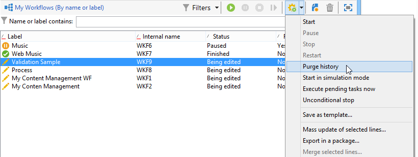

# Inicio de un flujo de trabajo {#starting-a-workflow}

Un flujo de trabajo siempre se inicia manualmente. Cuando se inicia, no obstante, puede permanecer inactivo según la información especificada mediante un planificador (consulte [Scheduler](../../workflow/using/scheduler.md)) o una planificación de actividad.

Las acciones relacionadas con la ejecución del flujo de trabajo de objetivos (inicio, detención, pausa, etc.) son procesos **asíncronos**: el comando se guarda y se aplica en cuanto el servidor esté disponible para su aplicación.

La barra de herramientas permite iniciar y rastrear la ejecución del flujo de trabajo.

A continuación se detalla la lista de opciones disponibles en el menú **[!UICONTROL Actions]** y el menú contextual.

>[!IMPORTANT]
>
>Tenga en cuenta que cuando un operador realiza una acción en un flujo de trabajo (inicio, detención, pausa, etc.), la acción no se ejecuta de inmediato, sino que se coloca en una cola para que la procese el [módulo de flujo de trabajo](../../workflow/using/architecture.md).

## Barra de herramientas de acciones {#actions-toolbar}

Los botones de la barra de herramientas se encuentran en esta [sección](../../campaign/using/marketing-campaign-deliveries.md#building-the-main-target-in-a-workflow). El botón **[!UICONTROL Actions]** le permite acceder a opciones de ejecución adicionales para actuar sobre los flujos de trabajo seleccionados. También puede utilizar el menú **[!UICONTROL File > Actions]** o hacer clic con el botón derecho del ratón en un flujo de trabajo y seleccionar **[!UICONTROL Actions]**.

* **[!UICONTROL Start]**

   Esta acción le permite iniciar la ejecución de un flujo de trabajo: un flujo de trabajo que aparezca como **Finalizado**, **Edición en curso** o **En pausa** cambia de estado a **Iniciado**. El motor de flujo de trabajo gestiona entonces la ejecución de este flujo de trabajo. Si el flujo de trabajo estaba en pausa, se reanuda, pero de lo contrario el flujo de trabajo se inicia desde el principio y se activan las actividades iniciales.

   El inicio es un proceso asincrónico: la solicitud se guarda y se procesa lo antes posible mediante un servidor de flujo de trabajo.

* **[!UICONTROL Pause]**

   Esta acción establece el estado del flujo de trabajo como **En pausa**. No se activa ninguna actividad hasta que se reanuda el flujo de trabajo; sin embargo, las operaciones en curso no se detienen.

* **[!UICONTROL Stop]**

   Esta acción detiene un flujo de trabajo que se está ejecutando. El estado de la instancia se establece como **Finalizado**. Las operaciones en curso se detienen, si es posible. Las consultas SQL y las importaciones se cancelan inmediatamente.

   La detención es un proceso asíncrono. La solicitud se registra, y luego el servidor de flujo de trabajo o los servidores cancelan las operaciones en curso. Por lo tanto, la detención de una instancia de flujo de trabajo puede llevar tiempo, especialmente si el flujo de trabajo se ejecuta en varios servidores, cada uno de los cuales debe asumir el control para cancelar las tareas en curso.

* **[!UICONTROL Restart]**

   Esta acción detiene y reinicia el flujo de trabajo. En la mayoría de los casos, es posible reiniciarlo más rápido. También resulta útil automatizar el reinicio cuando la detención lleva una determinada cantidad de tiempo: esto sucede porque el comando “Detener” no está disponible cuando el flujo de trabajo se detiene.

   Las acciones **[!UICONTROL Start / Pause / Stop / Restart]** también están disponibles a través de los iconos de ejecución de la barra de herramientas. Para obtener más información, consulte [esta sección](../../campaign/using/marketing-campaign-deliveries.md#creating-a-targeting-workflow).

* **[!UICONTROL Purge history]**

   Esta acción permite depurar el historial del flujo de trabajo. Para obtener más información, consulte [Depuración de “logs”](../../workflow/using/monitoring-workflow-execution.md#purging-the-logs).

* **[!UICONTROL Start in simulation mode]**

   Esta opción permite iniciar el flujo de trabajo en modo de simulación, distinto del modo real. Esto significa que, cuando se activa este modo, solo se ejecutan las actividades que no afectan a la base de datos o al sistema de archivos (por ejemplo **[!UICONTROL Query]**, **[!UICONTROL Union]**, **[!UICONTROL Intersection]**, etc.). Actividades que sí tienen impacto (por ejemplo, **[!UICONTROL Export]**, **[!UICONTROL Import]**, etc.). no se ejecutan ni los que se encuentran después de ellos (en la misma rama).

* **[!UICONTROL Execute pending tasks now]**

   Esta acción le permite iniciar todas las tareas pendientes lo antes posible. Para iniciar una tarea específica, haga clic con el botón derecho en su actividad y seleccione **[!UICONTROL Execute pending task(s) now]**.

* **[!UICONTROL Unconditional stop]**

   Esta opción cambia el estado del flujo de trabajo a **[!UICONTROL Finished]**. Esta acción debe utilizarse únicamente como último recurso si el proceso de detención normal falla tras varios minutos. Utilice únicamente la detención incondicional si está seguro de que no hay tareas de trabajos de flujo en curso.

   >[!CAUTION]
   >
   >Esta opción se reserva para usuarios expertos.

* **[!UICONTROL Save as template]**

   Esta acción crea una nueva plantilla de flujo de trabajo basada en el flujo de trabajo seleccionado. Debe especificar la carpeta donde desea que se guarde (en el campo **[!UICONTROL Folder]**).

   Las opciones **[!UICONTROL Mass update of selected lines]** y **[!UICONTROL Merge selected lines]** son opciones genéricas de plataforma disponibles en todos los menús **[!UICONTROL Actions]**. Para obtener más información, consulte [esta sección](../../platform/using/updating-data.md).

## Menú del botón derecho {#right-click-menu}

Cuando haya seleccionado una o más actividades de flujo de trabajo, puede hacer clic con el botón derecho para actuar sobre la selección.

Las siguientes opciones están disponibles en el menú del botón derecho:

**[!UICONTROL Open]**: esta opción permite acceder a las propiedades de la actividad.

**[!UICONTROL Display logs:]** esta opción permite ver el “log” de ejecución de la tarea para la actividad seleccionada. Consulte [Visualización de “logs”](../../workflow/using/monitoring-workflow-execution.md#displaying-logs).

**[!UICONTROL Execute pending task(s) now:]** esta acción permite iniciar tareas pendientes lo antes posible.

**[!UICONTROL Workflow restart from a task:]** esta opción permite reiniciar el flujo de trabajo con los resultados almacenados anteriormente para esta actividad.

**[!UICONTROL Cut/Copy/Paste/Delete:]** estas opciones permiten cortar, copiar, pegar y eliminar actividades.

**[!UICONTROL Copy as bitmap:]** esta opción permite realizar una captura de pantalla de todas las actividades.

**[!UICONTROL Normal execution / Enable but do not execute / Do not enable:]** : estas opciones están disponibles en la pestaña **[!UICONTROL Advanced]** de las propiedades de actividad. Se encuentran detalladas en [Execution](../../workflow/using/advanced-parameters.md#execution).

**[!UICONTROL Save / Cancel:]** permite guardar o cancelar los cambios realizados en un flujo de trabajo.

>[!NOTE]
>
>Puede seleccionar un grupo de actividades y aplicar uno de estos comandos.

El menú contextual del botón derecho también se detalla en esta [sección](../../campaign/using/marketing-campaign-deliveries.md#executing-a-workflow).
