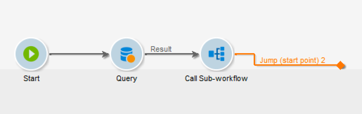

# Subflujo de trabajo{#sub-workflow}

La actividad **[!UICONTROL Sub-workflow]** permite activar la ejecución de otro flujo de trabajo y recuperar el resultado. Esta actividad permite utilizar flujos de trabajo complejos mientras se utiliza una interfaz simplificada.

Puede activar varios subflujos de trabajo en un solo flujo de trabajo. Los subflujos de trabajo se ejecutan de forma sincrónica.

En el ejemplo siguiente, un flujo de trabajo &quot;maestro&quot; llama a un subflujo de trabajo mediante saltos. Para obtener más información sobre los objetos gráficos de tipo salto, consulte [esta sección](../../workflow/using/jump--start-point-and-end-point-.md).

1. Cree un flujo de trabajo que utilizará como subflujo de trabajo en otro flujo de trabajo.
1. Insert a **[!UICONTROL Jump (end point)]** activity with a priority of 1 at the beginning of the workflow. Si tiene varios saltos de tipo &quot;punto final&quot;, Adobe Campaign utilizará el salto &quot;punto final&quot; con el número más bajo.
1. Insert a **[!UICONTROL Jump (start point)]** activity with a priority of 2 at the end of the workflow. Si tiene varios saltos de tipo &quot;punto de inicio&quot;, Adobe Campaign utilizará el salto &quot;punto de inicio&quot; con el número más alto.

   

   >[!NOTE]
   >
   >If the sub-workflow activity references a workflow with several **[!UICONTROL Jump]** activities, the sub-workflow is executed between the &quot;end point&quot; type jump with the lowest number and the &quot;start point&quot; type jump with the highest number.
   >
   >Para que el subflujo de trabajo se ejecute correctamente, solo debe tener un salto de tipo &quot;punto final&quot; con el número más bajo y un salto de tipo &quot;punto de inicio&quot; con el número más alto.

1. Complete y guarde este “subflujo de trabajo”.
1. Crear un flujo de trabajo “maestro”.
1. Inserte una actividad **[!UICONTROL Sub-workflow]** y ábrala.
1. Seleccione el flujo de trabajo que desee utilizar en la lista desplegable **[!UICONTROL Workflow template]**.

   

1. También puede agregar un script de configuración para alterar el flujo de trabajo al que se hace referencia.
1. Haga clic **[!UICONTROL Ok]**. It will automatically create an outbound transition with the label of the **[!UICONTROL Jump (start point)]** activity from the selected workflow.

   

1. Ejecute el flujo de trabajo.

Una vez ejecutado, el flujo de trabajo llamado como subflujo de trabajo sigue en estado **[!UICONTROL Being edited]**, lo que significa lo siguiente:

* No puede hacer clic con el botón derecho en las transiciones para mostrar el destino.
* No se puede mostrar el recuento de poblaciones intermedias.
* Los registros se agregan en el flujo de trabajo “maestro” y se etiquetan como “subflujo de trabajo”.

De hecho, este flujo de trabajo solo es una plantilla. Se crea un nuevo subflujo de trabajo basado en esta plantilla cuando se activa desde el flujo de trabajo “maestro”.

## Parámetros de entrada (opcional) {#input-parameters--optional-}

* tableName
* esquema

Cada evento entrante debe especificar un objetivo definido por estos parámetros.

## Parámetros de salida {#output-parameters}

* tableName
* esquema
* recCount

Este conjunto de tres valores identifica la población objetivo de la consulta. **[!UICONTROL tableName]** es el nombre de la tabla que registra los identificadores de destinatario, **[!UICONTROL schema]** es el esquema de la población (normalmente nms:recipient) y **[!UICONTROL recCount]** es el número de elementos de la tabla.

* targetSchema: Este valor es el esquema de la tabla de trabajo. Este parámetro es válido para todas las transiciones con **[!UICONTROL tableName]** y **[!UICONTROL schema]**.
