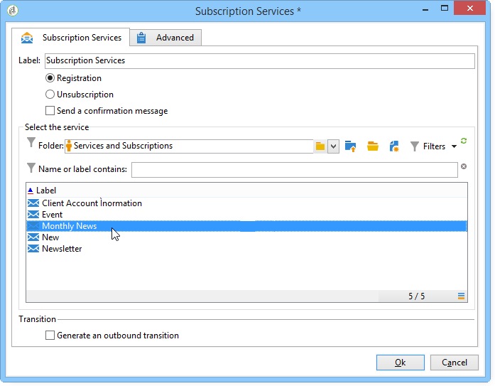
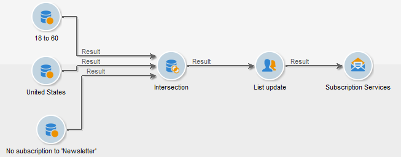

# Servicios de suscripción{#subscription-services}

Una actividad del tipo de **Subscription services** permite crear o eliminar una suscripción a un servicio de información para la población especificada en la transición.

Para configurarlo, edite la actividad e introduzca la etiqueta, luego seleccione la acción que se ejecutará (suscripción o baja) y el servicio, como en el siguiente ejemplo:

1. Introduzca la etiqueta de la actividad.
1. Seleccione **[!UICONTROL Generate an outbound transition]** si desea crear una transición al final de la ejecución.

   Por lo general, la suscripción de un objetivo a un servicio de información marca el final del flujo de trabajo de objetivos, por lo que la opción no está activada de forma predeterminada.

1. Haga clic en **[!UICONTROL Subscription]** o en **[!UICONTROL Unsubscription]** si desea suscribirse o darse de baja del servicio de información seleccionado de la población especificada.
1. Seleccione **[!UICONTROL Send a confirmation message]** para notificar a los destinatarios que se han suscrito o dado de baja de un servicio.

   El contenido de este mensaje se especifica en la plantilla de envío asociada al servicio de información. Para obtener más información, consulte [esta sección](../../delivery/using/managing-subscriptions.md).

## Ejemplo: Suscribir una lista de destinatarios a un boletín informativo {#example--subscribe-a-list-of-recipients-to-a-newsletter}

En una única operación, el siguiente flujo de trabajo tiene como objetivo que una lista de destinatarios sea apta para un boletín informativo destinado a personas que trabajan y viven en París para hacer que se suscriban.

Para esto, también debe excluir los destinatarios que ya se hayan suscrito.

>[!CAUTION]
>
>Antes de suscribirse manualmente a un servicio, compruebe que estos destinatarios acepten recibir comunicaciones.

1. Añada las tres consultas siguientes:

   * Un primer objetivo de destinatarios de 18 a 60 años.
   * Un segundo objetivo de destinatarios que viven en París.
   * Un tercer objetivo de destinatarios que actualmente no están suscritos al boletín informativo.

1. Agregue una actividad de intersección para hacer referencia a los distintos resultados.
1. Si lo desea, inserte una actualización de la lista para mantener la lista de suscriptores actualizada.
1. Inserte una actividad de servicios de suscripción y haga doble clic en esta para configurarla.
1. Introduzca la etiqueta de actividad y seleccione **[!UICONTROL Subscription]**.

   Si lo desea, puede informar a los destinatarios de su suscripción al boletín informativo marcando la casilla **[!UICONTROL Send a confirmation message]**.

1. Seleccione la carpeta en la que se encuentra el boletín informativo y selecciónelo en la lista que aparece.
1. Deje la casilla **[!UICONTROL Generate outbound transition]** sin seleccionar para que esta actividad marque el final del flujo de trabajo y haga clic en **[!UICONTROL Ok]**.

Durante la ejecución del flujo de trabajo, los destinatarios que correspondan a las tres consultas se agregan a la lista y se suscriben al boletín informativo.

Puede comprobar que la suscripción se haya realizado correctamente desde la pestaña **[!UICONTROL Subscription]** correspondiente a sus destinatarios.

## Parámetros de entrada {#input-parameters}

* tableName
* esquema

Cada evento entrante debe especificar un objetivo definido por estos parámetros.

