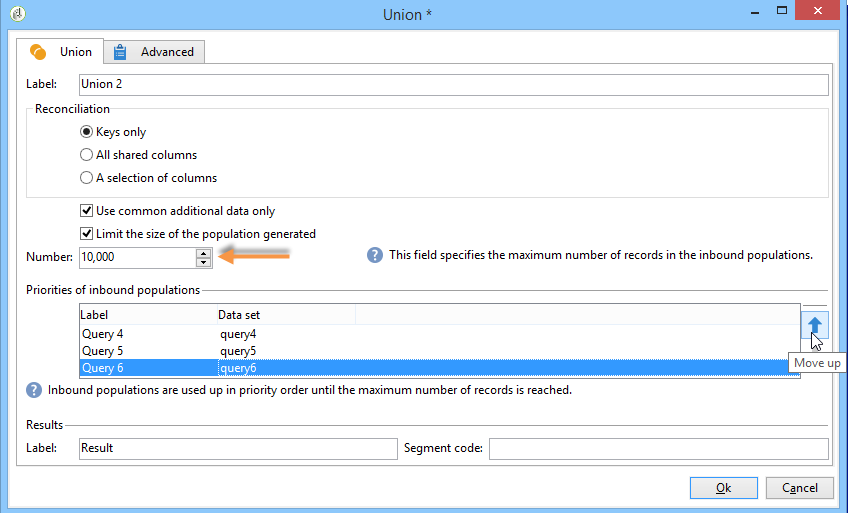
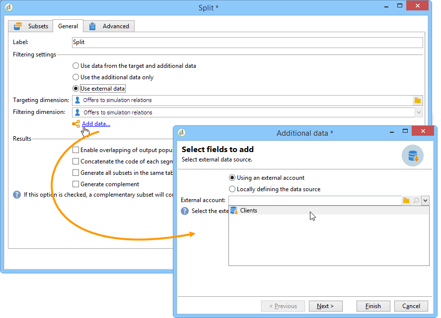

# Datos de objetivos{#targeting-data}

## Creación de consultas {#creating-queries}

### Selección de datos {#selecting-data}

A **[!UICONTROL Query]** activity lets you select basic data to build the target population. For more on this, refer to [Creating a query](../../workflow/using/query.md#creating-a-query).

You can also use the following activities to query and refine data from the database: [Incremental query](../../workflow/using/incremental-query.md), [Read list](../../workflow/using/read-list.md).

Se pueden recopilar datos adicionales que reenviar y procesar a lo largo del ciclo de vida del flujo de trabajo. Para obtener más información sobre esto, consulte [Adición de datos](../../workflow/using/query.md#adding-data) y [Edición de datos](#editing-additional-data)adicionales.

### Edición de datos adicionales {#editing-additional-data}

Una vez añadidos los datos adicionales, se pueden editar o utilizar para acotar el objetivo establecido en la actividad de consulta.

The **[!UICONTROL Edit additional data...]** link lets you view the added data and modify it or add to it.

Para añadir datos a las columnas de salida definidas anteriormente, selecciónelas en la lista de campos disponibles. To create a new output column, click the **[!UICONTROL Add]** icon, then select the field and click **[!UICONTROL Edit expression]**.

Defina un modo de cálculo para el campo que desee añadir, por ejemplo, un acumulado.

The **[!UICONTROL Add a sub-item]** option lets you attach computed data to the collection. Esto permite seleccionar los datos adicionales de la colección o definir cálculos acumulados en los elementos de colección.

Los subelementos se representan en el subárbol de la colección a la que se asignan.

Collections are shown in the **[!UICONTROL Collections]** sub-tab. You can filter the collected elements by clicking the **[!UICONTROL Detail]** icon of the selected collection. El asistente de filtro permite seleccionar los datos recopilados y especificar las condiciones de filtrado que se deben aplicar a los datos de la colección.

### Acotamiento del objetivo mediante el uso de datos adicionales {#refining-the-target-using-additional-data}

Los datos adicionales recopilados pueden permitirle acotar el filtrado de datos de la base de datos. To do this, click the **[!UICONTROL Refine the target using additional data...]** link: this lets you over-filter on the added data.

### Homogeneización de datos {#homogenizing-data}

In **[!UICONTROL Union]** or **[!UICONTROL Intersection]** type activities, you can choose to keep only shared additional data to keep the data consistent. En este caso, la tabla de trabajo temporal de salida de esta actividad solo contiene los datos adicionales encontrados en todos los conjuntos entrantes.

### Reconciliación con los datos adicionales {#reconciliation-with-additional-data}

Durante las fases de reconciliación de datos (**[!UICONTROL Union]**, **[!UICONTROL Intersection]**, etc.) actividades), puede seleccionar las columnas que se utilizarán para la reconciliación de datos en las columnas adicionales. Para ello, configure una reconciliación sobre una selección de columnas y especifique el conjunto principal. A continuación, seleccione las columnas en la columna inferior de la ventana, como se muestra en el siguiente ejemplo:

### Creación de subconjuntos {#creating-subsets}

The **[!UICONTROL Split]** activity lets you create subsets on criteria defined via extraction queries. Para cada subconjunto, al editar una condición de filtro en la población, puede acceder a la actividad de consulta estándar que permite definir las condiciones de segmentación de objetivos.

Puede dividir un destino en varios subconjuntos utilizando únicamente datos adicionales como condiciones de filtro o sumarlos a los datos de destino. También puede utilizar datos externos si ha adquirido la opción **Federated Data Access**.

Para obtener más información sobre esto, consulte [Creación de subconjuntos mediante la actividad](#creating-subsets-using-the-split-activity)Dividir.

## Segmentación de datos {#segmenting-data}

### Combinación de varios objetivos (Unión) {#combining-several-targets--union-}

La actividad de unión permite combinar el resultado de varias actividades dentro de una transición. Los conjuntos no tienen que ser necesariamente homogéneos.

Estas son las opciones disponibles:

* **[!UICONTROL Keys only]**

   Puede usar esta opción si las poblaciones de entrada son homogéneas.

* **[!UICONTROL All columns in common]**

   Esta opción le permite reconciliar los datos en función de todas las columnas que sean comunes a las distintas poblaciones de destino.

   Adobe Campaign identifica las columnas según su nombre. Se acepta un umbral de tolerancia: por ejemplo, se puede reconocer una columna “correo electrónico” como idéntica a una columna “@email”.

* **[!UICONTROL A selection of columns]**

   Seleccione esta opción para definir la lista de columnas a las que desea aplicar la reconciliación de datos.

   Para empezar, seleccione el conjunto principal (el que contiene los datos de origen) y las columnas que desea utilizar para el enlace.

   

   >[!CAUTION]
   >
   >Durante la reconciliación de datos, las poblaciones no se deduplican.

   Se puede restringir el tamaño de la población a un número determinado de registros. Para ello, haga clic en la opción correspondiente y especifique el número de registros que desee conservar.

   Especifique también la prioridad de las poblaciones entrantes: la sección inferior de la ventana muestra las transiciones entrantes de la actividad de unión y le permite ordenarlas utilizando las flechas azules a la derecha de la ventana.

   Los registros se toman primero de la población de la primera transición entrante en la lista, y después, si no se ha alcanzado el máximo, se toman de la población de la segunda transición entrante, etc.

   

### Extracción de datos conjuntos (Intersección) {#extracting-joint-data--intersection-}

La intersección permite recuperar únicamente las líneas compartidas por las poblaciones de las transiciones entrantes. Esta actividad se debe configurar como la actividad de unión.

Además, es posible mantener únicamente una selección de columnas o solo las columnas compartidas por la población entrante.

The intersection activity is detailed in the [Intersection](../../workflow/using/intersection.md) section.

### Exclusión de una población (Exclusión) {#excluding-a-population--exclusion-}

La actividad de exclusión permite excluir los elementos de un objetivo desde una población objetivo diferente. La dimensión objetivo de salida de esta actividad es la del conjunto principal.

Si es necesario, se pueden manipular las tablas entrantes. De hecho, para excluir un objetivo de otra dimensión, se debe devolver este objetivo a la misma dimensión objetivo que el objetivo principal. To do this click the **[!UICONTROL Add]** button and specify the dimension change conditions.

La reconciliación de datos se lleva a cabo mediante un identificador, un eje de cambio o una unión. Hay un ejemplo disponible en [Uso de datos de una lista: Lista](../../workflow/using/importing-data.md#using-data-from-a-list--read-list)de lectura.

### Creación de subconjuntos con la actividad de división {#creating-subsets-using-the-split-activity}

The **[!UICONTROL Split]** activity is a standard activity which lets you create as many sets as necessary via one or several filtering dimensions, as well as generating either one output transition per subset or a unique transition.

Los datos adicionales transmitidos por la transición entrante se pueden utilizar en los criterios de filtrado.

Para configurarlo, primero debe seleccionar unos criterios:

1. In your workflow, drag and drop a **[!UICONTROL Split]** activity.
1. En la **[!UICONTROL General]** ficha, seleccione la opción que desee: **[!UICONTROL Use data from the target and additional data]**, **[!UICONTROL Use the additional data only]** o **[!UICONTROL Use external data]**.
1. If the **[!UICONTROL Use data from the target and additional data]** option is selected, the targeting dimension lets you use all the data conveyed by the inbound transition.

   

   Cuando se crean subconjuntos, se utilizan los parámetros de filtrado mencionados.

   Para definir las condiciones de filtrado, elija la **[!UICONTROL Add a filtering condition on the inbound population]** opción y haga clic en el **[!UICONTROL Edit...]** vínculo. A continuación, especifique las condiciones de filtrado para crear este subconjunto.

   

   An example showing how to use filtering conditions in the **[!UICONTROL Split]** activity to segment the target into different populations is described in [this section](../../workflow/using/cross-channel-delivery-workflow.md).

   The **[!UICONTROL Label]** field lets you give the newly created subset a name, which will match the outbound transition.

   También se puede asignar un código de segmento al subconjunto para identificarlo y utilizarlo para dirigirlo a su población.

   Si es necesario, se pueden cambiar individualmente las dimensiones de filtrado y destino para cada subconjunto que desee crear. To do this, edit the subset&#39;s filtering condition and check the **[!UICONTROL Use a specific filtering dimension]** option.

   

1. If the **[!UICONTROL Use the additional data only]** option is selected, only additional data is offered for subset filtering.

   

1. If the **Federated Data Access** option is enabled, the **[!UICONTROL Use external data]** lets you process data in an external database which is already configured, or create a new connection to a database.

   

   Para obtener más información, consulte [esta sección](../../platform/using/about-fda.md).

A continuación, es preciso añadir nuevos subconjuntos:

1. Click the **[!UICONTROL Add]** button and define the filtering conditions.

   

1. Define the filtering dimension in the **[!UICONTROL General]** tab of the activity (see above).It applies to all subsets by default.

   

1. Si es necesario, se puede cambiar la dimensión de filtrado, individualmente, para cada subconjunto. Esto permite crear un conjunto para todos los titulares de la tarjeta Gold, otro para todos los destinatarios que hicieron clic en el último boletín y un tercero para las personas de 18 a 25 años que realizaron una compra en la tienda en los últimos 30 días, utilizando todos la misma actividad de división. To do this, select the **[!UICONTROL Use a specific filtering dimension]** option and select the data filtering context.

   

   >[!NOTE]
   >
   >Si ha adquirido la opción **Federated Data Access**, puede crear subconjuntos basados en la información de una base externa. To do this, select the schema of the external table in the **[!UICONTROL Targeting dimension]** field. Para obtener más información sobre esto, consulte [Acceso a una base de datos externa (FDA)](../../workflow/using/accessing-an-external-database--fda-.md).

Una vez creados los subconjuntos, la actividad de división muestra de forma predeterminada tantas transiciones de salida como subconjuntos:

Puede agrupar todos estos subconjuntos en una sola transición de salida. En este caso, el enlace a los respectivos subconjuntos se puede ver en el código del segmento, por ejemplo. Para ello, seleccione la **[!UICONTROL Generate all subsets in the same table]** opción.

Por ejemplo, puede colocar una sola actividad de envío y personalizar el contenido del envío en función del código de segmento de cada grupo de destinatarios:

Subsets can also be created using the **[!UICONTROL Cells]** activity. For more on this, refer to the [Cells](../../workflow/using/cells.md) section.

### Uso de los datos segmentados {#using-targeted-data}

Una vez identificados y preparados los datos, se pueden utilizar en los siguientes contextos:

* Se pueden actualizar los datos en la base de datos después de la manipulación de los mismos en las distintas fases del flujo de trabajo.

   Para obtener más información sobre esto, [actualice los datos](../../workflow/using/update-data.md).

* También puede actualizar el contenido de listas existentes.

   For more on this, refer to [List update](../../workflow/using/list-update.md).

* Se pueden preparar o iniciar envíos directamente en el flujo de trabajo.

   Para obtener más información sobre esto, consulte [Entrega](../../workflow/using/delivery.md), Control [de](../../workflow/using/delivery-control.md) envío y Entrega continua.

## Gestión de datos {#data-management}

En Adobe Campaign, la gestión de datos combina un conjunto de actividades para resolver problemas complejos relacionados con los objetivos mediante la oferta de herramientas más eficientes y flexibles. Las actividades de gestión de datos permiten implementar una administración coherente de todas las comunicaciones con un contacto mediante el uso de información relacionada con sus contratos, suscripciones, reacciones a los envíos, etc. La gestión de datos permite realizar un seguimiento del ciclo de vida de los datos durante las operaciones de segmentación, en particular:

* Simplificar y optimizar los procesos de segmentación al incluir datos que no se encuentran en la base de datos (creación de nuevas tablas: extensión local de cada flujo de trabajo de segmentación en función de la configuración).
* Mantener y transmitir cálculos de búfer, especialmente durante las fases de construcción de objetivos o para la administración de bases de datos.
* Acceso a bases externas (opcional): Bases de datos heterogéneas tomadas en cuenta durante el proceso de selección de objetivos.

Para implementar estas operaciones, Adobe Campaign ofrece:

* Actividades de recopilación de datos: Transferencia de archivos, carga [de datos (archivo)](../../workflow/using/data-loading--file-.md), carga [de datos (RDBMS)](../../workflow/using/data-loading--rdbms-.md), [actualización de datos](../../workflow/using/update-data.md). Este primer paso de recopilación de datos prepara los datos para permitir que se procesen en otras actividades. Es necesario monitorizar varios parámetros para garantizar que el flujo de trabajo se ejecuta correctamente y proporciona los resultados esperados. Por ejemplo, al importar datos, la clave principal (Pkey) de estos datos debe ser exclusiva para cada registro.
* Actividades de establecimiento de objetivos enriquecidas con opciones de administración de datos: [Consulta](../../workflow/using/query.md), [Unión](../../workflow/using/union.md), [Intersección](../../workflow/using/intersection.md), [Dividir](../../workflow/using/split.md). Esto permite configurar un enlace o una intersección entre los datos de distintas dimensiones de destino, siempre y cuando sea posible la comparación de los mismos.
* Actividades de transformación de datos: [Enriquecimiento](../../workflow/using/enrichment.md), dimensión [Cambio](../../workflow/using/change-dimension.md).

>[!CAUTION]
>
>Cuando hay dos flujos de trabajo vinculados, la eliminación de un elemento de la lista de origen no significa que se eliminen todos los datos vinculados a él.
>  
>Por ejemplo, si se elimina un destinatario a través de un flujo de trabajo, el historial de envío del destinatario no se elimina. Sin embargo, si se elimina un destinatario directamente en la carpeta “Destinatarios”, todos los datos vinculados a este sí se borran.

### Enriquecimiento y modificación de datos {#enriching-and-modifying-data}

Además de la dimensión de destino, la dimensión de filtrado permite especificar la naturaleza de los datos recopilados. Consulte [Segmentación y filtrado de dimensiones](../../workflow/using/building-a-workflow.md#targeting-and-filtering-dimensions).

Los datos identificados y recopilados se pueden enriquecer, añadir y manipular para optimizar la construcción de objetivos. To do this, in addition to the data manipulation activities detailed in the [Segmenting data](#segmenting-data) section, use the following:

* The **[!UICONTROL Enrichment]** activity lets you momentarily add columns to a schema, as well as add information to certain elements. It is detailed in the [Enrichment](../../workflow/using/enrichment.md) section of the repository of activities.
* The **[!UICONTROL Edit schema]** activity lets you modify the structure of a schema. It is detailed in the [Edit schema](../../workflow/using/edit-schema.md) section of the repository of activities.
* The **[!UICONTROL Change dimension]** activity lets you change the targeting dimension during the target construction cycle. It is detailed in the [Change dimension](../../workflow/using/change-dimension.md) section.

