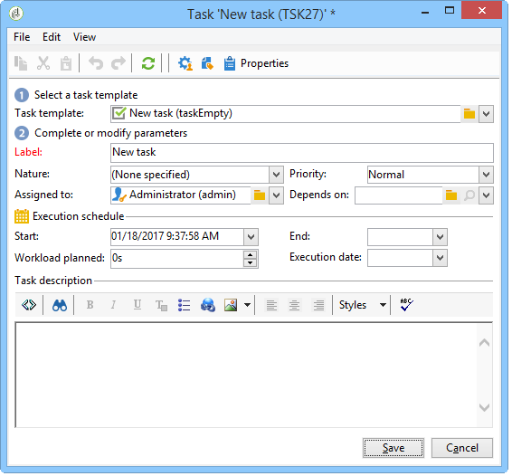

# Tarea{#task}

>[!AVAILABILITY]
>
>`:warning:` Esta funcionalidad solo está disponible en Campaign Classic v7. [Más información](../../mrm/using/creating-and-managing-tasks.md)

En un flujo de trabajo de campaña, la actividad **[!UICONTROL Task]** permite especificar dos situaciones: la primera, si la tarea se completa; y la segunda, si la tarea no se completa (si se marca manualmente como incompleta o si caduca).

La configuración y el funcionamiento de una tarea se detallan en [la documentación de Campaign Classic v7](../../mrm/using/creating-and-managing-tasks.md).

La opción **[!UICONTROL Resources]** permite definir varios operadores, así como también una programación de aprobación para la tarea. Si la persona de aprobación la rechaza, esto no hace que la tarea sea en sí rechazada.

