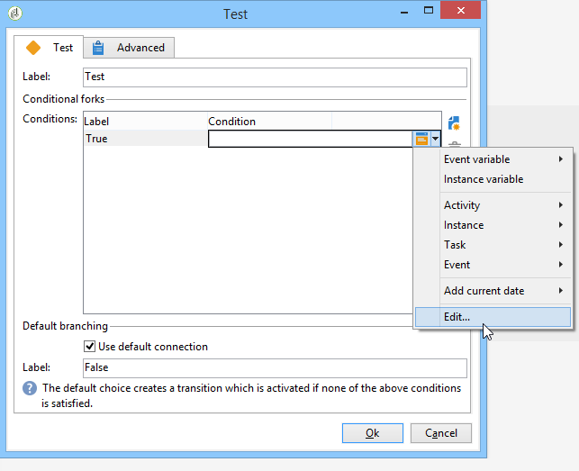

# Prueba{#test}

Una actividad de tipo **Prueba** activa la primera transición que cumple la condición asociada a esta. Si no se cumple ninguna condición y si la opción **[!UICONTROL Use the default fork]** está activada, se activa la transición predeterminada.

Una condición es una expresión JavaScript que debe evaluarse como “verdadera” o “falsa”. Para introducir la expresión, haga clic en el icono a la derecha del nombre de la condición y, a continuación, seleccione **[!UICONTROL Edit...]**.

Para obtener más información sobre todas las funciones adicionales de JavaScript y los métodos SOAP del servidor aplicativo accesible mediante JavaScript de flujo de trabajo, consulte la [Documentación de JSAPI](https://experienceleague.adobe.com/developer/campaign-api/api/index.html?lang=es).

También puede insertar variables directamente desde este editor. Para obtener más información sobre cómo trabajar con variables, consulte [esta sección](javascript-scripts-and-templates.md#variables).

Se pueden añadir, eliminar u ordenar las condiciones desde la ventana de edición de la propiedad actividad, pero también se puede modificar desde la transición.

Si el resultado de un cálculo se reutiliza en condiciones diferentes, es posible calcularlo en el guion de inicialización de la actividad. El resultado debe almacenarse en una variable de la tarea a la que deben acceder los scripts de condición (task.vars.xxx).

