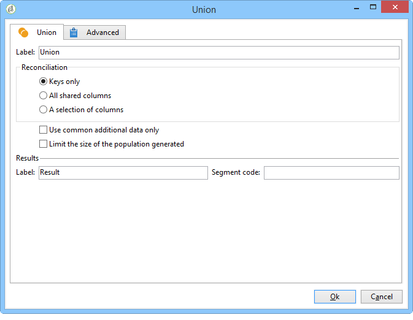
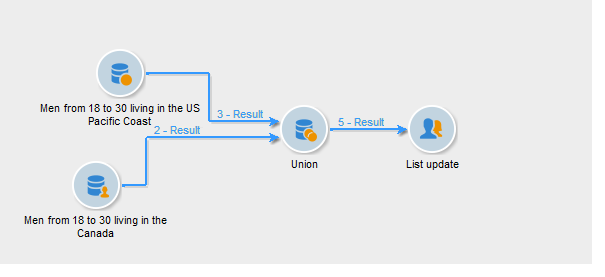

# Unión{#union}

Una unión agrupa el resultado de varias actividades entrantes en un solo destino. El objetivo se crea con todos los resultados recibidos: por lo tanto, todas las actividades anteriores deben terminar para que se ejecute la unión.

>[!NOTE]
>
>Para obtener más información sobre la configuración y el uso de la actividad de unión, consulte [Combinación de varios objetivos (Unión)](targeting-data.md#combining-several-targets--union-).

## Ejemplo de unión {#union-example}

En el ejemplo siguiente, los resultados de dos consultas se han combinado para actualizar la lista. Las dos consultas se dirigen a los destinatarios. Por lo tanto, los resultados se basan en la misma tabla.

1. Inserte una actividad de tipo **[!UICONTROL Union]** inmediatamente después de las dos consultas y antes de una actividad de tipo actualización de la lista y ábrala.
1. Puede introducir una etiqueta.
1. Seleccione el método de reconciliación **[!UICONTROL Keys only]** ya que, en este ejemplo, la población resultante de las consultas contiene datos coherentes.
1. Si agregó datos adicionales para las consultas, puede optar por mantener solamente los datos compartidos.
1. Si desea limitar el tamaño de la población final, marque la casilla **[!UICONTROL Limit size of generated population]**.

   Especifique este número final introduciendo el número máximo de destinatarios y seleccionando la consulta cuya población tendrá prioridad.

1. Apruebe la actividad de unión y configure la actividad de actualización de lista (consulte [Actualización de listas](list-update.md)).
1. Inicie el flujo de trabajo. El número de resultados se muestra y la lista definida en la actividad de actualización de lista se crea o actualiza. Esta lista contiene el conjunto de destinatarios para ambas consultas o, si corresponde, el número definido en el paso anterior.

   

## Parámetros de entrada {#input-parameters}

* tableName
* esquema

Cada evento entrante debe especificar un objetivo definido por estos parámetros.

## Parámetros de salida {#output-parameters}

* tableName
* esquema
* recCount

Este conjunto de tres valores identifica el destino resultante de la unión. **[!UICONTROL tableName]** es el nombre de la tabla que registra los identificadores de destinatario, **[!UICONTROL schema]** es el esquema de la población (normalmente, nms:recipient) y **[!UICONTROL recCount]** es el número de elementos de la tabla.

