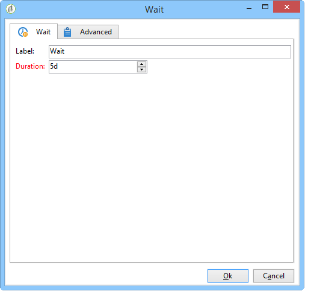

# Uso de la actividad de aprobación local{#using-the-local-approval-activity}

The **[!UICONTROL Local approval]** activity integrated into a targeting workflow lets you set up a recipient approval process before the delivery is sent.

>[!CAUTION]
>
>Para utilizar esta función, es necesario adquirir el módulo Distributed Marketing, que es una opción de Campaign. Compruebe el acuerdo de licencia.

Para configurar este caso de uso, se ha creado el siguiente flujo de trabajo de objetivo:

Los pasos principales del proceso de aprobación local son:

1. The population resulting from targeting can be limited thanks to a **[!UICONTROL Split]** type activity using a data distribution model.

   

1. The **[!UICONTROL Local approval]** activity then takes over and sends a notification email to each local supervisor. La actividad permanece pendiente hasta que cada supervisor local apruebe los destinatarios asignados a ellos.

   

1. Una vez que se llega al plazo de aprobación, el flujo de trabajo se inicia nuevamente. In this example, the **[!UICONTROL Delivery]** activity starts and the delivery is sent to the approved targets.

   >[!NOTE]
   >
   >Una vez alcanzada la fecha límite, los destinatarios que no han sido aprobados se excluyen de los objetivos.

   

1. A few days later, the second **[!UICONTROL Local approval]** type activity sends a notification email to each local supervisor with a summary of the actions carried out by their contacts (clicks, opens, etc.).

   

## Step 1: Creating the data distribution template {#step-1--creating-the-data-distribution-template-}

La plantilla de distribución de datos permite limitar la población resultante de la segmentación en función de la agrupación de datos, así como asignar cada valor a un supervisor local. In this example, we have defined the **[!UICONTROL Email address domain]** field as a distribution field and assigned a domain to each local supervisor

Para obtener más información sobre la creación de una plantilla de distribución de datos, consulte [Limitación del número de registros de subconjuntos por distribución](../../workflow/using/split.md#limiting-the-number-of-subset-records-per-data-distribution)de datos.

1. Para crear la plantilla de distribución de datos, vaya al **[!UICONTROL Resources > Campaign management > Data distribution]** nodo y haga clic en **[!UICONTROL New]**.

   

1. Select the **[!UICONTROL General]** tab.

   

1. Introduzca el **[!UICONTROL Label]** y el **[!UICONTROL Distribution context]**. In this example, we have selected the **[!UICONTROL Recipient]** targeting schema and the **[!UICONTROL Email domain]** field as a distribution field. La lista de destinatarios se desglosan por dominio.
1. In the **[!UICONTROL Distribution type]** field, select how the target limitation value will be expressed in the **[!UICONTROL Distribution]** tab. Aquí hemos elegido **[!UICONTROL Percentage]**.
1. In the **[!UICONTROL Approval storage]** field, enter the storage schema of the approvals that match the targeting schema in use. A continuación, se va a utilizar el esquema de almacenamiento predeterminado: **[!UICONTROL Local approval of recipients]**.
1. A continuación, haga clic en el **[!UICONTROL Advanced parameters]** vínculo.

   

1. Keep the **[!UICONTROL Approve the targeted messages]** option checked so that all recipients are pre-selected from the list of recipients to approve.
1. In the **[!UICONTROL Delivery label]** field, we&#39;ve left the default expression (compute string of the delivery). La etiqueta estándar del envío se utiliza en la notificación de comentarios.
1. In the **[!UICONTROL Grouping field]** section, we have selected the **[!UICONTROL Gender]** field as a grouping field for displaying recipients in the approval and feedback notifications.
1. En la **[!UICONTROL Edit targeted messages]** , hemos seleccionado la aplicación **[!UICONTROL Edit recipients]** web y el **[!UICONTROL recipientId]** parámetro. En las notificaciones de aprobación y comentarios, se puede hacer clic en los destinatarios y estos se dirigirán a la dirección URL de la aplicación web. The additional URL parameter will be **[!UICONTROL recipientId]**.
1. A continuación, haga clic en la **[!UICONTROL Distribution]** ficha. Para cada dominio, introduzca los siguientes campos:

   

   * **[!UICONTROL Value]**:: introduzca el valor del nombre de dominio.
   * **[!UICONTROL Percentage / Fixed]**:: para cada dominio, escriba el máximo. número de destinatarios a los que desea enviar la entrega. En este ejemplo, se desea limitar el envío a 10% por dominio.
   * **[!UICONTROL Label]**:: escriba la etiqueta del dominio que se mostrará en las notificaciones de aprobación y de comentarios.
   * **[!UICONTROL Group or operator]**:: seleccione el operador o grupo de operadores asignados al dominio.

      >[!CAUTION]
      >
      >Asegúrese de que se hayan asignado los derechos adecuados a los operadores.

## Step 2: Creating the targeting workflow {#step-2--creating-the-targeting-workflow}

Para configurar este caso de uso, se ha creado el siguiente flujo de trabajo de objetivo:

Se agregaron las siguientes actividades:

* Dos **[!UICONTROL Query]** actividades,
* Una **[!UICONTROL Intersection]** actividad,
* Una **[!UICONTROL Split]** actividad,
* Una **[!UICONTROL Local approval]** actividad,
* Una **[!UICONTROL Delivery]** actividad,
* Una **[!UICONTROL Wait]** actividad,
* Una segunda **[!UICONTROL Local approval]** actividad,
* Una **[!UICONTROL End]** actividad.

### Consultas, Intersección y División {#queries--intersection-and-split}

La segmentación ascendente se compone de dos consultas, una intersección y una división. The population resulting from targeting can be limited using a **[!UICONTROL Split]** activity using a data distribution template.

For more on configuring a split activity, refer to [Split](../../workflow/using/split.md). La creación de una plantilla de distribución de datos se detalla en [Limitar el número de registros de subconjuntos por distribución](../../workflow/using/split.md#limiting-the-number-of-subset-records-per-data-distribution)de datos.

If you do not want to limit the population from the query, you do not have to use the **[!UICONTROL Query]**, **[!UICONTROL Intersection]**, and **[!UICONTROL Split]** activities. In this case, complete the data distribution template in the first **[!UICONTROL Local approval]** activity.

1. En la **[!UICONTROL Record count limitation]** sección, seleccione la **[!UICONTROL Limit the selected records]** opción y haga clic en el **[!UICONTROL Edit]** vínculo.

   

1. Seleccione la **[!UICONTROL Keep only the first records after sorting]** opción y haga clic en **[!UICONTROL Next]**.

   

1. In the **[!UICONTROL Sort columns]** section, add the field which the sort is applied to. Here, we have chosen the **[!UICONTROL Email]** field. Haga clic **[!UICONTROL Next]**.

   

1. Seleccione la **[!UICONTROL By data distribution]** opción, seleccione la plantilla de distribución creada anteriormente (consulte [Paso 1: Creación de la plantilla](#step-1--creating-the-data-distribution-template-)de distribución de datos) y haga clic en **[!UICONTROL Finish]**.

   

En la plantilla de distribución, se ha elegido limitar la población al 10% por valor de agrupación, lo que coincide con los valores mostrados en el flujo de trabajo (340 como entrada y 34 como salida).

### Notificación de aprobación {#approval-notification}

The **[!UICONTROL Local approval]** activity lets you send a notification to each local supervisor.

Para obtener más información sobre la configuración de la **[!UICONTROL Local approval]** actividad, consulte Aprobación local.

Se deben introducir los campos siguientes:

1. En la **[!UICONTROL Action to execute]** sección, seleccione la **[!UICONTROL Target approval notification]** opción.
1. En la **[!UICONTROL Distribution context]** sección, seleccione la **[!UICONTROL Specified in the transition]** opción.

   If you don&#39;t want to limit the targeted population, select the **[!UICONTROL Explicit]** option here and enter the distribution template created previously in the **[!UICONTROL Data distribution]** field.

1. In the **[!UICONTROL Notification]** section, select the delivery template and the subject to be used for the notification email. Aquí, se ha elegido la plantilla predeterminada: **[!UICONTROL Local approval notification]**.
1. In the **[!UICONTROL Approval schedule]** section, we&#39;ve kept the default approval deadline (3 days) and added a reminder. El envío se realiza 3 días después del inicio de la aprobación. Una vez que se ha alcanzado el plazo de aprobación, la segmentación no tiene en cuenta los destinatarios no aprobados.

The notification email sent by the **[!UICONTROL Local approval]** activity to local supervisors is as follows:

### Espera {#wait}

La actividad de espera permite posponer el inicio de la segunda actividad de aprobación local que envía la notificación de entrega de comentarios. En el **[!UICONTROL Duration]** campo, hemos introducido el **[!UICONTROL 5d]** (5 días). Las acciones que realizan los destinatarios durante 5 días después de realizarse el envío se incluyen en la notificación de comentarios.

### Notificación de comentarios {#feedback-notification}

The second **[!UICONTROL Local approval]** activity lets you send a delivery feedback notification to each local supervisor.

Se deben introducir los campos siguientes:

1. En la **[!UICONTROL Action to execute]** sección, elija **[!UICONTROL Delivery feedback report]**.
1. En la **[!UICONTROL Delivery]** sección, elija **[!UICONTROL Specified in the transition]**.
1. In the **[!UICONTROL Notification]** section, select the delivery template and the subject to be used for the notification email.

Once the deadline configured in the wait activity is reached, the second **[!UICONTROL Local approval]** type activity sends the following notification email to each local supervisor:

### Seguimiento de aprobación por el administrador {#approval-tracking-by-the-administrator}

Cada vez que se inicia la actividad de aprobación local, se crea una tarea de aprobación. El administrador puede controlar cada una de estas tareas de aprobación.

Go to the targeting workflow of your campaign and click the **[!UICONTROL Local approval tasks]** tab.

The list of local approval tasks can also be accessed via the **[!UICONTROL Approval tasks]** tab of the data distribution template.

Select the task you want to monitor and click the **[!UICONTROL Detail]** button. The **[!UICONTROL General]** tab of the local approval task lets you view information on the task. Si es necesario, se pueden modificar las fechas de aprobación y de recordatorio.

Esta pestaña muestra la siguiente información:

* la etiqueta de la tarea y su ID
* la plantilla de distribución utilizada
* el número de mensajes dirigidos
* el flujo de trabajo y la campaña vinculados
* la programación de tareas

The **[!UICONTROL Distribution]** tab for the task lets you view the approval logs, their status, the number of messages targeted, the approval date, as well as the operator who approved the delivery.

Select an approval log and click the **[!UICONTROL Detail]** button to display more information. The **[!UICONTROL General]** tab of the local approval log lets you view general log information. Asimismo, se puede cambiar el estado de aprobación.

Esta pestaña muestra la siguiente información:

* la tarea de aprobación vinculada
* el estado de aprobación (**[!UICONTROL Approved]** o **[!UICONTROL Pending]**)
* la plantilla de distribución utilizada
* el supervisor local que aprobó y la fecha de aprobación
* el número de mensajes dirigidos y aprobados

The **[!UICONTROL Targeted]** tab of the approval log displays the list of targeted recipients and their approval status. Se puede cambiar este estado si es necesario.

