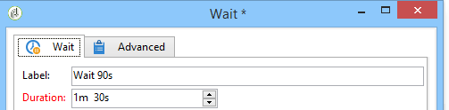

# Espera{#wait}

Una actividad **Wait** activa su transición después de un retraso de tiempo de entre unos segundos y varios meses. Una tarea de espera no bloquea la ejecución de otras tareas; el flujo de trabajo puede ejecutar tareas en paralelo mientras esta tarea está pendiente.

Puede introducir la etiqueta y esperar el tiempo utilizando el editor, como en el ejemplo siguiente:

En el campo **[!UICONTROL Duración]**, el valor se puede expresar en la unidad que elija: (según la configuración regional del operador):

* Si no se especifica la configuración regional: **s** para segundos, **m** para minutos, **h** para horas, **d** para días, **y** para años. En el momento de la aprobación, el valor se convierte automáticamente en la unidad más legible.

   La unidad predeterminada es el día (**d**).

* Mientras que si, por ejemplo, la configuración regional se establece en &quot;Francés&quot;: **s** para segundos, **mn** para minutos, **h** para horas, **j** para días, **m** para meses, **a** para años. En el momento de la aprobación, el valor se convierte automáticamente a la unidad más legible, como en el ejemplo anterior **90s** se convirtió a **1mn 30s**.

   La unidad predeterminada es el día (**d**).

