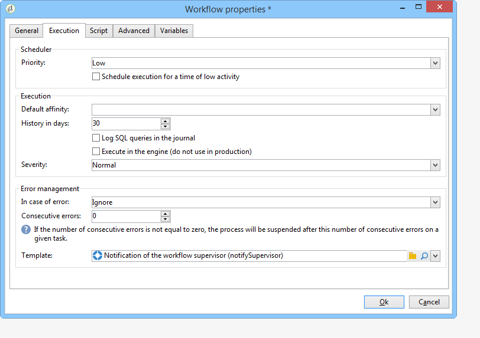

# Propiedades del flujo de trabajo{#workflow-properties}

## Pestaña de ejecución {#execution-tab}

La pestaña **[!UICONTROL Execution]**, dentro de la ventana **[!UICONTROL Properties]** en un flujo de trabajo, se divide en 3 secciones:

### Planificador {#scheduler}

Esta sección solo aparece en los flujos de trabajo de la campaña.

* **[!UICONTROL Priority]**

   El motor de flujo de trabajo procesa los flujos de trabajo que se van a ejecutar en función del criterio de prioridad definido en este campo. Por ejemplo, todos los flujos de trabajo con prioridad **[!UICONTROL Average]** se ejecutan antes que los que tienen prioridad **[!UICONTROL Low]**.

* **[!UICONTROL Schedule execution for a time of low activity]**

   Esta opción pospone el inicio del flujo de trabajo hasta un periodo menos ocupado. Algunos flujos de trabajo pueden resultar exigentes en términos de recursos para el motor de la base de datos. Se recomienda planificar la ejecución para una hora de baja actividad (por ejemplo, la noche). Low activity periods are defined in the **[!UICONTROL Processes on campaigns]** technical workflow.

### Ejecución {#execution}

* **[!UICONTROL Default affinity]**

   Si su instalación incluye varios servidores de flujo de trabajo, utilice este campo para elegir el equipo en el que desea ejecutar el flujo de trabajo. Si el valor introducido en este campo no existe en ningún servidor, el flujo de trabajo se mantiene pendiente.

   Consulte esta [sección](../../installation/using/configuring-campaign-server.md#high-availability-workflows-and-affinities).

* **[!UICONTROL History in days]**

   Las tablas de trabajo de la base de datos mantienen un historial de ejecuciones (tareas, eventos, “logs”). Aquí puede definir el número de días que desea archivar para este flujo de trabajo: una vez al día, el proceso de limpieza elimina los archivos más antiguos. Si el valor de este campo es cero, el archivo no se elimina nunca.

* **[!UICONTROL Log SQL queries in the journal]**

   Esta funcionalidad se reserva únicamente a los usuarios avanzados. Afecta a los flujos de trabajo que incluyen actividades de objetivos (consulta, unión, intersección, etc.). Cuando se activa esta opción, las consultas SQL enviadas a la base de datos durante la ejecución del flujo de trabajo se muestran en Adobe Campaign: esto significa que puede revisarlas para optimizar consultas o diagnosticar problemas.

   Las consultas se muestran en una pestaña **[!UICONTROL SQL logs]** que se añade al flujo de trabajo (excepto a los flujos de trabajo de la campaña) y a la actividad **[!UICONTROL Properties]** cuando la opción está activada. La pestaña **[!UICONTROL Audit]** también incluye consultas SQL.

   

* **[!UICONTROL Execute in the engine]**

   Esta opción solo puede utilizarse para tareas de depuración, nunca de producción. Cuando está activada, el flujo de trabajo tiene prioridad y el resto de flujos de trabajo se detienen hasta que este haya terminado.

### Gestión de errores {#error-management}

* **[!UICONTROL Troubleshooting]**

   Este campo permite definir las acciones que se deben llevar a cabo si una tarea de flujo de trabajo presenta errores. Hay dos opciones posibles:

   * **[!UICONTROL Stop the process]**:: el flujo de trabajo se pone en pausa automáticamente. El estado del proceso cambia a **[!UICONTROL Failed]**. Una vez resuelto el problema, reinicie el flujo de trabajo con los botones **[!UICONTROL Start]** o **[!UICONTROL Restart]**.
   * **[!UICONTROL Ignore]**: el estado de la tarea que activó el error cambia a **[!UICONTROL Failed]**, pero el flujo de trabajo mantiene el estado **[!UICONTROL Started]**. Esta configuración es importante para tareas recurrentes: si la rama incluye un planificador, la próxima vez que se ejecute el flujo de trabajo se inicia de forma normal.

* **[!UICONTROL Consecutive errors]**

   This field becomes available when the **[!UICONTROL Ignore]** value is selected in the **[!UICONTROL In case of errors]** field. Puede especificar el número de errores que se pueden omitir antes de que se detenga el proceso. Una vez alcanzado este número, el estado del flujo de trabajo cambia a **[!UICONTROL Failed]**. Si el valor de este campo es 0, el flujo de trabajo nunca se detiene, independientemente del número de errores.

* **[!UICONTROL Template]**

   Este campo permite seleccionar la plantilla de notificación que se debe enviar a los supervisores del flujo de trabajo cuando su estado cambia a **[!UICONTROL Failed]**.

   Los operadores afectados reciben una notificación por correo electrónico si su perfil incluye una dirección de correo electrónico. To define workflow supervisors, go to the **[!UICONTROL Supervisor(s)]** field of the properties (**[!UICONTROL General]** tab).

   

   La plantilla predeterminada **[!UICONTROL Notification to a workflow supervisor]** incluye un vínculo para acceder a la consola de Adobe Campaign a través de la web para que el destinatario pueda solucionar el problema una vez que haya iniciado sesión.

   To create a personalized template, go to **[!UICONTROL Administration>Campaign management>Technical deliveries and templates]**.

